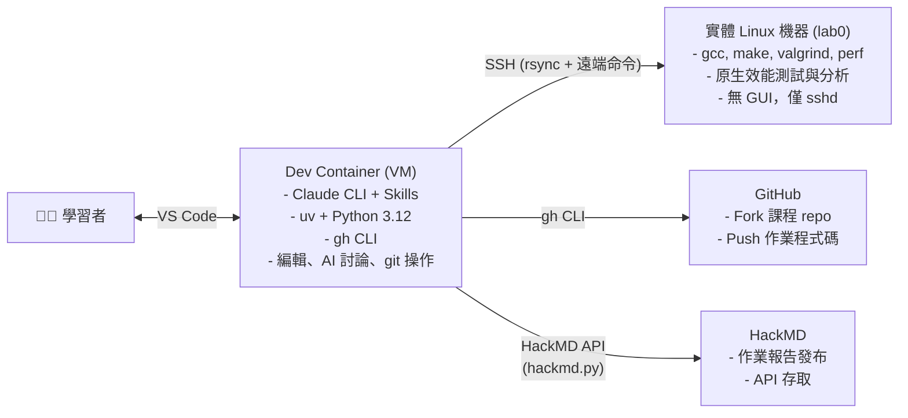
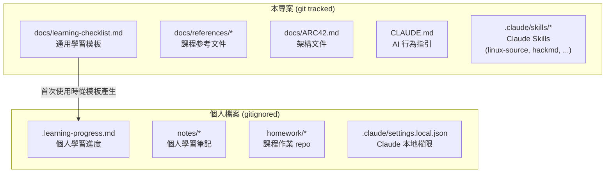
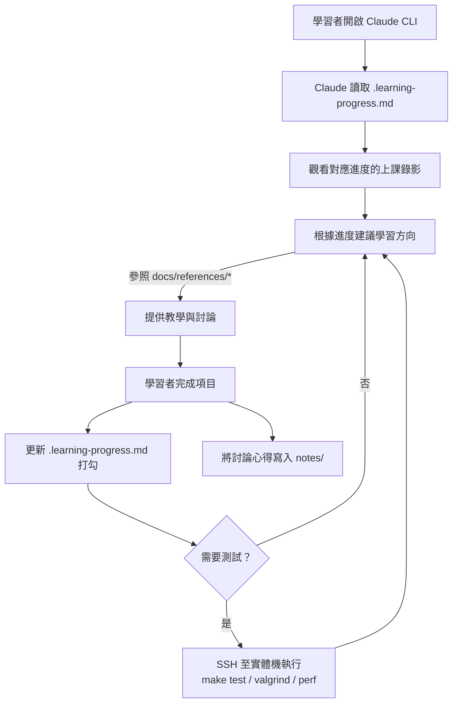

# ARC42 — 架構文件

> 本文件採用 [ARC42](https://arc42.org/) 模板，作為本專案的架構文件。

## 1. 簡介與目標

### 1.1 需求概述

建構一個 AI 輔助的 Linux Kernel 學習環境，讓學習者能透過 Claude 助手加速理解 kernel 原始碼與核心概念。

### 1.2 品質目標

| 優先序 | 品質目標 | 說明 |
|--------|---------|------|
| 1 | 可重現性 | 透過 Dev Container 確保環境一致 |
| 2 | 學習效率 | 透過 Claude Skills 與參考文件降低溝通成本 |
| 3 | 可擴充性 | 能隨課程進度持續擴充內容與工具 |

### 1.3 利害關係人

| 角色 | 期望 |
|------|------|
| 學習者 | 快速建立環境、高效學習 kernel |
| Claude 助手 | 有充足上下文以提供精準回答 |

## 2. 約束條件

- 開發環境：VS Code + Dev Container
- AI 工具：Claude CLI + Claude Skills
- 課程範圍：Linux Kernel 2026

## 3. 上下文與範圍



**Dev Container** 負責編輯、AI 輔助、版本控制；**實體機**負責編譯與原生效能測試。分離的原因是課程要求效能量測必須在原生 Linux 上進行，虛擬機的 overhead 會干擾結果。

> **參照：** [`linux2025-lab0.md`](references/linux2025-lab0.md) Part A（Checklist 1 警告：「使用原生 Linux 安裝，不要用虛擬機，以確保效能評估準確」）。

## 4. 解決方案策略

| 策略 | 說明 | 參照 |
|------|------|------|
| AI 輔助學習 | 透過 Claude CLI + Skills 提供即時的原始碼解釋與概念教學 | [`ai-guidelines.md`](references/ai-guidelines.md) |
| 參考文件預載 | 課程教材存於 `docs/references/`，降低重複查找的溝通成本 | [`linux-course-schedule.md`](references/linux-course-schedule.md) |
| 雙機分離 | VM 負責開發，實體機負責原生測試，透過 SSH 連接 | [`linux2025-lab0.md`](references/linux2025-lab0.md) Part A |
| 開發工具標準化 | 遵循課程指定的 GNU/Linux 工具鏈 | [`gnu-linux-dev.md`](references/gnu-linux-dev.md) |
| 漸進式深入 | 從 lab0 的 queue 實作開始，逐步展開至 kernel 子系統 | [`linux2025-review.md`](references/linux2025-review.md) |

## 5. 建構區塊視角



### 學習進度追蹤系統

| 元件 | 路徑 | 追蹤 | 說明 |
|------|------|------|------|
| 通用模板 | `docs/learning-checklist.md` | git | 定義所有學習項目，隨課程進度擴充 |
| 個人進度 | `.learning-progress.md` | gitignored | 使用者的完成狀態與筆記 |

**運作方式：**

1. 通用模板以 Markdown checkbox 格式定義學習項目，按主題分類
2. 首次使用時，Claude 從模板產生個人進度檔
3. 使用者學習過程中打勾並加註筆記（`<!-- 日期 備註 -->`）
4. Claude 讀取個人進度後，能根據狀態建議下一步學習方向
5. 模板更新時（課程推進新增項目），Claude 協助將新項目 merge 進個人進度

**格式範例：**

通用模板（`docs/learning-checklist.md`）：
```markdown
## 開發工具基礎
- [ ] Git 基本操作（commit, stage, push）
- [ ] Git rebase 與 interactive rebase
- [ ] Makefile 語法
```

個人進度（`.learning-progress.md`）：
```markdown
## 開發工具基礎
- [x] Git 基本操作（commit, stage, push） <!-- 2026-02-20 熟練 -->
- [ ] Git rebase 與 interactive rebase <!-- 需要練習 conflict resolution -->
- [ ] Makefile 語法
```

**設計考量：**
- 使用 Markdown 而非 YAML/JSON — 人機皆可直接讀寫，VS Code 可直接打勾，GitHub 上預覽直覺
- 個人進度不進 git — 每個人的起點與過程不同，避免衝突
- Claude 可同時讀取模板與進度 — 比對差異，提供個人化建議

## 6. 執行期視角

### 典型學習流程



## 7. 部署視角

### 雙機部署架構

#### Dev Container（VM 端）

- **用途：** 程式碼編輯、Claude AI 對話、git 操作、文件撰寫
- **基礎映像：** `mcr.microsoft.com/devcontainers/base:noble`
- **工具：** VS Code, Claude CLI, uv + Python 3.12, gh CLI
- **SSH 連線：** 透過 bind mount host 的 `~/.ssh` 存取 SSH key

devcontainer.json 設定：
```jsonc
{
    "features": {
        "ghcr.io/devcontainers/features/github-cli:1": {}
    },
    "mounts": [
        "source=${localEnv:HOME}/.ssh,target=/home/vscode/.ssh,type=bind,readonly"
    ]
}
```

#### 實體 Linux 機器（測試端）

- **用途：** 編譯、執行、效能測試（valgrind, perf, massif）
- **最低需求：** 任何 x86_64 Linux 機器（不需 GUI）
- **必要套件：**
  ```shell
  # 編譯與程式碼品質（參照 lab0-a 開發環境設定）
  sudo apt install build-essential git valgrind cppcheck clang-format \
                   wamerican aspell colordiff

  # 效能分析（參照 gnu-linux-dev.md — Perf 章節）
  sudo apt install linux-tools-common linux-tools-generic linux-tools-$(uname -r)

  # 數據視覺化（參照 gnu-linux-dev.md — gnuplot 章節）
  sudo apt install gnuplot

  # SSH 環境下的編輯器
  sudo apt install vim
  ```
- **服務：** sshd

> **套件來源：** 編譯工具參照 [`linux2025-lab0.md`](references/linux2025-lab0.md) Part A；
> perf 與 gnuplot 參照 [`gnu-linux-dev.md`](references/gnu-linux-dev.md)。

#### SSH 設定

Host 端 `~/.ssh/config`：
```
Host lab0
    HostName <實體機 IP>
    User <username>
    IdentityFile ~/.ssh/id_ed25519
```

#### 遠端測試工作流程

```shell
# 從 Dev Container 內操作：
# 1. 同步程式碼至實體機
rsync -avz --exclude='.git' /path/to/lab0-c/ lab0:~/lab0-c/

# 2. 遠端編譯與測試
ssh lab0 'cd ~/lab0-c && make clean && make && make test'

# 3. 遠端 valgrind 分析
ssh lab0 'cd ~/lab0-c && make valgrind'

# 4. 遠端效能分析
ssh lab0 'cd ~/lab0-c && perf stat ./qtest -f traces/trace-14-perf.cmd'
```

> **狀態：** 實體機尚未設定，待取得硬體後補完。

## 8. 橫切關注點

### 個人資料隔離

個人化檔案（學習進度、筆記、Claude 本地設定）一律 gitignore，確保：
- 多人共用同一份模板不會互相干擾
- 不會意外將個人筆記推至公開 repository

| 個人檔案 | 用途 | 備註 |
|----------|------|------|
| `.learning-progress.md` | 學習 checklist 打勾進度 | 從 `docs/learning-checklist.md` 產生 |
| `notes/*` | 討論心得、技術分析、閱讀筆記 | 僅 `notes/README.md` 進 git |
| `homework/*` | 課程作業 repository | 僅 `homework/README.md` 進 git，各作業有獨立 `.git/` |
| `.claude/settings.local.json` | Claude CLI 本地權限 | 自動產生 |

### 術語一致性

所有中文技術文件遵循 [`it-vocabulary.md`](references/it-vocabulary.md) 的術語規範，關鍵術語內嵌於 `CLAUDE.md` 確保 Claude 每次對話自動套用。

### AI 使用規範

課程要求學習者展現 substantial personal contribution。Claude 在協助作業時須遵循 [`ai-guidelines.md`](references/ai-guidelines.md)，必要時主動提醒使用者注意引用揭露與開發過程文件化。

## 9. 架構決策

### ADR-001：參考文件存放於 `docs/references/` 而非 Claude Skill

- **決策：** 課程教材以 Markdown 檔存放於 `docs/references/`，在 `CLAUDE.md` 中指示 Claude 優先引用
- **原因：** 參考文件是靜態資料，不是工作流程；Skill 的 description 會永久佔用 context，不適合大量參考資料
- **參照：** AI guidelines 同樣採此模式（見 §8）

### ADR-002：雙機分離架構

- **決策：** Dev Container 負責編輯與 AI，實體機負責編譯與原生測試
- **原因：** 課程明確要求效能量測在原生 Linux 進行；實體機不需 GUI，資源需求低
- **參照：** [`linux2025-lab0.md`](references/linux2025-lab0.md) Part A

### ADR-003：學習進度以 Markdown Checkbox 追蹤

- **決策：** 通用模板（git tracked）+ 個人進度檔（gitignored），皆為 Markdown 格式
- **原因：** Markdown checkbox 人機皆可讀寫；Claude 可直接比對模板與進度差異；不需額外 parser
- **替代方案：** YAML（更結構化但人工編輯不直覺）、資料庫（過度工程化）

### ADR-004：個人學習筆記存於 `notes/`（gitignored）

- **決策：** 專案內建立 `notes/` 目錄，內容 gitignored（僅 `README.md` 進 git 作為說明），用於存放與 Claude 討論後的心得紀錄
- **原因：**
  - 與 Claude 的深度技術討論常產生有價值的分析與洞見，session 結束後容易遺失
  - 放在專案內而非外部工具，Claude 後續 session 可直接讀取作為上下文
  - gitignored 不汙染專案，每個學習者有自己的筆記
  - 未來撰寫正式報告（HackMD）時，可從 notes 整理精華
- **替代方案：**
  - 另開 git repo — 可行但管理兩個 repo 麻煩，脈絡與專案斷裂
  - HackMD — 適合正式報告，但不適合隨手記錄，且 Claude 無法直接存取
  - Claude memory — 容量有限且格式受限，適合存關鍵 pattern 而非完整分析
- **建議工作流程：**
  1. 與 Claude 討論技術問題
  2. 討論告一段落，請 Claude 將重點寫入 `notes/`
  3. 需要撰寫 HackMD 報告時，從 notes 整理

### ADR-005：課程作業存於 `homework/`（gitignored）

- **決策：** 在專案內建立 `homework/` 目錄，存放 fork 的課程作業 repo，內容 gitignored（僅 `README.md` 進 git）
- **原因：**
  - 作業 repo 各自有獨立的 git 歷史，不應混入本學習專案的版控
  - 放在專案內讓 Claude 可直接讀取作業程式碼，提供討論與輔助
  - 模式與 `notes/` 一致（gitignored + README 說明）
- **替代方案：**
  - 作業 repo 放在專案外 — 可行但 Claude 存取不便，且工作目錄分散
  - Git submodule — 過度複雜，fork 的 remote URL 因人而異

### ADR-006：HackMD 整合採 CLI 腳本 + Claude Skill

- **決策：** 以 Python stdlib-only 腳本（`hackmd.py`）封裝 HackMD API，搭配 Claude Skill 提供互動式指引
- **原因：**
  - 課程要求在 HackMD 撰寫作業報告，需要從開發環境直接發布
  - stdlib only 避免額外依賴，`uv run` 即可執行
  - Skill 負責流程引導（認證、工作流程建議），腳本負責 API 呼叫
- **替代方案：**
  - 使用 HackMD 官方 CLI — 截至 2026 年無官方 CLI 工具
  - 手動在瀏覽器操作 — 無法從 Claude 對話中自動化

## 10. 品質需求

<!-- TODO: 細化品質場景 -->

## 11. 風險與技術債

<!-- TODO: 記錄已知風險與技術債 -->

## 12. 詞彙表

| 術語 | 說明 |
|------|------|
| Dev Container | VS Code 的容器化開發環境 |
| Claude CLI | Anthropic 的命令列 AI 助手 |
| Claude Skills | Claude CLI 中可自訂的指令快捷方式 |
| ARC42 | 軟體架構文件模板 |
| lab0-c | 課程第一份作業的 repository（`sysprog21/lab0-c`） |
| 實體機 | 用於原生效能測試的 Linux 實體機器，透過 SSH 連接 |
| 通用模板 | `docs/learning-checklist.md`，定義所有學習項目的 Markdown checklist |
| 個人進度 | `.learning-progress.md`，使用者的學習完成狀態（gitignored） |
| 個人筆記 | `notes/`，使用者的學習心得與技術分析（gitignored） |
| homework/ | 課程作業 repository 的工作區（gitignored），各作業有獨立 git 歷史 |
| gh CLI | GitHub 官方命令列工具，用於 fork、clone、PR 等操作 |
| HackMD | 線上協作 Markdown 編輯器，課程要求在此發布作業報告 |
| hackmd.py | 專案自建的 HackMD API 客戶端（Python stdlib only） |
| ADR | Architecture Decision Record，架構決策紀錄 |
