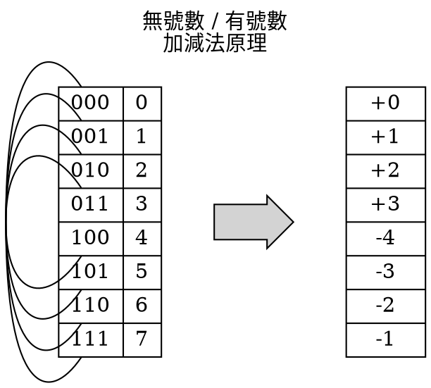

> **原始出處：** https://hackmd.io/@sysprog/binary-representation
> **擷取日期：** 2026-02-26
> **用途：** 課程教材 — 解讀計算機編碼（二補數、群論、資安）
> **涵蓋度：** 完整
> **省略內容：** 無

---
title: 解讀計算機編碼
image: https://i.imgur.com/VHXRc0v.jpg
description: 從數學觀點去解讀編碼背後的原理，並佐以資訊安全及程式碼最佳化的觀點，探討二補數這樣的編碼對於程式設計有何關鍵影響
tags: sysprog
---

# 解讀計算機編碼
> 資料整理: [jserv](https://wiki.csie.ncku.edu.tw/User/jserv)

:::success
人們對數學的加減運算可輕易在腦中辨識符號並理解其結果，但電腦做任何事都受限於實體資料儲存及操作方式，換言之，電腦硬體實際只認得 `0` 和 `1`，卻不知道符號 `+` 和 `-` 在數學及應用場域的意義，於是工程人員引入「補數」以便在二進位系統中，表達人們認知上的正負數。但您有沒有想過，為何「二補數」(2's complement) 被電腦廣泛採用呢？背後的設計考量又是什麼？本文嘗試從數學觀點去解讀編碼背後的原理，並佐以資訊安全及程式碼最佳化的考量，探討二補數這樣的編碼對於程式設計有何關鍵影響。
:::
> 啟發自 [dog250 的文章](https://blog.csdn.net/dog250/article/details/73381875)

:::info
本文區分「計算機」和「電腦」這二個詞彙，儘管英文都寫作 "computer"。論及抽象意義的場景或概念時，本文用「計算機」(像是[圖靈機](https://en.wikipedia.org/wiki/Turing_machine)這樣的抽象數學邏輯機器)，反之，若為具體議題則用「電腦」，例如電腦科學 (工程上的分類) 和電腦硬體。
:::

## 第〇部分：憑直覺設計的編碼有何問題？

### 符號與值 (sign & magnitude)

實數具備正與負二種符號，但計算機卻由 `0` 和 `1` 狀態建構而成，沒有專門表示正負號的原生方式。直觀的解決方式，就是挪用其中一位元來表示正負號，於是，人們約定將正負號置於給定數值儲存空間的最高有效位元 (most significant bit, MSB)，在 [big-endian](https://en.wikipedia.org/wiki/Endianness) 的位元排列方式 (如 TCP/IP) 中，MSB 就是二進位數值的最左邊的一個位元，當 MSB 等於 `0` 時表示正數，而 MSB 為 `1` 時表示負數。

舉例來說，用 8 個位元表達一個數值，由於需要保留一個位元來存放正負號，於是這樣的編碼系統實際能表達的範圍是:
> -(2^7^ - 1) = -127, -126, -125, ... -0, +0, ..., +125, +126, +(2^7^ - 1) = +127

上述以符號與值 (sign & magnitude) 編碼的方式，也稱為「原碼」。像是 [IBM 7090](https://en.wikipedia.org/wiki/IBM_7090) 這類早期的二進位電腦就使用這種表示法，或許正因為直觀的設計。


> 圖片說明: 用於 NASA [Project Mercury](https://en.wikipedia.org/wiki/Project_Mercury) (美國首個載人太空飛行計劃) 的二台 IBM 7090 主機，分別由二位低頭坐姿的男士操作 7090 終端機

:::success
電影《[關鍵少數](https://en.wikipedia.org/wiki/Hidden_Figures)》(Hidden Figures) 揭露美國得以完成首次太空船載人繞行地球創舉的功臣之一的 IBM 7090 處理器，它是全球第一台電晶體計算機，每秒可執行 229,000 道運算，也是大型主機的始袓。美國太空總署在 1960 年代初期以農神火箭發射登月太空船之前，即利用 IBM 7090 型電腦執行過數千次的模擬飛行。之後在 1969 年，美國太空總署更以 5 台 IBM System/360 執行任務控管，達成人類文明的重要里程碑 —— 阿波羅 11 號成功登月。
:::

「符號與值」編碼雖然直覺並實際證明運用於太空技術中，但由於以下缺點，隨後就被棄置：
1. 電路複雜
    * 從前述運算法可見，「符號與值」的正負號位元不能直接參與運算，必須要單獨的硬體線路來確定正負號符號位元;
    * 受限於額外的正負號位元，加法和減法需要各自的硬體電路才能實作：加法運算會產生「進位」(carry)，減法運算需要「借位」(borrow)，這二種運算對應的硬體電路差異很大，需要額外的電路才可把加法器改造為減法器;
2. `0` 的表示不唯一
    * 這種表示法導致有二種方式表示 `0`:
        * ==0==0000000 (+0)
        * ==1==0000000 (−0)
    * 這實際增加數位電路的複雜性和設計難度，中央處理器也為此須執行兩次比較，才能確認運算結果是否為 `0`;

### 一補數 (Ones' complement)

既然依恃直觀的編碼會增加硬體電路設計的難度，於是工程人員就想出另一個突破方式：一個負數的二進位形式改為其絕對值部分按位元逐位反轉，這樣的系統稱為「一補數」(ones' complement)，可以有效簡化加法和減法的硬體設計。

舉例來說，十進位數值 `-43` (43~10~ = 00101011~2~) 用「符號與值」表示是 10101011~2~，而一補數形式為 11010100~2~ (就是 +43~10~ 的二進位表示法做逐位元反轉)。透過一補數可表示的範圍為 −(2^N−1^ − 1) 到(2^N−1^ − 1)，以及 `+0` 和 `−0`。以 8 個位元來說，一補數有效地表達範圍是 −127~10~ 到 +127~10~，以及 00000000 (+0) 或者11111111 (−0)。

之所以要引入看似不直觀的編碼，就是為了運算的便利。考慮以下減法運算:
> 253 - 176 =？

顯然這個計算需要進行借位操作，又為了簡化電腦實作的難度，我們可略為變化運算過程為:
> 253 + (==999== - 176) + (==1 - 1000==) = ?

看似不起眼的操作，卻有重要的意義：用二個減法替代原先的一個減法，避免了煩瑣的借位操作。於是，負數 `-176` 轉化為另外一個數 `999 - 176` ，在十進位的觀點，我們可稱 `999 - 176` 相較於 `-176` 為「9 的補數」(nine's complement)。`1 - 1000` 在數學式子上是存在的，但在實作上`1` 是透過「循環進位」加回去的，`-1000` 是透過「硬體溢位」自然消失的。

:::success
在英語中，"complement" 有「補充」、「輔助」、「配襯」的意思，可作為動詞和名詞。
> It means to add to sth. in a way that improves it or makes it more attractive; or a thing that adds new qualities to sth. in a way that improves it or makes it more attractive

"complement" 指補充某物，並使其得以改進或使其更有吸引力 (這時詞性為動詞)；或指能提升品質、得以改進或更有吸引力的事物 (這時詞性名詞，常用搭配為 complement to ...)。

關於「9 的補數」運用於計算器的歷史典故，可參見短片[科學火箭叔：Curta 及機械計算器發明的故事](https://youtu.be/kRmExkQoOPY)
:::

這個運算的關鍵突破在於：把負數用「9 的補數」表示，轉化減法為加法。同理，我們推廣到二進位，即可得「一補數」(ones' complement)。

把減數從一串 `1` 當中減去，結果就稱為該數的「一補數」，在求一補數時，不需要額外做減法，因為一補數實際只要將原來的 `1` 變為 `0`、`0` 變為 `1` 即可，這其實是位元反轉，對應到數位邏輯電路就是一個反相器。因此，一補數也稱為「反碼」。

從上面的描述就可以很容易寫出一補數的編碼規則

一補數的計算不用區分符號和值 (magnitude)，直接進行計算，計算結果若遇到溢位，需要將溢位加到最低位，這操作稱為「循環進位」([end-around carry](https://en.wikipedia.org/wiki/Method_of_complements))。

如果想對 2 個採用一補數表達的數值進行加法運算，首先需要進行常規的二進位加法，但仍要在和的基礎上加上進位。為什麼呢？可見以下範例：(−1)~10~ 加上 (+2)~10~

```
           二進位    十進位
        11111110     -1
     +  00000010     +2
    ............    ...
      1 00000000      0   <-- 錯誤答案
               1     +1   <-- 加上進位
    ............    ...
        00000001      1   <-- 正確數值
```        

讓我們分析一補數的優缺點:
1. 優點: 電路設計單純
    * 因為不用分開考慮正負號和值，負數一補數只需逐位元求值的補即可得到，符號不需要變動。正數和負數的加法都一樣運算，所以一補數計算不需要單獨的判斷符號的電路，也不需要判斷 2 個數絕對值相對大小的電路;
    * 節省減法器，只需要一組額外的反相器就可將加法器改為兼顧加法和減法
2. 缺點
    * 電腦內部仍然需要進行「循環進位」的硬體電路，儘管這相較於「符號與值」單純許多;
    * 和「符號與值」編碼方式一樣，`0` 的表示不唯一，`0` 的編碼仍有二種方式： `0000_0000` 和 `1111_1111`;

一補數表示法用於 1960 年代老式電腦中，像是 PDP-1, CDC 160A, UNIVAC 1100/2200 系列。1960 年代時值美國為首的[第一世界](https://en.wikipedia.org/wiki/First_World)和蘇聯為首的[第二世界](https://en.wikipedia.org/wiki/Second_World)之間的冷戰時期，除了太空軍備競賽，也帶動電腦網路的蓬勃發展。因此，網際網路前身的 [ARPAnet](https://en.wikipedia.org/wiki/ARPANET) 就跟著當時通行的一補數編碼，對 IPv4, ICMP, UDP 及 TCP 採用同樣的16 位元一補數檢驗和演算法。


儘管現代電腦已改用二補數系統，因而缺少對應於一補數的「循環進位」硬體電路，但這種額外運算量不算沈重，大多用軟體操作即可。假設以下 3 個採用 16 位元表示的資料要透過 UDP 傳輸:
```
0110011001100000
0101010101010101
1000111100001100
```

為了確保接收端能正確得知訊息，UDP 傳送端會將上述 16 位元寬度的數值加總，並取一補數結果。前 2 個 16 位元表示的數值的和:

```shell
    0110011001100000
+   0101010101010101
--------------------
    1011101110110101
```

接著再加上第 3 個數值 (`1000111100001100`)，顯然可從開頭的 `1` 發現，這樣的加法運算會導致溢位:

```shell
    1011101110110101
+   1000111100001100
--------------------
 [1]0100101011000001
```
> 前方的 `[1]` 表示溢出的位元

為了描述的便利，可將 3 項資料總合 `0100101011000001` 命名為 S，接著對 S 取一補數，也就是位元反轉，可得到 `1011010100111110`，取名為 S~c~ 這即是檢驗碼，並伴隨網路傳輸。在 UDP 的接收端，得到上述 3 個 16 位元寬度的資料和另一個同樣 16 位元寬度的檢驗碼之後，就會將數值加總，也就是 S + S~c~。若接收端沒有遇到任何網路傳輸的錯誤，進行 S + S~c~ 運算的結果就該是 `1111111111111111`，反之，若運算結果出現某個位元有 `0`，就表示存在傳輸錯誤。
> 延伸閱讀: [Short description of the Internet checksum](https://web.archive.org/web/20190302125154/https://www.netfor2.com/checksum.html) 和 [RFC 1071: Computing the Internet checksum](https://tools.ietf.org/html/rfc1071)

:::success
1960 年代美國國防部先進研究中心 (Advanced Research Project Agency, ARPA) 掌管全美國科學領域研究約七成的資金，成為許多現代重要科技的發源地，像是網際網路、電腦繪圖、平行運算、模擬飛行等科技都是和 ARPA 的資助直接相關。

1966 年 Bob Taylor 時任 ARPA 「資訊處理科技研究室」 (Information Processing Techniques Office, IPTO) 主管，萌發建構新型電腦網路的想法，並邀請 Larry Roberts 出任資訊處理處處長。1967 年，Roberts 著手籌建分散式網路，不到一年，提出 ARPAnet  的構想。1968 年，Roberts 提交研究報告《資源共享的電腦網路》，致力於電腦達到互相連接，從而使大家分享彼此的研究成果。1969 年底，ARPANet 正式投入運行。
:::

無論是「符號與值」抑或「一補數」，都有各自的缺點，於是「二補數」在工程人員的努力下，成為今日電腦技術的根基之一。


## 第一部分：二補數編碼

### 數學和電腦的表現形式

數學是門高度抽象的學科，而電腦科學則是這學科的一種具體展現，後者顯然無法處理某些僅在抽象意義上存在的概念，諸如無窮大、虛數之類的「數」。倘若我們將數學中的加法、乘法一類的運算，實作於電腦中，很快就會發現一個殘酷的事實：由於數學中的實數加法 (包含其他的運算) 建構於實數域上，而實數域又是無限的，僅能處理有限域運算的電腦勢必要限縮可處理的範疇。倘若只在給定範圍內保證運算正確、超出範圍的結果則予以顯示錯誤並通報給操作人員，那麼如此的電腦會有太多限制，也難以實現自動化，總不能每次都要操作人員盯著螢幕，監視頻繁出現的錯誤訊息吧？

人們把思路移向另一個方向：若能在有限的編碼上實現諸如實數運算一類「無錯誤」運算，我們就不用凡事仰賴系統訊息，並可在任何情況下 (包括超出範圍) 都得到一個「能自圓其說地正確」的結果。這樣的規則具體來說，就是計算機在有限域上進行加法運算後，再行模除操作，將結果控制在有限的範圍內。


> 這個時鐘計時方式使用了模數為 `12` 的模算數

計算機以模算數 ([modular arithmetic](https://en.wikipedia.org/wiki/Modular_arithmetic)) 進行加法和乘法運算，必定伴隨一套明確的規則。由於電腦的組成是離散系統，可儲存和操作的位元數量有限，因此能夠表達的數值也會有限制，比方說我們限定用 3 個位元來表達一個數值，不考慮正負號的情況下，數值的範圍即是 0, 1, 2, ..., 7，而 $7 + 1$ 的結果不會是 `8`，因為發生[溢位](https://en.wikipedia.org/wiki/Integer_overflow) (overflow)，在有效的 3 個位元會呈現 `000`，用同餘 (congruence modulo, 符號 ≡) 表示即是：
$7 + 1 \equiv 0 \pmod{8}$

推廣到 k 個位元所能表達的無號數，在允許溢位的狀況下，其加法就等價於以下表示式：
$A + B \equiv C \pmod{2^k}$

:::success
模算數是個整數的算術系統，其中數字超過一定值後 (稱為「模」) 後會「捲回」到較小的數值。常見的應用是在 12 小時制，將一天分為 2 個以 12 小時計算的單位。假設現在 7 點，8 小時後會是 3 點。用一般的算術加法，會得到`7 + 8 = 15`，但在 12 小時制中，超過 12 小時會歸零，不存在「15 點」。類似的情形，若時鐘目前是 12 時，21 小時後會是 9 點，而非 33 點。如此模 12 的模算數系統中，12 和 12 本身同餘，也和 0 同餘，因此 12:00 的時間也可以稱為是 0:00，因為模 12 時，12 和 0 同餘。
[模算數總結](https://blog.sengxian.com/algorithms/mod-world)
:::

同餘的特性告訴我們，允許溢位的加法滿足交換律、結合律一類的數學性質，溢位背後蘊含的意義可一點都不簡單。世事往往相對，有前就有後，有上就有下，數學亦然，加法之於減法，猶如乘法之於除法，及函數之於反函數。正與反彼此可等量相消，而用等量相消的元素，稱作「反元素」(也稱為「逆元」)：加法的反元素是負數 `-x` ，乘法的反元素是倒數 `1/x` ，函數的反元素是反函數 f^-1^ 。所謂的「元素」，視情況是指數值、指函數，甚至是矩陣等等。

對於加法，必須實現一個[阿貝爾群](https://en.wikipedia.org/wiki/Abelian_group)，從而滿足交換律：擁有一個「零」，並確保每個元素都存在一個「反元素」，相加後等於「零」，無論做多少次操作，其結果也必定落於該群之中，只要按照這規則設計一種編碼系統，那麼對於計算機而言，即可圓滿運作。對於任何數值進行加法操作，我們都不會得到「錯誤」，而是明確獲得一個正確的結果。關於阿貝爾群相關「群」的闡述和討論，在本文後半段會提及，這裡我們先有概念即可。若實數可表示在一維座標，那麼經由計算機處理的數值，就可表示在一個圓環上，後者隱含著圓環上的數值個數是有限的。


> 圖片來源: [Roman Numerals 18K Rose Gold Rhinestone Ring](https://www.evermarker.com/products/roman-numerals-18k-rose-gold-rhinestone-ring)


為了簡化討論，本文限制計算機操作數值的方式為位元組導向 (byte-oriented; 1 byte = 8 bits)，而且只用一個位元組表達數值。

### 計算機為何如此編碼

一個位元組可表示從 `00000000` 到 `11111111` 範圍內的 256 個數值，這些 `0` 和 `1` 的組合其實不區分有號和無號數。顧及和實數的對應，我們將前述一個位元組可表示的數值視為有號數，這樣的話，負數和正數應該各佔一半，它們中間有一個 0，由於十進位數和二進位數僅僅是進位規則的不同，不管在什麼進位方式，`0` 都是不變的，那麼顯然需要將 `0` 編碼為 `00000000`。現在考慮一下這樣做的後果，8 位元的二進位數的最小值被編碼為 `0`，那負數怎麼辦呢？畢竟沒有比 `0` 更小的數字！因此，我們需要設計一套「編碼」機制，透過固定的表示方式，確保其真正的涵義是字面上的數值，而不是編碼後的數值，這句話乍聽之下令人費解，但我們生活日常或多或少都有接觸。比如說，我們可將民國 `108` 年編碼成 `2019`，並把主體 `70` 年編碼為 `1981`，很多亞洲國家的居民都熟悉類似的編碼。

:::success
北韓自 1997 年起用「主體」紀年，紀念「金氏王朝」首位獨裁者金日成，以金日成出生的公元 1912 年開始起算，定為主體元年，恰好與中華民國曆法有一致的起點。日本以[天皇年號](https://zh.wikipedia.org/zh-tw/%E6%97%A5%E6%9C%AC%E5%B9%B4%E8%99%9F%E5%88%97%E8%A1%A8)為名紀年，南亞和東南亞的佛教國家，如柬埔寨和泰國，則使用傳統的[佛曆](https://zh.wikipedia.org/zh-tw/%E4%BD%9B%E6%9B%86)。
:::

任何編碼都帶有現實世界目的，往往和數學的純粹和自我解釋有所出入。人為設計編碼就為了將電腦內部一系列由 `0` 和 `1` 組合出的大量資料組合，對應於真實世界的各式意涵。其實所有的編碼就是一張僅有 2 個欄位表格，一個欄位是現實中的真實含義，另一欄是代表真實涵義的表示法。

再來考慮負數，我們先從 `-1` 規劃起，在字面上，`-1` 加上 `1`就是 `0`，而 `1` 的二進位編碼就是 `00000001` (二進位和十進位僅僅進位規則不同，編碼正數和 `0` 當然就是直接按照字面意義進行轉換，編碼負數其實是編碼一個符號 `-`)，最低位元是 `1`，根據二進位加法規則，要想讓 `x + 00000001` 的結果為 `00000000`，`x` 的值必定是 `11111111` (逢 2 進位，從最低位元開始進位)，但這樣會面臨新問題：8 個位元的 `1` 和 `00000001` 加在一起是 `100000000` 而非 `00000000`，也就是說，需要用 9 個位元表示上述 `-1` 的編碼，實際超出一個位元組的有效範圍。

不過沒關係，既然我們的前提是只能使用 8 個位元表示數值，那麼最高位的 `1` 當然是溢位，因此 `-1` 的編碼是 `11111111`，接下來 `-2` 呢？顯然 `-2 + 1 = -1`，因此 `-2` 為 `11111110`，依次類推，我們得到的最小的負數為 `10000000`，為什麼呢？假設存在還能表示比它小 `1` 的負數 `x`，則 `x + 1 = 10000000`，這樣的話 `x` 的值就是 `01111111`，我們姑且將這個數看成是比 `10000000` 還小 `1` 的一個負數，接下來考慮一下正數，我們知道 `1` 的編碼是 `00000001`，`2` 的編碼是 `00000010`，依次類推，我們也推得 `01111111` 這個數。前面提過，計算機將能表示的數值編碼於一個圓環上，而非一條可左右延伸的一維座標上，那麼 `01111111` 到底是正數還是負數呢？

回顧阿貝爾群的性質，若將 `01111111` 編碼為負數，那它將和自身的反元素相加結果為 `00000000`，既然計算機算術僅僅最後做了模除 (modulo) 操作，群的性質和實數域應該一致，因此 `01111111` 的反元素必定為正數，我們求出它的反元素是 `10000001`，後者是我們從 `-1` 開始的負數編碼推導出來的負數編碼，但這又與我們一開始的假設不符合。

:::success
模除運算 ([modulo operation](https://en.wikipedia.org/wiki/Modulo_operation)) 和餘數運算 (complementation) 兩者概念上有重疊，但又不完全一致。模除主要是用於電腦術語 (而隨著不同的程式語言亦有落差)，餘數更多是數學概念。兩者主要區別是：在被除數和除數符號不同時，餘數的符號有所歧義。

:notes: modulo 音標 [ˈmɑdʒəlo]，該詞彙衍生自拉丁語
 
至於 `%` 和 `div` 在 C/C++ 語言的執行結果，正負號要以被除數抑或除數為主，程式語言的標準一度變遷過：
* ISO C90 / ISO C++98: `%` 是 implementation-defined，而 [div](http://www.cplusplus.com/reference/cstdlib/div/) 依據被除數的正負號;
* ISO C99 / ISO C++11: 將 `%` 和 [div](http://www.cplusplus.com/reference/cstdlib/div/) 都依據被除數的正負號;

對 2 的 n 次方作模除運算，可得到以下等價快速解: (適用於正整數)
> x % 2^n^ == x & (2^n^ - 1)

[最佳化編譯器](https://hackmd.io/@sysprog/c-compiler-optimization)可能會用此來改寫模除運算，而在 C 語言這樣仰賴被除數的正負號來決定最終模除運算結果，這樣的最佳化對於有號數就不再適用 (除非改為 `unsigned`)
:::

經由剛才的反證法，我們知道 `01111111` 必然屬於一個正數的編碼，它的十進位數是 `127`，也是一個位元組能表示最大的有號整數值，而 `10000000` 則是一個位元組能表示的最小的負整數，其十進位值是 `-128`。[The New C Standard: An Economic and Cultural Commentary](http://www.knosof.co.uk/cbook/cbook.html) 電子書摘錄 C 語言規格書並做了註釋，其中 "5.2.4.2.1 Sizes of integer types" 這節提到:
* `CHAR_BIT`: Defines the number of bits in a byte
* `SCHAR_MIN`: Defines the minimum value for a signed char
* `SCHAR_MAX`: Defines the maximum value for a signed char
* `CHAR_MIN`: Defines the minimum value for type char and its value will be equal to `SCHAR_MIN` if char represents negative values, otherwise zero
* `CHAR_MAX`: Defines the value for type char and its value will be equal to `SCHAR_MAX` if char represents negative values, otherwise `UCHAR_MAX`

上述的巨集是和編譯器和執行環境相關，常見的數值組合為 `CHAR_BIT` = `8`, `CHAR_MIN` = `-128`, `CHAR_MAX` = `127`，考量點正如以上解釋。


最大的正數 `01111111` 加 `1` 結果為何？答案是 `10000000`，也就是最小的負數，這合理，因為計算機將數值編碼在一個環上。倘若我們把此圓環從 `10000000` 處切開並拉直，將得到一個線段，上面編碼的數值自 `10000000` 開始遞增，直到 `01111111`。接著來思考加法的本質，一個數 `x` 在圓環上，另一個數 `y` 肯定也在圓環上，`x + y` 的計算過程則是維持 `x` 不變，擷取自 `00000000` 到 `y` 的這段圓弧 ar，拼接到 `x` 處，最終的 ar 的終點處的編碼就是結果，事實上 ar 有二種摘取方式：順時針和逆時針，不管哪種方式，最後結果落到同一處。

計算機加法的結果會按照圓環的周長作模除，並不是說先得到實數域的字面結果，然後再執行取模操作，而是按照前面設計的圓環，二進位加法最終的模除是自動進行，本質上說這個「自動」是通過高位的溢位來達成。注意，這裡討論的是編碼，不涉及正負號，具體是有號還是無號，就看電腦指令的解釋，`10000000` 可以是有號的 `-128`，也可是無號的 `128`，同樣，`11111111` 可以是有號的 `-1`，也可以是無號的 `255`。


### 模除和溢位

既然編碼和符號彼此無關，那麼模除運算是如何實作呢？設想 `250 + 10` 的操作，字面操作的結果是 `260`，但計算機最大只能由 8 個位元表示，因此按照無號數解釋最大也只能表示為 `11111111`，亦即 `255`，可是 `260` 和 `255` 還相差 `5`，顯然結果需要在 `255` 的基礎再加上 `5`，根據剛才的形象化的圓環加法，加上 `5` 之後落到 `00000100` 這個位置，也就是十進位 `4`，這個 `4` 就是就是最後的結果。圓環的周長是 `256`，`4` 正好是 `260` 除以 `256` 的餘數，而取餘數就是模除，電腦硬體一般透過溢位來實作。`255` 的二進位表示為 `11111111`，它加上 `1` 之後就發生最高位溢位到第 9 個位元，由於一個位元組僅能表示 8 個位元的數值，因此最高位就被捨棄，結果為 `[1]00000000`

:::success
==[]== 範圍內的位元會被丟棄，本文皆用這樣的表達法
:::

一切從 `0` 開始，再加上 `4`，結果就是 `4`。無論在圓環上繞幾圈，最終的落點仍會在圓環上，每繞一圈就會發生最高位的溢位，並從 `00000000` 開始，這就是模除的本質。

對於乘法，這個圓環依然使用，二個數相乘，只要有一個數是正數，那麼就可用上述的圓弧不斷拼接來得到答案，比如 `3 * 2` 就是用 `2` 個 `3` 這個圓弧拼接兩次，`-2 * 4` 就是拿 `4` 個 `-2` 這個圓弧拼接四次，對於二個負數相乘，比如 `(-a) * (-b)`，可拆成 `(a * b) * (-1) * (-1)`，於是只要計算 `(-1) * (-1)` 即可，也就是 `11111111 * 11111111`，最終的結果是 `[xxx]00000001`，高位全部溢位，結果就是正數 `1`。

在實數乘法中，我們依靠一個「負負得正」規則，然而在計算機編碼中，負號本身和數值一起被編碼，依靠溢位竟可推導出「負負得正」這個所謂的規則，這也說明了引入抽象分析的重要性：在計算機上，將負號和數值一起編碼，即可推導出一切在實數域上的異號數值乘法的性質。

:::success
過往數學教育對「負負得正」通常先要求學生記住，學會計算後再來理解，卻造就一群對數學原理一知半解的學生。要充分理解「負負得正」背後的原理，需要不少推理。18 世紀法國作家 Stendhal (1783-1843) 對於授課教師「負負得正」的解釋顯然並不滿意。他回想從前學習負數的情況： 
> 數學是不會矯揉造作。在我的青春歲月裡，我相信那些使用數學做為工具的科學也必然真確；別人這麼告訴我。但是當我發現沒有人能解釋負負得正(`－` × `－` ＝ `＋`) 的原因時，你能想像我的感受嗎？！（而這還是所謂「代數」的一項基本規則）對我來說，這個沒有解釋的難題真是夠糟的了（它既然能導致正確的結果，無疑地也應該可以解釋）。而更糟的是，有人用那些顯然對自己都不清不楚的理由來對我講解。 

德國數學家與教育家 [Felix Klein](https://en.wikipedia.org/wiki/Felix_Klein) 在 1908 年語重心長地說：
> 如果我們現在帶著批判的眼光去看中學裡負數的教法，常常可以發現一個錯誤，就是像老一代數學家如上指出的那樣，努力地去證明記號法則的邏輯必要性。…… 我反對這種做法，我請求你們別把不可能的證明講得似乎成立。大家應該用簡單的例子來使學生相信，或有可能的話，讓他們自己弄清楚。 
 
參考資訊:
* [負負為何得正（上)](https://kknews.cc/zh-tw/education/rzapo4.html)
* [負負為何得正（下)](https://kknews.cc/education/xrb6j9.html)
:::

加法和乘法都適用於上述「圓環 + 溢位」模型之後，最後再來思考 `0` 這個特殊的數字。在實數域上，`-x + x = 0` 也是個規定，是群的一個性質，然而在計算機上，一切卻真實地展現，也是依靠溢位，不失一般性。以 `-1 + 1` 為例，`1` 的編碼為 `00000001`，要想讓 `-1` 的編碼和 `1` 加和等於 `00000000`，根據二進位加法，只要能得到 `[x[y]]00000000` 即可，8 位元以上的部分不用理會，溢位即可。另一個例子是 `11111111 + 00000001 = [1]00000000`，就落實群性質中的數和「反元素」相加等於「零」的性質。


### 反思所謂的規則

計算機概論的教材提到的一補數、二補數，還說計算機一律使用二補數編碼，正數和 `0` 的二補數等於原始正負號表示型態，負數的二補數等於負數相反數的原始正負號表示形態的一補數加 `1`。這些本來就不用特別去記憶，僅由上述「圓環 + 溢位」模型即可說明，當初的編碼設計者也是先想到上述「圓環 + 溢位」這個形象化的模型，才逐步建構一補數、二補數這些抽象的概念，再解釋為何負數的二補數是其相反數的一補數加 `1` 就水到渠成。

:::success
「一補數」的英語寫法為 ones' complement，中國簡體譯作「反碼」;「二補數」的英語寫法為 two's complement，中國簡體譯作「補碼」。
注意兩者英語寫法中撇號 (apostrophe) 的位置。

ones' complement 是對 1 求補數，這裡的 `1`，本質是個有限位數構成的數值系統中所能表示出的範圍，8 位元能表示的無號最大值是 `11111111`，所以是一系列的 `1`，用 "ones"。至於 two's complement 是對 2 求補數，這個 2 指的是容量 (模)，亦即單一位數能表示的狀態數。對 1 位元二進位數來說，只有 `0` 和 `1` 二種狀態。
:::

首先我們要知道負數和其相反數相加等於 `00000000`，為了滿足群的性質，因此這個 `00000000` 實際上應為 `100000000`，也就是溢位一個 `1` 到第 9 位元，再者，一個正數和對其每個位元反轉 (即逐位元進行 `0` 和 `1` 互換) 的值相加後，會得到 `11111111` 這樣的二進位表示，之後再加上 `1` 則會得到 `[1]00000000`，也就是所謂的 `0`。

正整數的二進位編碼完全按照進位之間的轉換機制，由十進位 (或者其它進位) 數值轉化得來，而負數由於需要編碼一個「負號」，因此它需要被改成別的形式，於是就由「去掉負號的該數，逐位元取反轉操作 (即 `0` 和 `1` 互換) 然後加上 `1`」來表示負數，其中包含二個部分，第一部分是負號，第二部分為該負數的相反數。最終，表示負數的時候，其相反數就成為「原始的正負號表示形態」，得到負數編碼的中間步驟 —— 對每個位元進行反轉操作的結果顯然就是「一補數」，而結果加 `1` 則稱作「二補數」。考量到一致性，正數的補數就是原始的正負號表示形態！按照有號數值去解讀，所有的負數的最高位都是 1，而所有的正數最高位都是 0，因此最高位也就成負號位，注意，負號 `-` 的編碼已經隱藏在「取相反數→逐位元反轉→結果加 `1`」的過程中，因此最高位雖然是符號位元，它卻不是負號 `-` 的編碼，你不能說「負號」的編碼是 `10000000`。

如果我們用 3 個位元來表達數值，則有 0, 1, 2, ..., 7 共 8 個數值可定義。若要定義負數，則取首碼來表示正負（`0` 為正、`1` 為負），後兩碼對應數字，共可定義 `-4`, `-3`, `-2`, ..., `+3` 同樣共 8 個數值；然而其中負數最大的是 `-1`，故以 `１１１` 訂之，負數中最小的是 `-4`，以 `１００` 訂之，其餘依大小類推，確保二進位與十進位的大小加減方向相同。而非直接以後兩碼的二進位數字表示。



由上方對稱性可知，例如將 3 的二進位表示 `０１１` 逐位元反轉為 `１００` 之後，對應的是 `-4`（而非 `-3`！這是由於為了把 `0` 定義進來，導致正負數範圍不對稱），因此只要再加 `１` 上去，就會變成 `-3` 的二進位表示 `１０１`。即：

０１１(==+3~10~==) ──(位元反轉) ─→ １００ (-4~10~) ──(再加 `1`)─→ １０１(==-3~10~==)

這就是從 `+3` 取其二補數得到 `-3` 的過程。此定義也使得負數自動符合減法運算：只要再加上一個條件「溢位就忽略掉」。運算結果就會落在 `-4` ~ `+3` 之間循環。

例如運算 `2 + (-3)`，在二進位的運算即對應 `０１０` + `１０１`，這其實在原本二進位的無號數定義中是 `2 + 5` 的意義。但因溢位就忽略掉造成的循環，我們發現 `+5` 的運算和 `-3` 兩者在運算上等價，換言之，在這些運算中：
* `+4` 與 `-4` 效果相同
* `+5` 與 `-3` 效果相同
* `+6` 與 `-2` 效果相同
* `+7` 與 `-1` 效果相同

因此，原本二進位無號數下半部的加法操作，可視為二進位有號數的減法操作。

若有效位元數量為 $k$，那必然存在以下關係:
$A + \neg A = 2^k - 1$

也就是:
$A + (\neg A + 1) \equiv 2^k \equiv 0 \pmod{2^k}$

又因為 $-A$ 是 $A$ 的反元素，於是:
$-A := \neg A + 1$

這意味著，我們不需要減法運算，而只要有加法和補數操作即可。從上述群論的討論可知，允許溢位的加減法實際構成一個群，並且允許溢位的乘法可構成一個環。以 3 個位元的狀態，我們可生動地視覺化二補數如下:


不難看出對稱性，在稍後的篇幅會繼續探討這性質。

若我們的學習過程不是先死背一補數和二補數這類規則，而是先探討上述「圓環 + 溢位」的模型，並由模型自然而然導出這些概念的話，應當更能理解整個知識體系，唯有理解這些歸納的過程，才能真正融會貫通。


### 編碼對於加 / 減法器電路設計的影響

二補數表示法允許我們能在單一電路中進行加減法運算。
> 科普短片: [See How Computers Add Numbers In One Lesson](https://youtu.be/VBDoT8o4q00)

為此，我們需要一個接收 2 個二進位的輸入值 $a$ 和 $b$，及 input carry $c_{in}$，從而計算 $a + b + c_{in}$ 的結果。下圖是二補數加 / 減法器的方塊圖:


考慮以下二種狀況：
1. 當 $Sub/\overline{Add}$ 的結果為 `0` (加法操作)，Selective Complement 會將 `y` 傳入加法器的 $b$ 作為輸入並將 $c_{in}$ 設為 `0`。因此，加法器的輸出即為 $a+b+c_{in}=x+y$
2. 當 $Sub/\overline{Add}=1$ 時 (減法操作)，Selective Complement 會將 `y` 的一補數傳入加法器的 $b$ 作為輸入，也就是圖中的 $y^{compl}$。而且在這個情況中，$c_{in}$ 會設為 `1`。因此，加法器執行 $a+b+c_{in}=x+(y^{compl}+1)$ 的運算

依據前述討論，$y^{compl}+1$ 就是 $y$ 的二補數。所以，加法器實際上是進行 $x-y$ 的運算。

參考資料: [Two’s Complement Representation: Theory and Examples](https://www.allaboutcircuits.com/technical-articles/twos-complement-representation-theory-and-examples/)


### 處理器的指令集和數值編碼

C 語言中提供有號 (signed) 和無號 (unsigned) 二種資料型態，其實用來提示編譯器該「如何解釋」這個物件 (object)，對於機械碼層次的編碼來說，不用區分正負號，比如 `11111111` 可解釋成無號數 `255`，也可解釋成有號數 `-1`。那麼 C 語言的關於有號和無號的資料型態又是給誰看呢？其實是給電腦處理器指令 (instruction)，後者負責解釋一個資料是有號的還是無號的。與大部分人的想像不同，會區分有號數或無號數的指令非常少，按照直覺判斷，每個算術指令都該提供兩套，也就是一套針對有號數，另一套針對無號數，但實際無此必要。計算機的數值編碼不區分正負號，甚至沒有大小之分，==完全是個封閉的阿貝爾群==，二個數相加前如何解釋，它們的和就該如何解釋，加法的過程完全符合上述圓弧拼接法則，因此不用針對有號無號去設計兩套指令。

:::success
在 C 語言的物件就指在執行時期，有效的資料儲存區域，本身可明確表示數值的內容。摘錄自 C99 規格 [3.14] object 一節的內容:
> region of data storage in the execution environment, the contents of which can represent values
:::

本文假設計算機最多用 8 個位元來編碼資料，然而現代電腦可用 8 位元、16 位元、32 位元，乃至於 64 位元等不同的位元數來編碼資料，那就涉及到「將一個 `x` 位元的資料放到一個 `y` 位元的空間中」這類操作。

在電腦架構中，實際上每種資料都表示一個圓環，假設系統中有 8 位元、16 位元、32 位元等 3 種資料處理模型 ([data model](https://en.wikipedia.org/wiki/64-bit_computing#64-bit_data_models)) 的話，系統中就存在三個圓環，只有將一個資料從一個圓環放到另一個圓環的指令才會考慮符號，比如現有 8 位元編碼 `11111111`，將其放入用 16 位元表達的圓環中，倘若它是無號數，顯然它會是 `255`，因此 16 位元編碼為 `000000011111111`，然而如果它是有號數，那麼它就是 `-1`，對應的 16 位元編碼是 `1111111111111111`，不難發現放到 16 位元表示的圓環中的位置不同，於是只在這種情況才需要考慮符號，故電腦硬體為此提供指令集的對應，如 Intel x86 的 [movzx](https://www.felixcloutier.com/x86/MOVZX.html) 和 [movsx](https://www.felixcloutier.com/x86/MOVSX:MOVSXD.html) 這兩道指令，反之，同一圓環上進行的運算根本不用考慮符號，因此也就不用提供兩套指令。

:::success
Intel x86 的資料搬移指令 (Data Transfer Instructions) 其中有以下三道：
* mov 指令
    - `mov 目的, 來源`
    - 二個運算元必須等寬，而且不能是記憶體單元
* movzx 指令 (複製較窄的數值到較寬的數值，補零擴展 [Zero extension])
    - `movzx r32, r/m8`
    - `movzx r32, r/m16`
    - `movzx r16, r/m8`    ; 8-bit 來源運算元補零擴展到 16-bit 目的運算元
    - 僅用於無號整數
* movsx 指令 (複製較窄的數值到較寬的數值，符號擴展 [[Sign extension](https://en.wikipedia.org/wiki/Sign_extension)]) 
    - `movsx r32, r/m8`
    - `movsx r32, r/m16`
    - `movsx r16, r/m8`    ; 低位 8-bit 複製後，取出來源最高位元，複製到目的運算元高位 8-bit
    - 僅用於有號整數
:::

---

## 第二部分：圖解有限長度二進位運算與二補數編碼

### 準備工作

計算機無法表示整個抽象的實數域，而我們慣用的電腦不是抽象機器，計算機可表示的數值具固定長度，比如 4 bit, 8 bit, 16 bit, 32 bit 等等。為簡化討論，本文接下來以 4 位元為例講解。首先我們定義一個初始值 `0000`，讓其不斷加 `1`，觀察運算過程：

0000 → 0001 → 0010 → 0011 → 0100 → 0101 → 0110 → 0111 →
1000 → 1001 → 1010 → 1011 → 1100 → 1101 → 1110 → 1111 → ？

到 `1111` 後，再加 `1` 會如何？顯然再加 `1` 的話會變成 `10000`，然而我們稍早假設的 4 位元數值範圍不允許表達該數值，也就是說由最低往高位算的第 5 位元裡頭的 `1` 將因溢位而被丟棄，所以最終結果是 `1111 + 0001 = 0000`

於是我們會得到以下序列：
0000, 0001, 0010, 0011, 0100, 0101, 0110, 0111,
1000, 1001, 1010, 1011, 1100, 1101, 1110, 1111,
0000, 0001, 0010, ...

不難發現，無論如何加 `1`、加多少個 `1`，以 4 個位元只能表示 16 個元素，它們構成一個集合：
```c
{
  0000, 0001, 0010, 0011, 0100, 0101, 0110, 0111,
  1000, 1001, 1010, 1011, 1100, 1101, 1110, 1111
}
```

### 時鐘上的運算

上述的操作是不是很像我們平時所見的機械式時鐘呢？時鐘有 12 個刻度，當指針指向 `12` 時，接下來沒有 `13`，而是重新自 `1` 開始，只不過在上述 4 位元的案例中，刻度為 16 個，其它行為卻異常相似：


儘管上面以 4 bit 舉例，但不失一般性，其實哪怕是 64 bit 的資料，也有一樣的道理。

### 時鐘加法的物理意義

我們先思考在機械式時鐘的刻度盤上如何表示一個任意的 4 bit 集合中的數 a。數值 a 的物理意義是從刻度 `0000` 作為起點，並以刻度 a 作為終點的一段圓弧：


假設二個數相加，被加數和加數分別是 `x` 和 `y`，那麼 `x + y` 的物理意義是，`x` 維持不變，順時針移動圓弧 `y`，直到圓弧 `y` 的起點與圓弧 `x` 的終點重合，也就是將圓弧 `y` 的起點順時針移動到圓弧 `x` 的終點，令移動後的圓弧為 `y'`：


這樣 `y’` 的終點就是 `x + y` 的結果。於是加法操作就對應到物理的意義。

### 時鐘減法的物理意義

理解加法後，繼續探討時鐘減法的物理意義。假設二個數相減 `x - y`，其物理意義相較於加法略為複雜，它分為兩步操作：
1. 先將圓弧 `y` 逆時針旋轉，使其終點移動到 `0000` 的位置，並翻轉其方向 (翻轉的意義在於始終保持圓弧的起點位置與 `0000` 重合)。令新的圓弧為 `y’`

    
    
2. 再將圓弧 `x` 逆時針旋轉，使其起點 `0000` 移動到圓弧 `y'` 的終點位置，令新的圓弧為 `x'`：


這樣 `x'` 的終點就是 `x - y` 的結果。

既然這是一個圓環，秉持 16 世紀上葉麥哲倫環球的思路，換個方向探索應該可達到相同的目標，於是接下來我們將圓弧 `x` 和圓弧 `y` 順時針旋轉，而非上述的逆時針旋轉。依然分兩步：
1. 先將圓弧 `y` 順時針旋轉，使其終點和 `0000` 重合，並翻轉起點和終點，設為圓弧 `y'`，作為基調：
    

    
2. 再將圓弧 `x` 順時針旋轉，使其起點和圓弧 y’ 的終點重合，設為 `x'`：
    


圓弧 `x'` 的終點就是結果。只看上面的步驟 (2)，你會發現，這和上節提及的加法物理意義一致，都是「移動一條圓弧，使其起點與另一條圓弧的終點重合」，但把逆時針旋轉的操作統一為順時針旋轉，這就是將減法全轉換為加法，換言之，將 `x - y` 轉換為 `x + (-y)`。

:::success
麥哲倫 (西班牙語: Fernando de Magallanes，1480 年生，1521 年 4 月 27 日歿)，生於葡萄牙，後來放棄葡萄牙國籍轉為西班牙政府效力。1519 年到 1521 年之間率領維多利亞號船隊首次環航地球，死於與菲律賓當地部族的衝突。儘管麥哲倫沒有親自環球，但他船隊的水手卻在他死後繼承意志，繼續向西航行，終究回到西班牙。此舉不僅證實地球是個圓球體，也因整個航行過程中做出卓越貢獻，歐洲人仍稱麥哲倫為「第一個擁抱地球的人」。
:::

也許你想知道，上述第一步為何要反轉起點和終點呢？因為在加法中，任何圓弧的起點都是 `0000`，這意味著，你可將一段圓弧理解為一個在「時鐘坐標系」中以 `0000` 為起點的一個向量。
  
至此，我們理解在這個時鐘上的加法和減法運算的物理意義，總結來說：

* 加法就是順時鐘圓弧拼接；
* 減法就是逆時針圓弧拼接；
* 由於時鐘錶盤是個圓環，從一個方向能到的地方，也能從另一個方向達到;

至今尚未涉及任何關於二進位和編碼，待筆者娓娓道來。

### 阿貝爾群及對稱性

接下來談之前略過的阿貝爾群。數學上的「[群](https://en.wikipedia.org/wiki/Group_(mathematics))」(group) 體現於多個領域，像是數論、代數方程、幾何等等。簡言之，群就是一組元素的集合，集合中每二個元素之間，定義符合一定規則的某種運算規則。以下將九九乘法表簡化為「四四乘法表」:

| x | 1 | 2 | 3  | 4  |
| - |:-:|:-:|:--:|:--:|
| 1 | 1 | 2 | 3  | 4  |
| 2 | 2 | 4 | 6  | 8  |
| 3 | 3 | 6 | 9  | 12 |
| 4 | 4 | 8 | 12 | 16 |
> 四四乘法表

我們再將個別元素除以 5 取餘數，得到以下表格:

| x | 1 | 2 | 3 | 4 |
| - |:-:|:-:|:-:|:-:|
| 1 | 1 | 2 | 3 | 4 |
| 2 | 2 | 4 | 1 | 3 |
| 3 | 3 | 1 | 4 | 2 |
| 4 | 4 | 3 | 2 | 1 |
> 對「四四乘法表」個別元素除 5 取餘數

上表有個有趣的特性：它的每一列都是由（1, 2, 3, 4）這四個元素組成，每一行中四個數全有且不重複，只是改變順序。這特性乍看之下沒什麼特別，但數學家 Euler 發現，並非對於每個 $n$ 以此法構成的乘法表都具有這個性質，而是若且唯若 $n$ 是質數時，$(n-1)$ 個元素的餘數表才具備此特性。這個有關質數的結論對 Euler 證明[費馬小定理](https://en.wikipedia.org/wiki/Fermat%27s_little_theorem)頗有啟發。

:::success
瑞士數學家和物理學家、近代數學先驅 Leonhard Euler (1707-1783)，Euler 讀音為 oi-ler，台灣舊譯名「尤拉」，在中國普遍譯為「歐拉」。Euler 創立和推廣多款我們今日所見的數學符號，最為著名的是引進「函數」概念，並首次將函數書寫為 $f(x)$，以表示一個以 x 為自變數的函數。他還引入三角函數現代符號，以 $e$ 表記自然對數的底 (現也稱 Euler 數），用希臘字母 $\Sigma$ 表記累加，及以 $i$ 表示虛數單位。在數論中，Euler 引入 Euler 函數。自然數 $n$ 的 Euler 函數 $\varphi (n)$ 被定義為小於 $n$ 並與 $n$ 互質的自然數的個數。例如 $\varphi (8)=4$，因為有 4 個自然數 `1`, `3`, `5`, `7` 與 `8` 互質。
:::

費馬小定理是數論中的一個定理：假如 $a$ 是個整數，$p$ 是一個質數，那麼 ${a^{p}-a}$ 是 $p$ 的倍數，可表示為
${a^{p}\equiv a{\pmod {p}}}$
如果 $a$ 不是 $p$ 的倍數，這個定理也可以寫成
${a^{p-1}\equiv 1{\pmod {p}}}$

費馬小定理是 Euler 定理的一個特殊情況：如果 $n$ 和 $a$ 的最大公因數是 $1$ (即互質)，那麼
${a^{\varphi (n)}\equiv 1{\pmod {n}}}$
這裡 $\varphi (n)$ 是 Euler 函數，若 $n$ 是質數，則 $\varphi (n) = n-1$，即費馬小定理。

以群論的說法，上表的 4 個元素，構成一個「群」，因為這 4 個元素兩兩之間定義一種乘法 (本例是整數相乘再求除以 `5` 的餘數)，並滿足群的以下 4 個基本要求：
1. 封閉性 (Closure): 兩元素相乘後，結果仍然是群中的元素。本例顯然存在此特性;
2. 結合律 (Associativity): `(a * b) * c = a * (b * c)`，整數相乘滿足結合律;
3. 單位元素 (Identity element): 存在單位元素，與任何元素相乘，結果不變。本例中對應於元素 `1`;
4. 反元素 (Inverse element): 每個元素都存在反元素，元素與其反元素相乘，得到單位元素。也能在本例發現此特性;

Euler 研究數論時，有了「群」的模糊概念，但「群」這個名詞以及基本設想，卻是首先在法國數學家伽羅瓦 ([Évariste Galois](https://en.wikipedia.org/wiki/%C3%89variste_Galois),  法語字尾的 `s` 不發音﹐當子音接 `oi` 時﹐`oi` 要發 [wa]，因此 Galois 讀作 [găl-wa]) 研究方程理論時所提出。伽羅瓦在短短 20 年生命中所作的最重要的成就，是開創建立「群論」這個無比重要的數學領域。說到方程可解性，又牽扯到另外一位也是年紀輕輕就去世的挪威數學家阿貝爾 ([Niels Abel](https://en.wikipedia.org/wiki/Niels_Henrik_Abel))。

中學數學告訴我們，一元二次方程式 $ax^2 + bx + c = 0$ 的求根公式為：
$$
x_{1,2} = \frac{-b \pm \sqrt{b^2 - 4ac}}{2a}
$$

對於 3 次和 4 次的多項式方程式，數學家們也都得到相應的一般求根公式，也就是由方程式的係數及根式組成的「根式解」，數學家歷經幾百年卻無法得到 5 次多項式方程式的一般解，所有的努力都以失敗告終，這使得阿貝爾萌生另一個念頭：也許包括 5 次方程式在內的所有次數大於 4 的方程式，根本不存在統一的根式解。

:::success
探討阿貝爾、伽羅瓦，以及五次以上方程式一般公式解的科普影片可見:
1. [阿貝爾和伽羅瓦的悲慘世界](https://www.youtube.com/watch?v=CdBbPkXxc3E)
2. [如何求解二、三、四次方程？](https://www.youtube.com/watch?v=JRcJ3iyTHhs)
3. [群論入門：隱藏在根與係數關係中的秘密](https://www.youtube.com/watch?v=RLuqMxZiTQM)
4. [15 Puzzle: 隱藏在數字華容道中的群論](https://www.youtube.com/watch?v=fayE1hjf4DY)
5. [伽羅瓦理論的精髓！正二十面體群不可解](https://www.youtube.com/watch?v=GfZwOgPMXEM)
6. [伽羅瓦理論：一般五次方程為何沒有求根公式？](https://www.youtube.com/watch?v=8MWwttrK-yM)
:::

伽羅瓦從研究多項式的方程式理論中發展出群論，又巧妙地透過群論解決一般代數方程式的可解性問題。伽羅瓦的思想大致是：每個多項式都對應於一個與它的根的對稱性有關的置換群，後人稱之為「[伽羅瓦群](https://en.wikipedia.org/wiki/Galois_group)」。下圖是個簡單置換群 S~3~ 的例子。一個方程有沒有根式解，取決於它的伽羅瓦群是否為可解群。


在上圖的置換群 S~3~ 中，給定 3 個字母 ABC，它們能被排列成如上圖右邊的 6 種不同的順序。也就是說，從 ABC 產生 6 種置換構成的元素。這 6 個元素按照生成它們的置換規律而分別記成 `(1)`, `(12)`, `(23)` ... 括號內的數字表示置換的方式，比如 `(1)` 表示不變，`(12)` 的意思就是第 1 個字母和第 2 個字母交換等等。

不難發現，這 6 個元素在上圖的乘法規則之下，滿足上面談及的定義「群」的 4 個特性，進而構成一個群。這裡的「乘法」不是尋常用語的整數間乘法，而是二個置換方式的連續操作。上圖右方還標示出 S~3~ 一個特別性質：其中定義的乘法不可交換。如上圖右方所示，`(12)` 乘以 `(123)` 得到 `(13)`，而當把它們交換變成 `(123)` 乘以 `(12)` 時，卻得到不同的結果 `(23)`，因此，S~3~ 是種不可交換的群，或稱之為「非阿貝爾群」，反過來說，像上面對個別元素除 5 取餘數而構成的「四四乘法表」裡頭的元素的可交換群，被稱之為「阿貝爾群」。S~3~ 有 6 個元素，是元素數目最小的非阿貝爾群。

整體整數 (..., -4, −3, −2, −1, 0, 1, 2, 3, 4, ...) 的加法就構成一個「離散但無限」的群。因為二個整數之和仍然是整數 (符合封閉性)，整數加法符合結合律；`0` 加任何數仍然是原來那個數（0 就是單位元素)，任何整數都和它的相應負整數抵消 (比如 `-3` 是 `3` 的反元素)。全體整數在整數乘法下卻並不構成「群」。因為整數的反元素不是整數，而是一個分數，所以不存在反元素，違反前述群的 4 個特性，不能構成群。

伽羅瓦引入「群」這個概念時，主要考慮的是五次以上方程式解法的問題，但今天它的應用場景遠超越當初設想，主要因為後來人們意識到，群論的最大用途是關於「對稱性」的研究：所有具有對稱性質，群論都可派上用場。

只要發生變換後仍有什麼東西還維持不變，那符合對稱的性質。幾何體當然可以對稱：一個圓左右翻轉後還是圓，旋轉 180 度後還是圓，所以它在這二種變換下是對稱的。對稱性也適用於非幾何體的抽象概念，考慮到 f(x, y, z) = x^2^ + y^2^ + z^2^ 這個函數，無論我們如何調換 x, y, z 的位置，都不會改變結果；又，另一個案例是函數 $sin(t)$，用 $(t + 2\pi)$ 代替 $t$，也不會改變結果。它們也都具有相應的對稱性。


> 就連魔術方塊也是個「群」：魔術方塊中的小方塊可以看作「群」的元素，轉動方塊相當於運算，因此魔術方塊的公式可由群論得出

前述數學的對稱性質也和物理世界中的守恆一一對應。例如物理學定律是不因時間的流逝而改變，換言之，它在時間變換下對稱，這個對稱性可直接推導出物理學中的能量守恆。物理學定律也不隨著空間的位置而改變，這個對稱性質又能推出另一條同樣關鍵的動量守恆。每個物理上的守恆量必然伴隨著數學上的對稱性，這是[傑出女性數學家 Emmy Noether](https://www.thenewslens.com/article/70724) 所發現。現代粒子物理學依賴著群論，種類繁多的新粒子之所以能被整齊歸入標準模型，要歸功於對稱性質的研究。


### `x` 和 `-x` 在時鐘上的表示

經由對時鐘加法及減法物理意義的理解，我們知道 `x` 和 `-x` 的表示法可用下圖呈現:


以數學語言來說，`-x` 是 `x` 的相反數，`x + (-x)` 的結果是 `0`，按照上述的物理意義去操作，我們可交叉驗證這點。上述這個由 4 位元所能表示的 16 個元素的集合就是一個阿貝爾群，確切的說是一個有限群，因為它僅由有限的 16 個元素構成，它滿足以下的性質：
* 在集合中 `x` 及 `y` 彼此之和 `x + y` 依然在集合中，這個已透過上述時鐘加法一目了然； 
* 集合中存在一個 0 元，即 `0000`，滿足任意的 `x` 與其相加均等於 `x` 本身：`x + 0000 = x`；
* 集合中任意一個元素 `x` 均有一個反元素 `-x`，滿足 `x + (-x) = 0000`；
* 集合中任意二個元素 `x`，`y` 之和滿足交換律，即 `x + y = y + x`

這意味著，任何元素 `x` 的相反數(群加法裡的反元素即相反數，0 元為 `0`；群乘法的反元素即倒數，0 元為 `1` ) `-x` 在時鐘圓弧表示上均相對 `0000` 點對稱，二者的加和為 `0000`，這裡不再贅述。

這裡我們理解到一個群對稱性，即一個值和它的相反數關於 `0000` 對稱，顯然 `0000` 的相反數是它本身，由阿貝爾群的性質決定。具備群論的基礎後，我們終於要探討二進位編碼，為上述的物理操作賦予二進位的意義。


### 從對稱性推導一補數和二補數之間的關聯

我們將 4 位元能表示的所有數值都刻寫於上述時鐘，再次展現上述圖例：


這個模型也能推廣到任意個位元的二進位數值，一樣展現在時鐘操作。

以下我們仍以 4 個位元來討論。我們知道 4 個位元能表示的數值個數為偶數個，而且就算推廣到 $n$ 個位元也是如此，因為 2^n^ 必定為偶數。而且，數值編碼的範圍也明確可知：一是 `0000`，另一是 `1111`，對於任意個位元所表示的數值，範圍的上下界必為 `00...00` 和 `11...11`，也就是一個全是 `0`，另一個全是 `1`。若把它們依序排列於鐘錶上，拿 `1111` 做二進位遞減，拿 `0000` 做遞增，可發現成對的二個值逐位元做「或」運算 (bitwise OR) 的結果都會是 `1111`：


> `0 0 0 0` 和 `1 1 1 1` 彼此對稱，`0 0 0 1` 和 `1 1 1 0` 彼此也對稱

由上可得到另一個對稱性，即一補數對稱性。和阿貝爾群對稱不同，`0000` 的一補數對稱是 `1111`，而非是本身，因此它的對稱軸線與阿貝爾群對稱軸線有偏差：


> 藍色是一補數的對稱軸，紅色是二補數的對稱軸

我們嘗試推導：
* `0 + (-0) = 0` → `0000 + 0000 = 0000`
* `1 + (-1) = 0` → `0001 +   ?1 = 0000`
* `2 + (-2) = 0` → `0010 +   ?2 = 0000`
* ...

上述的 `?_` 該是多少？可從對稱性的對比，得知答案：
* `?1` 是 `1110`
* `?2` 是 `1101`

也就是找出與固定加數在關於群對稱位置的另一個值。然而，這該如何去定義呢？總不能每次都擺出這個錶面才能求值吧？正確且科學的做法是，找出一個規律並依循規律重新定義，即便該定義可能沒有任何物理意義，但這是必要的。
  
從上圖中，我們可發現上述二種物理意義對稱 (群對稱和一補數對稱) 的對稱軸僅僅偏差 `0.5`，因此便可以此定義二補數：一個數值在時鐘上位置關於 `0000` 群對稱的位置就是其二補數，它恰好表示為該數值關於一補數對稱軸對稱的位置所表示的值加上 `0001`：


> `0 0 1 0` 的反元素為 `1 1 1 0` (相對紅線對稱，二補數)，但 `0 0 1 0` 的一補數是逐位元反轉的 `1 1 0 1` (相對藍線對稱);
> `1 1 1 0` 和 `1 1 0 1` 恰好差 `1`

然而這個二補數只是個狹義的二補數，為了推廣到更一般的狀況，我們規定在一補數對稱軸右邊的數值編碼的二補數是其本身，而一補數對稱軸左邊的數值編碼的二補數為其位置編碼加 `1`，因為：
1. 按照阿貝爾加法群，`x` 與 `-x` 的和必須是 `0000`，`0000` 的對稱數值為其本身 `0000`；
2. 按照一補數對稱，`0000` 的對稱位置為 `1111`，不再是 `0000`，它和其本身相差 `0001`。

關於一補數，二補數的概念頓時變得清晰且單純，至於為何二補數是一補數加 `1`，也可由上圖窺見本質，即二種對稱的不相容問題。


### 編碼規則背後的思考

考慮下列十進位數值：
`-4`, `-3`, `-2`, `-1`, `0`, `1`, `2`, `3`, ...

當我們問說，哪個數值是哪個數值的一補數？貌似是個簡單的問題，直覺想法是「若無一補數，何談二補數？」

按照二進位的方法，`-3` 的二補數是什麼？是 `-4` 嗎？還是 `-2` 嗎？其實都不是！結論是，扣除二進位，別的進位系統不存在一補數，這要從狀態談起。所謂一補數就是非此即彼，`0` 和 `1` 正好具備此特質。回頭看十進位，與 `0` 相「反」的數值有 `1`, `2`, `3`, `4`, `5`, `6`, `7`, `8`, `9`，到底是哪個數值，我們無法確定，因此，在十進位裡，數值系統不存在一補數，既然沒有一補數，也就不存在前述的「一補數對稱軸」。
  
但是，對稱軸如果不存在，是否意味著無法定義操作嗎？非也！

我們可在群環域裡定義所有的這些！然而，為何在實數域裡不存在「二補數等於一補數加 `1`」這種命題嗎？因為：
1. 實數域不需要編碼
2. 實數域的實際處理者是人的大腦，而非凡事都要考慮到有效儲存位元數的電腦，所以人可動用任何抽象的邏輯思維來搞定這一切

當有人說出 `3.14159` 這個數時，人腦不用對其進行固定格式的編碼，即可理解這個數值的意義，甚至聯想到圓周率的近似值，這就是運算的本質。
  
編碼的存在到底為了什麼？主要為了處理現實世界資料而發展。然而，在抽象世界，根本就不需要編碼，或者說，編碼本身就是抽象的操作。
  
「定義一個數」和「表示一個數」是截然不同的概念：「定義一個數」涉及抽象的過程，而「表示一個數」則不然，數學可以定義一個數，但是要表示一個數，即必然借助人腦或者電腦，而人腦和電腦對於數值的表示有所有不同。舉例來說，很多人誤認在 C 語言程式中，`(int) 7` 和 `(float) 7.0` 是等價的，在 x86_64 硬體架構運作的 GNU/Linux 作業系統來說，這兩者在執行時期佔用的空間都是 4 個位元組，但只要從以資料表示的角度來觀察，就會發現這兩者截然不同，前者對應到二進位的 `111`，而後者以 [IEEE 754](https://en.wikipedia.org/wiki/IEEE_754) 浮點數表示則大異於 `111`。


> 可善用線上工具 [IEEE-754 Analysis](https://christophervickery.com/IEEE-754/) 觀察給定浮點數值的二進位表示法

究竟該先學「定義」，還是先學「表示法」呢？這裡傾向於要先學會定義。

---

## 第三部分：在資訊安全的應用

以下我們透過探討資訊安全議題，思考計算機編碼帶來的效益。台灣鋼琴家[官大為](http://v6.wiwistudio.com/)實際測試透過分析人們對電腦按鍵輸入過程中的聲音，進而猜出實際輸入序列，並有極高的成功率:

> YouTube: [哪有可能？！只要聽鍵盤的聲音，就可以知道別人打了什麼字？](https://youtu.be/2xCICHh4Pas)

上述解析按鍵聲音從而猜測出密碼的手段，屬於旁路攻擊 ([side channel attack](https://en.wikipedia.org/wiki/Side-channel_attack))，也就是利用通道以外的資訊，像是執行加解密過程中的時間差異、加解密過程中的積體電路的電壓變化、加密傳輸的資料流量變化和路徑等等，以「旁敲側擊」進行攻擊的方式。

### 時序攻擊

時序攻擊 ([timing attack](https://en.wikipedia.org/wiki/Timing_attack)) 是種旁路攻擊，考慮以下 C 語言程式:

```c
int memcmp(const void *s1, const void *s2, size_t n) {
    if (n != 0) {
        const unsigned char *p1 = s1, *p2 = s2;
        do {
            if (*p1++ != *p2++)
                return ((*--p1) - (*--p2));
        } while (--n != 0);
    }
    return (0);
}
```

當這個 `memcmp` 函式用於比較使用者輸入的字串和存放在系統記憶體某處的密碼是否一致，預期的狀況是輸入字串和給定的密碼需要完全匹配，才能讓使用者存取到系統資源，否則就該出現錯誤訊息，並讓使用者重新輸入。乍看之下，似乎密碼長度越長，使用者要亂猜成功的機會越低，不過上述實作程式碼有個顯著缺陷：每次都從第一個字元開始比較，且一旦和給定的密碼相比不同就立刻回傳，倘若我們能在執行 `memcmp` 函式的過程中精準紀錄耗費的時間，不就可大概知道在哪個字元開始出現不匹配嗎？於是破解密碼的難度得以大幅降低。


> 延伸閱讀: [The password guessing bug in Tenex](https://www.sjoerdlangkemper.nl/2016/11/01/tenex-password-bug/)
> TENEX 作業系統源自 [Bolt, Beranek and Newman](https://en.wikipedia.org/wiki/Bolt,_Beranek_and_Newman) (BBN) 公司

隨著電腦運算能力的提升，許多軟體被證實存在時序攻擊的漏洞，不乏有 OpenSSL 和 OpenSSH 等知名安全導向的程式。更甚者，攻擊者還可結果機率分佈以找出敏感資訊和觀測狀態之間的關聯。
> * 參見: [Side Channel Attack By Using Hidden Markov Model](https://www.cs.ox.ac.uk/files/271/NuffieldReport.pdf)
> * 用旁路攻擊取得手機的 RSA 私鑰: [One&Done: A Single-Decryption EM-Based Attack on OpenSSL’s Constant-Time Blinded RSA](https://www.usenix.org/system/files/conference/usenixsecurity18/sec18-alam.pdf)

### 常數時間實作

BearSSL 網站有篇文章 [Why Constant-Time Crypto?](https://www.bearssl.org/constanttime.html) 談及涉及密碼學和處理敏感資訊的程式應引入常數時間 (constant-time) 實作，[Cryptocoding](https://github.com/veorq/cryptocoding) 也收錄若干密碼學實作議題。

接著我們用「對整數取絕對值」這樣的操作為例，思考如何提出常數時間的實作。依據數學定義:
$$
abs(x) = 
\begin{cases}
x & \text{if } x \geq 0 \newline
-x & \text{if } x < 0
\end{cases}
$$

顯然，如果我們直接轉換為程式碼，分支 (branch) 指令勢必存在，且在 $x < 0$ 的狀況，至少需要多執行一道 `-x` 指令，該如何移除 branch (即 "branchless") 呢？答案就在二補數系統。

前述「第一部分：二補數編碼」提到，在二補數系統中，給定有號整數 `A`，對應的負數就是 `~A + 1`，其中 `~` 是 C 語言中反轉對每個位元的操作，等價於 $\neg A$，於是，取絕對值等價於以下操作:
$$
abs(x) = 
\begin{cases}
x & \text{if } x \geq 0 \newline
(\sim x) + 1 & \text{if } x < 0
\end{cases}
$$

假定 $x > 0$。因二補數系統恆存在以下關係:
$$
(-x)_2 =\ \sim (x)_2 + 1
$$
> 下標 ~2~ 表示二進位數值

換言之，在二補數系統中，若要找到某個負數的相反數就是「先減去 `1`，再反轉所有位元」。

為了簡化程式設計，以下我們只探討 32 位元的整數。觀察真值表:

Bitwise XOR (`^`)

| bit a  | bit b  | bitwise `^` |
| ------ | ------ | ----------- |
|0       |0       |0            |
|1       |0       |1            |
|0       |1       |1            |
|1       |1       |0            |

注意看最後兩列，若要讓每個位元都是 `0` -> `1`, `1` -> `0` 的話，選用的 bitmask (可翻譯為「位元遮罩」，聽起來很文言，但很好理解，即想對某個數值做位元操作，才會得到預期的結果) 就該是 111...1 (在有效的位元空間中全部填入 `1`)，後者在二補數系統中，就是 `-1`。換言之，對 `-1` 做 XOR 操作可達到位元反轉。

`~x` (反轉全部位元) 可用「對 `0xFFFFFFFF` 做 XOR 操作，會變成和原來相反的位元」的特性來改寫，亦即可用 `(x ^ 0xFFFFFFFF)` 代替。

萬事俱備，終於可改寫為 branchless 的 C 程式，但需要留意的是，由於 C 語言最初是為了開發 UNIX 作業系統而生，後者至今已有 50 年歷史 (自 1969 年起算，但 C 語言約在 1972 年發展)，當時一補數系統仍在特定的領域通行，因此 C 語言為了相容，並未強制規定計算機編碼要用二補數，而是讓實作者 (C 語言編譯器及應用環境) 自行決定。還好自 C99 提出 Fixed width integer types (定義於標頭檔 `<stdint.h>`) 並規範採用二補數，因此諸如 `int16_t`, `int32_t`, `int64_t` 等經由 typedef 定義 (因此會以 `_t` 結尾)、編譯器實作商提供的衍生型態，必定是二補數系統。
> 參見 C 語言規格書 (7.18.1.1 Exact-width integer types, 1.) The typedef name 𝚒𝚗𝚝_𝑁𝚝 designates a signed integer type with width 𝑁 , no padding bits, and a two’s complement representation. Thus, int8_t denotes a signed integer type with a width of exactly 8 bits

再來我們觀察位移 (shift) 操作，二種位移的方式:
1. Arithmetic shift (算數位移)
    
    * Right shift 時，空出的 bit 填 MSB
    * Left shift 時，空出的 bit 填 0
2. Logical shift (邏輯位移)
    
    * Right 與 Left shift 時，空出的 bit 皆填 0

依據 [C99 Standard - 6.5.7.5](http://www.open-std.org/jtc1/sc22/wg14/www/docs/n1124.pdf)
> The result of `E1 >> E2` is `E1` right-shifted `E2` bit positions. If `E1` has an unsigned type or if `E1` has a signed type and a nonnegative value, the value of the result is the integral part of the quotient of `E1` / 2^`E2`. **If `E1` has a signed type and a negative value, the resulting value is implementation-defined.**

和 [Re: right shift of signed type - GCC](https://gcc.gnu.org/ml/gcc/2000-04/msg00152.html) 的討論得知:
> An arithmetic left shift is equivalent to a logical left shift.
> For right shifts, if the type is signed, then  we use an arithmetic shift;if the type is unsigned then we use a logical.

倘若輸入數值的資料型態是 32 位元有號整數時，向右位移採用算數位移。觀察下列位移操作的效果:
1. 若輸入值是正整數，那麼:
    * A = 輸入值 `>> 31` 得到 0x00000000 => `0`
    * `B = -A` 得到 -0x00000000 => `0`
2. 若輸入值是負整數，那麼:
    * A = 輸入值 `>> 31` 得到 0xFFFFFFFF => `-1`
    * `B = -A` 得到 0x00000001 => `1`

結合以上討論，我們針對 32 位元整數實作絕對值:

```c
#include <stdint.h>
int32_t abs(int32_t x) {
    int32_t mask = (x >> 31);
    return (x + mask) ^ mask;
}
```

該作法的原理：
1. 若 `x >= 0`，產生的 `mask` 是 `0x00000000`，做 XOR 之後根本不會變，做完的結果再扣掉 `mask` 也不會變;
2. 反之，若 `x < 0`，產生的 `mask` 就會是 `0xFFFFFFFF`，也就是二補數的 `-1`。上面的作法剛好就是把 `x` 扣掉 1 之後再反轉所有位元;

把 `31` 依照位元寬度不同，進行對應調整即可推廣到更寬的位元。

不難留意到 `x + mask` 這樣的加法運算可能會有溢位，例如輸入 x = `-3` 的狀況:
```
    11111111111111111111111111111101
+   11111111111111111111111111111111
------------------------------------
 (1)11111111111111111111111111111100
```

有趣的是，溢位後的數值正好是我們期望拿來做位元反轉的數值:
```
    11111111111111111111111111111100
^   11111111111111111111111111111111
------------------------------------
    00000000000000000000000000000011
```

得到 11~2~ 亦即十進位的 `3`。

### 數值表示的有效範圍

以下兩項表達式，分別對應將 w 個位元轉為二補數 (`B2T`) 和一補數 (`B2O`):

$B2T_{w}(\vec{x})=-x_{w-1}2^{w-1} + \sum_{i=0}^{w-2}x_i2^i$
$B2O_{w}(\vec{x})=-x_{w-1}(2^{w-1} - 1) + \sum_{i=0}^{w-2}x_i2^i$

給定輸入 `10000000000000000000000000000000`
* 依據二補數，數值對應為 ${-1}*2^{31} = -(2^{31})$
* 依據一補數，數值對應為 ${-1}*(2^{31} - 1) = -(2^{31} - 1)$

另一個輸入 `11111111111111111111111111111111`
* 依據二補數，數值對應為 `-1`
* 依據一補數，數值對應為 `-0`

在一補數系統中，所有的數值都有對應的補數，但二補數卻不具備此特性。嘗試解析以下狀況:

* `01111111111111111111111111111111` (32 位元有號整數正極值)
    * 二補數系統: 2^31^ - 1
    * 一補數系統: 2^31^ - 1
* `10000000000000000000000000000000` (32 位元有號整數負極值)
    * 二補數系統: -(2^31^)
    * 一補數系統: -(2^31^ - 1)

顯然二補數系統較一補數系統多表達一個數值，即 -(2^31^)，但這個數值卻無法在 32 位元中表達對應的正數。

撰寫 C 程式:
```c
#include <stdio.h>
#include <stdint.h>
int32_t test(int32_t x) {
    int mask = x >> 31;
    printf("mask = %d, x + mask = %d\n", mask, x + mask);
    return (x + mask) ^ mask;
}
int main(void) {
    printf("abs(INT32_MIN) = %d\n", test(-2147483648));
    return 0;
}
```

執行結果:
```
mask = -1, x + mask = 2147483647
abs(INT_MIN) = -2147483648
```

GNU C Library 文件裡頭 [Absolute Value](https://www.gnu.org/software/libc/manual/html_node/Absolute-Value.html) 指出:
> Most computers use a two’s complement integer representation, in which the absolute value of INT_MIN (the smallest possible int) cannot be represented; thus, abs (INT_MIN) is not defined. 

於是，儘管 `abs()` 的定義看似單純，但 `abs(INT32_MIN)` 卻是沒有定義的行為，以上述的實作程式碼來看，得到 `INT32_MIN` 的結果 (最小的 32 位元整數，負值)，顯然不是數學意義上的「絕對值」。換句話說，呼叫 `abs` (宣告在 C 標頭檔 `<stdlib.h>`) 的開發者必須保證參數的有效範圍，避開 `INT32_MIN`，否則會因為非預期的執行結果，從而釀造系統的弱點，可參見 Mozilla 網頁瀏覽器引擎的安全相關議題:
* [BMP and ICO decoders have issues if the height in the bitmap header is INT32_MIN](https://bugzilla.mozilla.org/show_bug.cgi?id=865919)

延伸閱讀: [基於 C 語言標準研究與系統程式安全議題](https://hackmd.io/@sysprog/c-std-security)

### 常數時間實作與處理器指令

常數時間取絕對值有另一個實作手法:
```c
int32_t abs(int32_t x) {
    int32_t mask = (x >> 31);
    return (x ^ mask) - mask;
}
```

當 $x \geq 0$ 時，`mask` 為 `0`，於是回傳值就是 `x`。那麼，當$x \lt 0$ 時，上面的結果會不會給出 $-x$ 呢？後者也就是 $x$ 的加法反元素、對應的二補數表示法。回想二補數系統「`x`, `y` 互為反元素的充要條件是 $x + y = 0x00000000$」，亦即某數和其反元素的關係:

$$
\mathtt{\bar x + x = 0x00000000}
$$

裡頭的 $\bar x$。

回到上面程式，當 `x < 0` 時，存有：

$$
\mathtt{abs(x) = (\sim x) + 1}
$$

驗證是否滿足反元素的定義：

$$
\mathtt{abs(x) + x = (\sim x) + x + 1}
$$

因為 `~x + x` 是 `0xFFFFFFFF`，再加上 `1` 即成為 `0x00000000`，因此結果是 `0x00000000`，從而證明 $abs(x)$ 確實是 $x$ 的反元素。由此可知在 $x < 0$ 時，程式碼的輸出即是 `-x`。

上述程式碼在 Microsoft Visual C++ 2005 可產生最佳化的 x86 組合語言輸出:

```ruby
cdq           ; if eax >= 0 then edx := 0
              ;             else edx := 0xFFFFFFFF

xor eax, edx  ; if eax >= 0 then eax := eax xor 0 = eax 
              ;             else edx := eax xor 0xFFFFFFFF = not eax

sub eax, edx  ; if eax >= 0 then eax := eax xor 0 - 0 = eax 
              ;             else edx := (eax xor -1) - (-1) = not eax + 1 = -eax
```

[`cdq` 指令](https://www.aldeid.com/wiki/X86-assembly/Instructions/cdq) (意思是 Convert Doubleword to Quadword) 會依據 `%eax` (輸入的參數和回傳值都置放在此暫存器) 的正負號位元 (sign bit) 來設定 `%edx` 暫存器: (extend the sign bit of EAX into the EDX register)
* 若 `%eax >= 0`，那 `%edx` 設定為 `0`，於是接下來的兩道指令不會更動到 `%eax` 暫存器的內容，也就原封不動地回傳 `%eax`;
* 若 `%eax < 0`，那麼 `%edx` 會變成 `0xFFFFFFFF` (也就是 `-1`)。緊接的兩道指令會依據二補數規則，變更 `%eax` 暫存器的內容，即負數的絕對值;

對應的 ARMv7-A/M 指令如下:
```
asrs    r1, r0, #31    @ Arithmetic Shift Right
eors    r0, r1         @ Exclusive OR
qsub    r0, r1         @ Subtract
```

在 Arm Cortex-M4 佔 3 個 CPU 週期，符合常數時間的實作。

### 不需要分支的設計

從 branchless 絕對值學到的技巧可運用於類似規模的程式碼，像是給定二個有號整數，找出其中較小的數值:
```c
int32_t min(int32_t a, int32_t b) {
    int32_t diff = (a - b);
    return b + (diff & (diff >> 31));
}
```

注意：這實作僅在 `INT32_MIN <= (a - b) <= INT32_MAX` 成立時，才會發揮作用。

再者考慮以下程式碼:
```c
int32_t a, b, c, x;
...
if (a > b)
    x += c;
```

當 `INT32_MIN <= (b - a) <= INT32_MAX` 條件成立時，我們可改寫 `if (a > b) x += c;` 為以下程式碼:

```c
x += ((b - a) >> 31) & c;
```

當處理有號整數類型時，對 32 位元整數右移 31 位元，會將所有位元設置為該數的符號位的值，亦即，對正數右移 31 位元後，結果為 `0`；對負數右移 31 位元後，結果為 `-1`。於是，當 `a` 小於 `b` 時，表達式 `(a-b) >> 31` 的結果為 `-1`，而 `~(a - b) >> 31` 的結果為 `0`，從而使最終結果為 `b`。相反地，當 `a` 大於 `b` 時，`(a - b) >> 31` 的結果是 `0`，而 `~(a - b) >> 31`的結果是 `-1`，使得最終結果為 `a`。

我們可運用上述特性，來建構不需要分支指令的 `max`:
```c
int max(int a, int b)
{
    return b & ((a - b) >> 31) | a & (~(a - b) >> 31);
}
```

又，在 C 語言中，true 的值是 `1`，而 false 的值是 `0`。我們可先比較 `a` 和 `b`，再用該比較結果來影響最終的運算。若 `a` 小於 `b`，則 `-(a < b)` 的結果是 `-1`，這使得最終結果變成 `b`。反之，若 `a` 大於 `b`，則 `-(a < b)` 的結果是 `0`，這使得最終結果是 `a`。這樣可改寫為以下:
```c
int max(int a, int b)
{
    return a ^ ((a ^ b) & -(a < b));
}
```

儘管現代的中央處理器具備分支預測器 ([branch predictor](https://en.wikipedia.org/wiki/Branch_predictor))，在 `a` 和 `b` 之間變化難以預測時，上述的 branchless 手法可消弭因分支預測錯誤引發的效能損失。

參考資料
* [Optimized abs function](https://www.strchr.com/optimized_abs_function)
* [Optimized ABS function in Assembly](https://helloacm.com/optimized-abs-function-in-assembly/)
* [How to get absolute value of a 32-bit signed integer as fast as possible?](https://community.arm.com/developer/ip-products/processors/f/cortex-m-forum/6636/how-to-get-absolute-value-of-a-32-bit-signed-integer-as-fast-as-possible)
* [Bit Twiddling Hacks](https://graphics.stanford.edu/~seander/bithacks.html)

---

## 第四部分：總結

從上方討論，不難發現要先理解群、環的概念，才可能知道「負負得正」是必然，也才會知道過往在書本或網際網路瞥見的位元操作「魔法」程式碼，其實是借助基本定義即可逐步推導出來的結論，從而涉入應用場景中。不過，如果你拘泥於編碼或表示法的形式，卻不思考背後原理，那你將錯過能夠駕馭電腦的[原力](http://www.catb.org/jargon/html/U/UTSL.html)。

孟岩在〈[理解矩陣](https://blog.csdn.net/myan/article/details/647511)〉一文有感而發寫道：
> 「自從 1930 年代法國布爾巴基學派興起以來，數學的公理化、系統性描述已經獲得巨大的成功，這使得我們接受的數學教育在嚴謹性上大大提高。然而數學公理化的一個備受爭議的副作用，就是一般數學教育中直覺性的喪失。數學家們似乎認為直覺性與抽象性是矛盾的，因此毫不猶豫地犧牲掉前者。然而包括我本人在內的很多人都對此表示懷疑，我們不認為直覺性與抽象性一定相互矛盾，特別是在數學教育中和數學教材中，幫助學生建立直覺，有助於它們理解那些抽象的概念，進而理解數學的本質。反之，如果一味注重形式上的嚴格性，學生就好像被迫進行鑽火圈表演的小白鼠一樣，變成枯燥的規則的奴隸。」

這個生動的描述「枯燥的規則的奴隸」豈止單單在數學教學中出現呢？華人世界的教育中，不乏這類「訓練有素的狗」(愛因斯坦名言)。唯有跳脫規則的禁錮，重新思考我們所學的每個重要知識，才會給我們真正的知識成長。

:::success
布爾巴基 ([Nicolas Bourbaki](https://en.wikipedia.org/wiki/Nicolas_Bourbaki)) 是 1920 年代一群法國數學家共用的筆名，也就是虛構的人物。這群數學家自 1935 年開始撰寫一系列述說對現代高等數學探研的書籍，使命是把整個數學建基於集合論為目的，過程中，他們致力於做到最極端的嚴謹和泛化，建立新術語和概念。

第二次世界大戰後的十餘年間，布爾巴基的聲望達到頂峰。《[數學原理](https://en.wikipedia.org/wiki/Principia_Mathematica)》成為新的經典，經過兩代布爾巴基成員的努力，終於把代數拓撲學、同調代數、微分拓撲學、微分幾何學、多複變量函數論、代數幾何學、代數數論、李群和代數群理論、泛函分析等數學領域匯合在一起，形成現代數學的主流。法國數學家在國際數學界的領袖地位也因而獲得認可，

布爾巴基在教育上的失敗也是影響它的衰落。由於布爾巴基的影響，1950 年代起曾有「新數學」(New Math) 運動，把抽象數學，特別是抽象代數的內容引入中小學的教科書中。這種突然的變革不但使學生無法接受新教材，就連教師也無法全面掌握，致使數學教育的混亂。後來重新編寫的教科書逐漸破除布爾巴基的形式體系，改採用較自然、具體、循序漸進的方式。

延伸閱讀: [參與 Nicolas Bourbaki 的二十五年](https://www.math.sinica.edu.tw/media/pdf/d403/40304.pdf)
:::