> **原始出處：** https://hackmd.io/@sysprog/c-linked-list
> **擷取日期：** 2026-02-26
> **用途：** 課程教材 — linked list 和非連續記憶體
> **涵蓋度：** 完整
> **省略內容：** 無

---
tags: DYKC, C, CLANG, C LANGUAGE, linked list, leetcode
---
# [你所不知道的 C 語言](https://hackmd.io/@sysprog/c-prog/): linked list 和非連續記憶體
Copyright (**慣C**) 2018, 2022 [宅色夫](http://wiki.csie.ncku.edu.tw/User/jserv)

==[直播錄影](https://youtu.be/pTcRq__iKzI)==

## 前言
「[你所不知道的 C 語言](https://hackmd.io/@sysprog/c-prog/)」講座致力於引導學員思索專業的程式開發議題，「linked list 和非連續記憶體操作」探討以下:
* 檢驗學員對於 C 語言指標操作的熟悉程度
* linked list (鏈結串列) 本質上就是對非連續記憶體的操作，乍看僅是一種單純的資料結構，但對應的演算法變化多端，像是「如何偵測 linked list 是否存在環狀結構？」和「如何對 linked list 排序並確保空間複雜度為 $O(1)$ 呢？」
* linked list 的操作，例如走訪 (traverse) 所有節點，反映出 Locality of reference (cache 用語) 的表現和記憶體階層架構 (memory hierarchy) 高度相關，學員很容易從實驗得知系統的行為，從而思考其衝擊和效能改進方案

無論是作業系統核心、C 語言函式庫內部、程式開發框架，到應用程式，都不難見到 linked list 的身影，包含多種針對效能和安全議題所做的 linked list 變形，又還要考慮到應用程式的泛用性 (generic programming)，是很好的進階題材。

## 從 Linux 核心的藝術談起

[Linus Torvalds 在 TED 2016 的訪談](http://www.ted.com/talks/linus_torvalds_the_mind_behind_linux?language=zh-tw)

> 「我不是願景家，我是工程師。我對那些四處遊蕩、望著雲端的人沒有任何意見。但是我是看著地面的人，我想修補就在我面前的坑洞，以免跌進去。」

Linus Torvalds 在 TED 訪談中提及自己的思維模式、性格與 Linux 和 Git 背後的心路歷程。

於 [14:10](https://youtu.be/o8NPllzkFhE?t=850) 時，他提到程式設計的 "good taste" 為何。

:::info
對照 CMU 教材 ==[Linked Lists](https://www.andrew.cmu.edu/course/15-121/lectures/Linked%20Lists/linked%20lists.html)==
    
* 3 exceptional cases, we need to take care of:
    - list is empty
    - delete the head node
    - node is not in the list

以下的討論不涵蓋 list is empty 和 node is not in the list 的狀況
:::

原本的程式碼 (10 行)
```c
void remove_list_node(List *list, Node *target)
{
    Node *prev = NULL;
    Node *current = list->head;
    // Walk the list
    while (current != target) {
        prev = current;
        current = current->next;
    }
    // Remove the target by updating the head or the previous node.
    if (!prev)
        list->head = target->next;
    else
        prev->next = target->next;
}
```

直觀的寫法會有特例，也就是第一筆資料與中間的資料的移去操作不同。

若要移去的是第一筆資料，那就需要把指標指向第一個節點；而若是要移除中間的資料，則須要把指標指向目標的前一個節點。

- [ ] 有「品味」的版本 (4 行)
```c
void remove_list_node(List *list, Node *target)
{
    // The "indirect" pointer points to the *address*
    // of the thing we'll update.
    Node **indirect = &list->head;
    // Walk the list, looking for the thing that 
    // points to the node we want to remove.
    while (*indirect != target)
        indirect = &(*indirect)->next;
    *indirect = target->next;
}
```

Linus Torvalds 換個角度來思考，藉由指標的指標 (或稱「間接指標」，即 indirect pointer) 來操作，如此一來，上面的特例就不存在。
:::success
依據中華民國教育部《[重編國語辭典修訂本](https://dict.revised.moe.edu.tw/)》，「[雙](https://dict.revised.moe.edu.tw/dictView.jsp?ID=9189)」作為量詞時，指計算成對物品的單位，因此間接指標不該被稱為「雙」指標：一個指標指向到另一個指標，在記憶體存取的角度來看，實屬階層 (hierarchy) 關係，而非「成對」或「對等」的存在 
:::

Linus Torvalds 的解說:
> People who understand pointers just use a "pointer to the entry pointer", and initialize that with the address of the list_head. And then as they traverse the list, they can remove the entry without using any conditionals, by just doing`*pp = entry->next`.

在 [15:25](https://youtu.be/o8NPllzkFhE?t=925) 時，他說:
> It does not have the if statement. And it doesn't really matter -- I don't want you understand why it doesn't have the if statement, but I want you to understand that sometimes you can see a problem in a different way and rewrite it so that a special case goes away and becomes the normal case. And that's good code. But this is simple code. This is CS 101. This is not important -- although, details are important.

重點是有時候我們可以從不同的角度來詮釋問題，然後重寫，那麼例外就會消失，這樣就是好的程式。

原本的方式是，有個指向前一元素的指標、另一個指向目前位置的指標，再利用 `while` 敘述逐一走訪鏈結串列，找到 `target` 時停下來。這會有個分支判斷 `prev` 是否為 `NULL`，若為 `NULL` 就代表 target 是鏈結串列的 head，因此需要把鏈結串列的 head 指向下個元節點；若非 `NULL` 就把前個節點的 `next` 設為目前的下一個節點。


而 Linus Torvalds 的想法則是拿一個指標指向「節點裡頭指向下個節點 的指標」，以「要更新的位址」為思考點來操作。

有個指標的指標 `indirect`，一開始指向 head，之後一樣走訪 list，解指標看是不是我們要的 target，如果 `*indirect` 就是我們要移去的元素，代表 `indirect` 現在指向前一個節點裡面的 `next` 指標，因此把 `*indirect` 設為 target 的下個節點，即可完成整個操作：

> 圖解出處: [The mind behind Linux 筆記](https://hackmd.io/@Mes/The_mind_behind_Linux)

解說: [Linked lists, pointer tricks and good taste](https://github.com/mkirchner/linked-list-good-taste)
> [符合 Linux 核心風格的調整](https://github.com/felipec/linked-list-good-taste)

以下是拆解：我們先做一個指向 head 的指標: `Node **indirect = &list->head;`
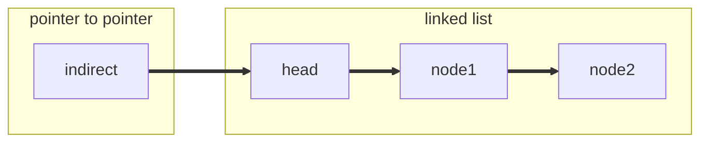

在走訪 list 時，先進行 `*indirect` (dereference `indirect` 找出其指向的 node，此刻為 head)， 接著 `(*indirect)->next` (找出它的 `->next` ，這邊為 head 的 next，即 `node1`)，然後 `indirect = &((*indirect)->next)` (將其 reference 存回 `indirect` ，此刻 `indirect` 就變更為指向 `node1` 的指標)：
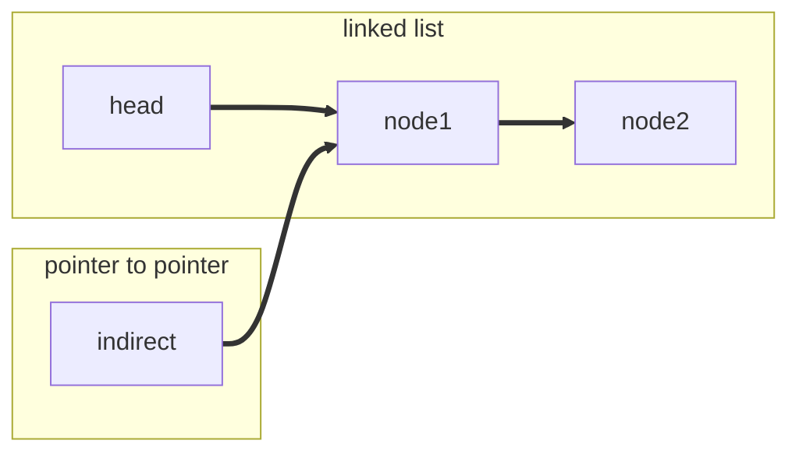

如此一來 head 從頭到尾都沒有動，直接回傳 head 就好。

:::info
從「要更新什麼位置的資料」思考，無論是 head 或者非 head，更新的是同一類型的資料，不用特別操作，自然省下額外的處理
:::

延續上述討論，我們嘗試撰寫完整的 C 程式，過程中思考「如何撰寫更優雅的程式碼」。首先是結構定義:
```c
typedef struct list_entry {
    int value;
    struct list_entry *next;
} list_entry_t;
```

要從給定的鏈結串列中，移走 (remove) 第一個符合特定數值的節點時，可撰寫以下程式碼:
```c
list_entry_t *remove(list_entry_t *head, int value)
{
    if (!head)
        return NULL;
    if (head->value == value)
        return head->next;

    list_entry_t *prev = head;
    list_entry_t *cur = head->next;
    while (cur) {
        if (cur->value == value) {
            prev->next = cur->next;
            return head;
        }
        prev = cur;
        cur = cur->next;
    }
    return head;               
}
```

這段程式碼考慮到開頭的節點是否被移走，於是要有對應的程式碼來處理特例，最終回傳新的開頭節點。改進方式為，引入一個暫時節點，使其在給定的開頭節點之前，這樣就不用特別撰寫程式碼來處理特例：
```c
list_entry_t *remove(list_entry_t *head, int value)
{
    list_entry_t dummy = {.next = head};
    for (list_entry_t *prev = &dummy; prev->next; prev = prev->next) {
        if (prev->next->value == value) {
            prev->next = prev->next->next;
            break;
        }
    }
    return dummy.next;
}
```

不過這段程式碼依舊可改進，因為我們根本不用回傳新的開頭節點，相反的，可將函式原型改為 `void remove(list_entry_t **head, int value)`，藉由間接指標來更動傳入的鏈結串列開頭節點。
> 這部分的程式碼給學員當練習題。

針對鏈結串列的新增節點的操作，考慮以下程式碼:
```c
void append(int value, list_entry_t **head)
{
    list_entry_t *direct = *head;
    list_entry_t *prev = NULL;

    list_entry_t *new = malloc(1 * sizeof(list_entry_t));
    new->value = value, new->next = NULL;

    while (direct) {
        prev = direct;           
        direct = direct->next;
    }

    if (prev)
        prev->next = new;
    else
        *head = new;
}
```

函式的參數列表中，之所以用 `list_entry_t **head`，而非 `list_entry_t *head`，是因為原本傳入的 `head` 可能會被變更，但 C 語言在參數傳遞時永遠都是傳遞數值 (副本)，於是若接受 `list_entry_t *head` 做為參數，那就要提供 `append` 函式的傳回值，也就是說，該函式原型宣告變為:
```c
list_entry_t *append(int value, list_entry_t *head);
```

如此就不優雅且顯得累贅。運用上述 indirect pointer 的技巧，我們可重寫 `append` 函式如下:
```c
void append_indirect(int value, list_entry_t **head)
{
    list_entry_t **indirect = head;

    list_entry_t *new = malloc(1 * sizeof(list_entry_t));
    new->value = value, new->next = NULL;

    while (*indirect)
        indirect = &((*indirect)->next);

    *indirect = new;
}
```

延伸閱讀:
* [Applying the Linus Torvalds "Good Taste" Coding Requirement](https://medium.com/@bartobri/applying-the-linus-tarvolds-good-taste-coding-requirement-99749f37684a)
* [Linus on Understanding Pointers](https://grisha.org/blog/2013/04/02/linus-on-understanding-pointers/)

### 案例探討: [LeetCode 21. Merge Two Sorted Lists](https://leetcode.com/problems/merge-two-sorted-lists/)

[LeetCode 21. Merge Two Sorted Lists](https://leetcode.com/problems/merge-two-sorted-lists/) 簡述:
> Merge two sorted linked lists and return it as a sorted list. The list should be made by splicing together the nodes of the first two lists.
> (給定二個已排序的 linked list，傳回合併過後的 linked list)

直觀的做法是，提供一個暫時節點，依序將內含值較小的節點串上，最後回傳暫時節點指向的次個節點:
```c
struct ListNode *mergeTwoLists(struct ListNode *L1, struct ListNode *L2) {
    struct ListNode *head = malloc(sizeof(struct ListNode));
    struct ListNode *ptr = head;
    while (L1 && L2) {
        if (L1->val < L2->val) {
            ptr->next = L1;
            L1 = L1->next;
        } else {
            ptr->next = L2;
            L2 = L2->next;
        }
        ptr = ptr->next;
    }
    ptr->next = L1 ? L1 : L2;
    return head->next;
}
```

倘若我們想避免配置暫時節點的空間 (即上方程式碼中的 `malloc`)，該怎麼做？運用上述 indirect pointer 的技巧:

```c
struct ListNode *mergeTwoLists(struct ListNode *L1,
                               struct ListNode *L2) { 
    struct ListNode *head;
    struct ListNode **ptr = &head;
    for (; L1 && L2; ptr = &(*ptr)->next) {
        if (L1->val < L2->val) {
            *ptr = L1;
            L1 = L1->next;
        } else {
            *ptr = L2;
            L2 = L2->next;
        }
    }
    *ptr = (struct ListNode *)((uintptr_t) L1 | (uintptr_t) L2);
    return head;
}
```

觀察使用 indirect pointer 版本的程式碼，其中 `if-else` 的程式碼都是將 ptr 指向下一個要接上的節點，之後將節點更新到下一個，不過要為 L1 跟 L2 分開寫同樣的程式碼，該如何簡化？可以再使用一個指標的指標來指向 L1 或 L2。
```c
struct ListNode *mergeTwoLists(struct ListNode *L1, struct ListNode *L2) {
    struct ListNode *head = NULL, **ptr = &head, **node;

    for (node = NULL; L1 && L2; *node = (*node)->next) {
        node = (L1->val < L2->val) ? &L1: &L2;
        *ptr = *node;
        ptr = &(*ptr)->next;
    }
    *ptr = (struct ListNode *)((uintptr_t) L1 | (uintptr_t) L2);
    return head;
}
```

注意 `node = L1->val < L2->val? &L1: &L2` 不能寫成 `node = &(L1->val < L2->val? L1: L2)`，依據 [C99 規格書](http://www.open-std.org/jtc1/sc22/wg14/www/docs/n1124.pdf) `6.5.15` 的註腳:
> A conditional expression does not yield an lvalue

因此無法使用 `&` (address of) 去取得 `L1->val < L2->val? L1: L2` 的地址，只能分開取得 L1 和 L2 的地址。

| expression               | dereference              | 說明                                                            |
| ------------------------ | ------------------------ | --------------------------------------------------------------- |
| `ptr = &head;`        | `head`                   | `ptr` 指向 head                                             |
| `node = &L1;`             | `L1`                       | 假設比較完 `L1` 跟 `L2` 後，<br> `node` 指向 `L1`                   |
| `*ptr = *node;`          | `head = L1;`             | 將要合併節點更新到 `head`                                     |
| `*node = (*node)->next;`   | `L1 = L1->next;`           | 因為要合併剩下的節點，所以<br>將節點更新到 `next`                   |
| `ptr = &(*ptr)->next;` | `ptr = &(head)->next;` | 將 `ptr` 指向 `head->next` 讓<br>下一輪迴圈更新 `head->next` |

[LeetCode 23. Merge k Sorted Lists](https://leetcode.com/problems/merge-k-sorted-lists/) 則將 [LeetCode 21. Merge Two Sorted Lists](https://leetcode.com/problems/merge-two-sorted-lists/) 指定的 2 個 linked list 擴充為 k 個的合併，其本質就是將分割好的 sorted lists 合併成一條，示意如下:

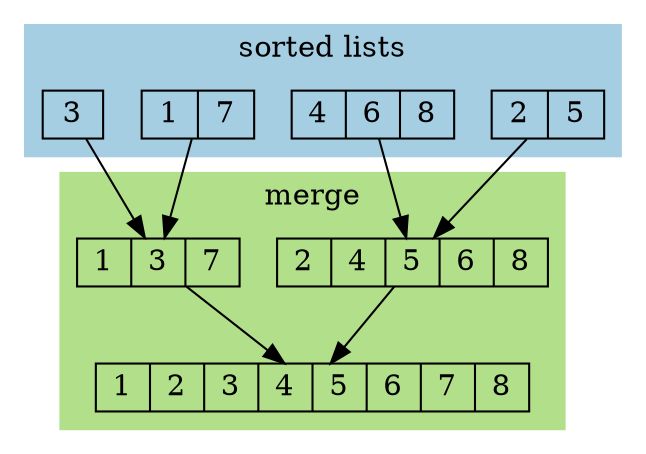

顯然在 `merge` 階段可延用上述 `mergeTwoLists` 函式，至於 list 合併的方向就是演算法勝出的關鍵，可能的思路如下:

- [ ] naive

直觀地用第一條串列接上剩下的串列，這樣會導致 `lists[0]` 愈來愈長，立即會遇到的問題是：多數的情況下合併速度會愈來愈慢。
```c
struct ListNode *mergeKLists(struct ListNode **lists, int listsSize) {
    if (listsSize == 0) return NULL;
    for (int i = 1; i < listsSize; i++)
        lists[0] = mergeTwoLists(lists[0], lists[i]);
    return lists[0];
}
```

- [ ] 頭跟尾兩兩合併

從固定第一條串列改成頭跟尾兩兩合併，直到剩一條為止，比起前一方法的每次都用愈來愈長的串列跟另一條串列合併，頭尾合併在多數的情況下兩條串列的長度比較平均，合併會比較快。

當合併完頭尾後，偶數長度會少一半，奇數長度則為 `(listsSize + 1) / 2`，奇數更新的方式也可以用在偶數長度上。
```c
struct ListNode *mergeKLists(struct ListNode **lists, int listsSize) {
    if (listsSize == 0) return NULL;
    
    while (listsSize > 1) {
        for (int i = 0, j = listsSize - 1; i < j; i++, j--)
            lists[i] = mergeTwoLists(lists[i], lists[j]);
        listsSize = (listsSize + 1) / 2;
    }
    
    return lists[0];
}
```

- [ ] 分段合併
除了頭尾合併，還可以分段存取下個要合併的串列，分別合併 `lists[i]` 跟 `lists[i + interval]`，為確保內層迴圈不會重複存取，索引值 `i` 會更新為 `i + interval * 2`，當內層迴圈合併完之後會把結果分別存到 `lists[interval*0]`, `lists[interval*2]`, `lists[interval*4]`, `lists[interval*6]`, 等等，示意如下:
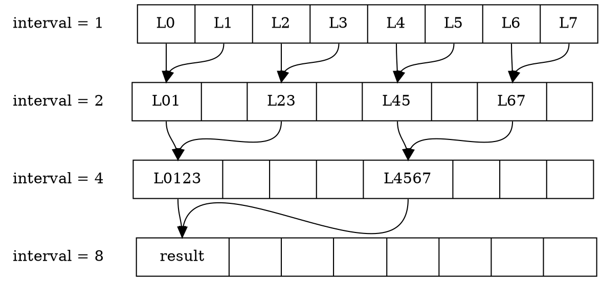

因此，外層迴圈在更新 interval 時，也要變成 2 倍，以確保進入內層迴圈存取 lists 的正確位置。
```c
struct ListNode *mergeKLists(struct ListNode **lists, int listsSize) {
    if (listsSize == 0) return NULL;
    
    for (int interval = 1; interval < listsSize; interval *= 2) 
        for (int i = 0; i + interval < listsSize; i += interval * 2) {
            lists[i] = mergeTwoLists(lists[i], lists[i + interval]);
        }
    
    return lists[0];
}
```

- [ ] Divide and Conquer
由於 lists 中的串列已排序，可視為 sorted element，直接進行 merge sort:
```c
struct ListNode *mergeKLists(struct ListNode **lists, int listsSize) {
    if (!listsSize)
        return NULL;
    if (listsSize <= 1)
        return *lists;

    int m = listsSize >> 1;
    struct ListNode *left = mergeKLists(lists, m);
    struct ListNode *right = mergeKLists(lists + m, listsSize - m);

    return mergeTwoLists(left, right);
}
```

### 案例探討: [Leetcode 2095. Delete the Middle Node of a Linked List](https://leetcode.com/problems/delete-the-middle-node-of-a-linked-list/)

[Leetcode 2095. Delete the Middle Node of a Linked List](https://leetcode.com/problems/delete-the-middle-node-of-a-linked-list/) 簡述:
> You are given the head of a linked list. Delete the middle node, and return the head of the modified linked list.
(給定一條鏈結串列，並刪除中間的節點)

若不考慮釋放掉中間的節點，可用指標的指標，搭配快慢指標的技巧來實作:
```c
struct ListNode *deleteMiddle(struct ListNode *head) {
    struct ListNode **indir = &head;
    for (struct ListNode *fast = head; fast && fast->next; fast = fast->next->next) 
        indir = &(*indir)->next;
    *indir = (*indir)->next;
    return head;
}
```

倘若要釋放中間的節點，可以再用一個指標 `prev` 跟隨於 `indir` 之後，當迴圈走訪完，`indir` 會指向鏈結串列中間的節點，之後 `prev` 再指向 `indir` 的下個節點，整個執行流程如下:


對應的程式碼:
```c
struct ListNode *deleteMiddle(struct ListNode *head) {
    if (!head->next) return NULL;
    
    struct ListNode **indir = &head, *prev = NULL;
    for (struct ListNode *fast = head; fast && fast->next; fast = fast->next->next) {
        prev = *indir;
        indir = &(*indir)->next;
    }
    prev->next = (*indir)->next;
    free(*indir);
    return head;
}
```

上述的程式碼看似正確，一旦提交後則會被 [Leetcode](https://leetcode.com/) 內建的 [Address Sanitizer](https://github.com/google/sanitizers) 偵測到 [heap-use-after-free](https://github.com/google/sanitizers/wiki/AddressSanitizerExampleUseAfterFree)。

考慮給定的鏈結串列為 `[1, 3, 4, 7, 1, 2, 6]`，上述的程式碼在迴圈結束後，`*indir` 會指向內容為 `7` 的節點 (以下記做 node~7~)，`prev` 緊隨其後指向內容為 `4` 的節點 (以下記做 node~4~)，換言之，`prev->next` 就是 `*indir`。

找出 `indir` 跟 `prev` 所指向的節點與關係後，可知 `prev->next = (*indir)->next;` 相當於 `(*indir) = (*indir)->next;`，即 `*indir` 從 node~4~ 指向 node~1~。

查閱 [C99 規格書](http://www.open-std.org/jtc1/sc22/wg14/www/docs/n1124.pdf#page=44) 6.2.4.2
> If an object is referred to outside of its lifetime, the behavior is undefined. The value of a pointer becomes indeterminate when the object it points to (or just past) reaches the end of its lifetime.

因此 `free(*indir)` 會釋放 node~1~ 對應的記憶體，因此在驗證階段時，會被偵測到 [heap-use-after-free](https://github.com/google/sanitizers/wiki/AddressSanitizerExampleUseAfterFree)。
> 延伸閱讀 [你所不知道的 C 語言：指標篇](https://hackmd.io/@sysprog/c-pointer)

若要修正這個問題，可藉由新的指標 `next` 來保存 `(*indir)->next`，方可在 `indir` 釋放掉後再以 `next` 更新。
```c
struct ListNode *deleteMiddle(struct ListNode *head) {
    if (!head->next) return NULL;
    
    struct ListNode **indir = &head, *prev = NULL;
    for (struct ListNode *fast = head; fast && fast->next; fast = fast->next->next) {
        prev = *indir;
        indir = &(*indir)->next;
    }
    struct ListNode *next = (*indir)->next;
    free(*indir);
    prev->next = next; // *indir = next
    return head;
}
```

倘若要釋放中間的節點，需額外用一個指標記錄欲釋放的物件。執行完 for 迴圈後，鏈結串列和 `indir` 如下圖。其中 `indir` 指向的是指向 node~7~ 的指標 (即 node~4~ 的 `next` 指標)：

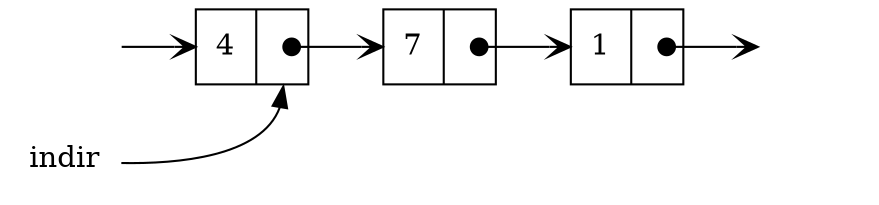

當我們要從鏈結串列中移去並釋放 node~7~，只要用一個指標 `del` 指向 node~7~ (即 `del = *indir`)，並將 node~4~ 的 `next` 指標更改為指向 node~1~ (即 `*indir = (*indir)->next`)，示意圖如下：

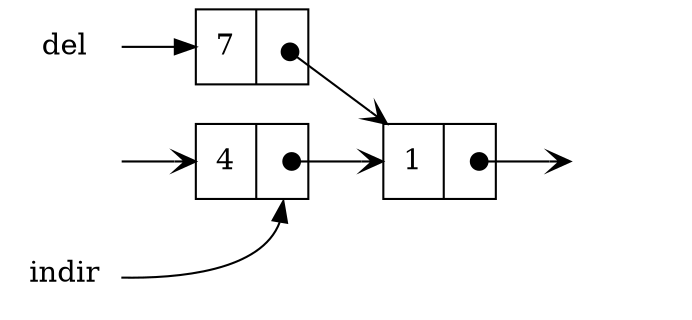

最後再釋放 node~7~ 所在的空間，對應的程式碼如下：
```c
struct ListNode *deleteMiddle(struct ListNode *head) {
    struct ListNode **indir = &head;
    for (struct ListNode *fast = head; fast && fast->next; fast = fast->next->next)
        indir = &(*indir)->next;
    struct ListNode *del = *indir;
    *indir = (*indir)->next;
    free(del);
    return head;
}
```


### 案例探討: [LeetCode 86. Partition List](https://leetcode.com/problems/partition-list/)

>Given the head of a linked list and a value x, partition it such that all nodes less than x come before nodes greater than or equal to x.
>
>You should preserve the original relative order of the nodes in each of the two partitions.
> (給定一個鏈結串列跟整數 x，將串列分割成兩組，比 x 小的節點置前，大於或等於 x 的節點置後，應維持分割前的順序)

例如輸入為 `[1, 4, 3, 2, 5, 2]`, x = 3
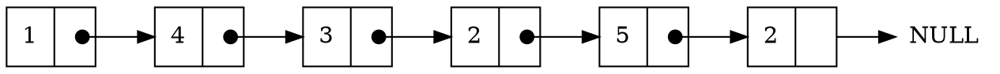

輸出 `[1, 2, 2, 4, 3, 5]`
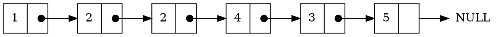
> 第一個節點內容為 `1`，小於 `x` 的值，而後續的節點對應的數值均大於或等於 `x` 的值

直觀的做法是配置兩個暫時節點分別保存「節點的數值小於 `x`」和「節點的數值大於等於 `x`」的鏈結串列，分割後再以前者 (即節點數值均「小於 `x`」的鏈結串列) 合併另一者。

注意，「大於等於 `x`」的鏈結串列要將最後一個節點的 `next` 指向 `NULL`，例如範例的 node~5~ 的下個節點指向 node~2~，如果沒有將 node~5~ 的下一個指向 `NULL`，會在執行時期陷入無窮迴圈，從而被 LeetCode 驗證系統判定為超時。
```c
static struct ListNode *new_node()
{
    struct ListNode *node = malloc(sizeof(struct ListNode));
    node->val = 0, node->next = NULL;
    return node;
}

struct ListNode *partition(struct ListNode *head, int x)
{
    struct ListNode *l1 = new_node(), *l2 = new_node();
    
    struct ListNode *ptr1 = l1, *ptr2 = l2;
    for (; head; head = head->next) {
        if (head->val < x) {
            ptr1->next = head;
            ptr1 = ptr1->next;
        } else {
            ptr2->next = head;
            ptr2 = ptr2->next;
        }
    }
	
    ptr2->next = NULL;
    ptr1->next = l2->next;
    return l1->next;
}
```

我們可運用上述間接指標的技巧，分別指向兩條要合併的串列，從而避免動態記憶體配置:
```c
struct ListNode *partition(struct ListNode *head, int x)
{
    struct ListNode *l2 = NULL;
    struct ListNode **p1 = &head, **p2 = &l2;
    
    for (struct ListNode *node = head; node; node = node->next) {
        if (node->val < x) {
            *p1 = node;
            p1 = &(*p1)->next;
        } else {
            *p2 = node;
            p2 = &(*p2)->next;
        }
    }
	
    *p1 = l2;
    *p2 = NULL;
    return head;
}
```

不難發現，在 `if-else` 中的 p1 跟 p2 是一樣的操作，且 p1 跟 p2 都是指標的指標，可否進一步精簡程式碼？這時又可利用「指標的指標的指標」來簡化程式碼，但要注意 dereference 的型態是「指標」，抑或是「指標的指標」。

宣告「指標的指標的指標」`indir` 指向要被更新節點，如 `p1`，再 dereference 兩次 (`**indir`) 就會得到指標型態的 `p1` 所指向的節點並將 `node` 指派到 `p1`。

更新 p1 到下個節點前，應進行 dereference (`*indir`) 以取得指標的指標 p1，再透過 dereference indir 兩次並取得 next 後用 address-of 運算子得到指標的指標，再指派回 p1 即可完成更新。
```c
struct ListNode *partition(struct ListNode *head, int x)
{
    struct ListNode *l2 = NULL;
    struct ListNode **p1 = &head, **p2 = &l2;
    
    for (struct ListNode *node = head; node; node = node->next) {
        struct ListNode ***indir = node->val < x ? (&p1): (&p2);
        **indir = node;
        *indir = &(**indir)->next;
    }
	
    *p1 = l2;
    *p2 = NULL;
    return head;
}
```

| 表示式 | dereference | 說明 |
| ---- | --- | --- |
| `***indir = &p1;`             | `p1`                       | 假設比較完 `node->val` 跟 `x`，`indir` 指向 `p1`                   |
| `**indir = node;`          | `(*p1) = node;`             | 將小於 x 的節點更新到 `p1`                                     |
| `*indir = &(**indir)->next;` | `p1 = &(*p1)->next;` | 將 `p1` 指向 `p1->next` 讓下輪迴圈更新 `p1` |

## circular linked list

環狀鏈結串列 (circular linked list) 是鏈結串列的最後一個節點所指向的下一個節點，會是第一個節點，而不是指向 `NULL`:


其優點為:
* 從 head 找到 tail 的時間複雜度為 $O(n)$，但若新增一個 tail pointer (此為 last) 時間複雜度可降為 $O(1)$
    > [示意動畫](https://youtu.be/kErHUGvFrNg)
* 容易做到反向查詢
* 若要走訪整個 linked list，任何節點都可作為起始節點
* 避免保留 `NULL` 這樣特別的記憶體地址 (在沒有 MMU 的 [bare metal](https://en.wikipedia.org/wiki/Bare_machine) 環境中，`(void *) 0` 地址空間存取時，沒有特別的限制)

用「龜兔賽跑」([Floyd's Cycle detection](https://en.wikipedia.org/wiki/Cycle_detection)) 來偵測是否有 cycle 產生。

有 3 種狀態需要做討論
> * $a$ 為起始點
> * $b$ 為連接點
> * $c$ 為龜兔相遇位置

- [ ] 狀況 1: cycle 在中間
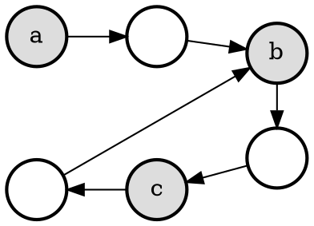

- [ ] 狀況 2: 頭尾相連
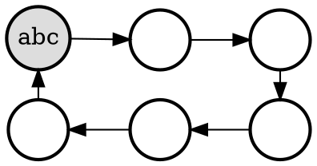

- [ ] 狀況 3: 尾尾相連
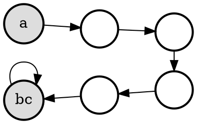

我們需要求得 a, b, c 三點位置，才能進行處理。
假設 $\overline{ac}$ 距離為 $X$ ，這代表 tortoise 行經 $X$ 步，那麼 hare 走了 $2X$ 步，$X$ 數值為多少並不重要，只代表要花多少時間兩點才會相遇，不影響求出 $\mu$ 和 $\lambda$。

接下來要分成三個步驟來處理
1. tortoise 速度為每次一步，hare 為每次兩步，兩者同時從起點 $a$ 出發，相遇時可以得到點 $c$。若是上述「狀況 2: 頭尾相連」，在第 1 步結束就求完三點了
2. 兩者分別從點 $a$ 和 $c$ 出發，速度皆為一次一步，相遇時可得到點 $b$。因為 $\overline{ac}$ 長度為 $X$，那麼 $cycle$ $c$ 長度也為 $X$，相遇在點 $b$ 時，所走的距離剛好都是 $X - \overline{bc}$
3. 從點 $b$ 出發，速度為一次一步，再次回到點 $b$ 可得到 cycle 的長度

- [ ] cycle finding

如果只需要判斷是否為 circular linked list，那麼只要執行上述的第 1 部分。

除了計算 $\mu$ 和 $\lambda$，還需要記錄整個串列的長度，若不記錄，會影響到後續進行 sorting 一類的操作。

```c
static inline Node *move(Node *cur) { return cur ? cur->next : NULL; }

bool cycle_finding(Node *HEAD, Node **TAIL, int *length, int *mu, int *lambda) {
    // lambda is cycle length
    // mu is the meet node's index
    Node *tortoise = move(HEAD);
    Node *hare = move(move(HEAD));

    // get meet point
    while (hare && tortoise && (hare != tortoise)) { 
        tortoise = move(tortoise);
        hare = move(move(hare));
    }

    // not loop
    if (!hare) {
        *TAIL = NULL;
        *length = 0;
        tortoise = HEAD;
        while (tortoise && (tortoise = move(tortoise)))
            (*length)++;
        return false;
    }

    // get mu
    *mu = 0;
    tortoise = HEAD;
    while (tortoise != hare) {
        (*mu)++;
        tortoise = tortoise->next;
        hare = hare->next;
    }

    // get lambda
    *lambda = 1;
    tortoise = move(tortoise);
    *TAIL = tortoise;
    while (tortoise != hare) {
        *TAIL = tortoise;
        (*lambda)++;
        tortoise = move(tortoise);
    }
    *length = *mu + *lambda;

    return true;
}
```

> 延伸閱讀: [探索 Floyd Cycle Detection Algorithm](https://medium.com/@orionssl/%E6%8E%A2%E7%B4%A2-floyd-cycle-detection-algorithm-934cdd05beb9)

LeetCode 相關題目:
* [141. Linked List Cycle](https://leetcode.com/problems/linked-list-cycle/)
* [142. Linked List Cycle II](https://leetcode.com/problems/linked-list-cycle-ii/)
* [146. LRU Cache](https://leetcode.com/problems/lru-cache/)
* [金刀的演算法手册](https://github.com/glodknife/algorithm)

## Merge Sort 的實作

Merge sort 是經典排序演算法，以串列為例，將串列分割成排序好的子串列，再將所有排序好的子串列合併在一起。

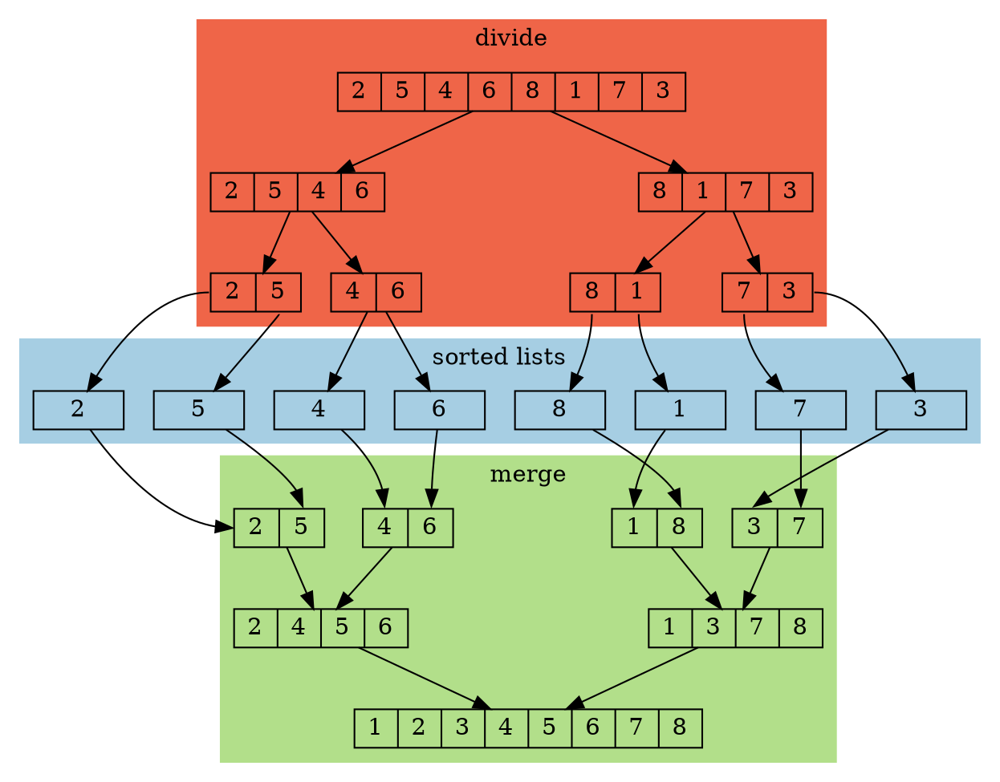

採用遞迴呼叫，搭配前述 slow-fast 指標將串列左右對半切分，直到分割成單一節點再合併成排序好的串列，對應實作如下:
```c
static node_t *mergesort_list(node_t *head) {
    if (!head || !head->next) return head;

    node_t *slow = head;
    for (node_t *fast = head->next; fast && fast->next; fast = fast->next->next)
        slow = slow->next;
    node_t *mid = slow->next;
    slow->next = NULL;

    node_t *left = mergesort_list(head), *right = mergesort_list(mid);
    return mergeTwoLists(left, right);
}

void mergesort(node_t **list) { *list = mergesort_list(*list); }
```

### 非遞迴的實作

如何將上述 merge sort 從遞迴轉成迭代？可善用之前探討過的 [merge K Lists](https://leetcode.com/problems/merge-k-sorted-lists/) 程式碼。

- [ ] 原始的迭代版 merge sort
```c
void mergesort_iter(node_t **list) {
    node_t *head = *list;
    if (!head || !head->next)
        return;

    node_t *result = NULL;
    node_t *stack[1000];
    int top = 0;
    stack[top] = head;

    while (top >= 0) {
        node_t *left = stack[top--];

        if (left) {
            node_t *slow = left;
            node_t *fast;

            for (fast = left->next; fast && fast->next; fast = fast->next->next)
                slow = slow->next;
            node_t *right = slow->next;
            slow->next = NULL;

            stack[++top] = left;
            stack[++top] = right;
        } else
            result = mergeTwoLists(result, stack[top--]);
    }
    *list = result;
}
```

naive 是將單一節點逐個合併，速度非常慢，所以改成將分割好的節點存進指標陣列 lists 改成頭尾合併來改善效能。


- [ ] 初步改進
```c
void mergesort_iter(node_t **list) {
    node_t *head = *list;
    if (!head || !head->next)
        return;

    int top = 0;
    int listsSize = 0;
    node_t *stack[1000] = {NULL};
    node_t *lists[100000] = {NULL};
    stack[top] = head;

    // divide to single node
    while (top >= 0) {
        node_t *left = stack[top--];

        if (left) {
            node_t *slow = left;
            node_t *fast;

            for (fast = left->next; fast && fast->next; fast = fast->next->next)
                slow = slow->next;
            node_t *right = slow->next;
            slow->next = NULL;

            stack[++top] = left;
            stack[++top] = right;
        } else
            lists[listsSize++] = stack[top--];
    }

    // merge K sorted lists
    while (listsSize > 1) {
        for (int i = 0, j = listsSize - 1; i < j; i++, j--)
            lists[i] = mergeTwoLists(lists[i], lists[j]);
        listsSize = (listsSize + 1) / 2;
    }
    *list = lists[0];
}
```

觀察初步改進後的實作，可將迭代版 merge sort 拆成**分割階段**與**合併階段**來實作並持續改進，進而延伸出各種組合，接下來分別探討兩種階段的實作。

回顧 merge sort 的概念，將串列分割成排序好的子串列，再將所有排序好的子串列合併在一起。
* 分割 $\to$ 將 list 分割成 sorted lists
* 合併 $\to$ 將 sorted lists 合併在一起

> 延伸閱讀: [Merge Sort 與它的變化](https://hackmd.io/@lambert-wu/list-merge-sort)


## Linked list 在 Linux 核心原始程式碼

[linux/list.h](https://github.com/torvalds/linux/blob/master/include/linux/list.h) 是 Linux 核心中相當實用的 circular doubly-linked list (雙向環狀鏈結串列，以下簡稱 `list`) 封裝，只要在自定義的結構中加入 `struct list_head`，就可以搭配 Linux 中一系列的 linked list 操作 (詳見 [The Linux Kernel API - List Management Functions](https://www.kernel.org/doc/html/latest/core-api/kernel-api.html)) 來建立自定義結構的 linked list。在 Linux 行程 (process) 管理的相關實作中可見到應用，例如 [sched.h](https://github.com/torvalds/linux/blob/v5.15/include/linux/sched.h) 中約出現 20 處，程式碼部分摘錄如下:
```c=527
struct sched_entity {
    /* For load-balancing: */
    struct load_weight      load;
    struct rb_node          run_node;
    struct list_head        group_node;
    unsigned int            on_rq;
    ...
};
```

list 的關鍵概念是，將結構體 `list_head` 嵌入到所需的結構體中，再藉由稍後會提及的 `container_of` 巨集得知 list 個別節點的地址。示意如下圖:


自 `Head` 開始，鏈結 list 各節點，個別節點皆嵌入 `list_head` 結構體，不過 `Head` 是個特例，無法藉由 `container_of` 巨集來找到對應的節點，因為後者並未嵌入到任何結構體之中，其存在是為了找到 list 整體。

好處在於，只要 `list_head` 納入新的結構體的一個成員，即可操作，且不用自行維護一套 doubly-linked list。

> 參考: [Intrusive linked lists](https://www.data-structures-in-practice.com/intrusive-linked-lists/)
> [FreeRTOS](http://wiki.csie.ncku.edu.tw/embedded/freertos) 的任務管理也採用 linked list

圖解如下:
- [ ] `list_head` 結構體
```c
struct list_head { struct list_head *prev, *next; };
```

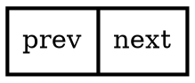

- [ ] 在自行定義的結構體置入 `list_head` 物件
```c
typedef struct {
    char *value;
    struct list_head list;
} my_data;
```

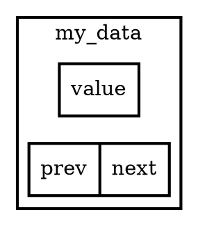

簡化為下圖：
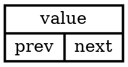

- [ ] `LIST_HEAD - Declare list head and initialize it`
```c
#define LIST_HEAD(head) struct list_head head = {&(head), &(head)}
```

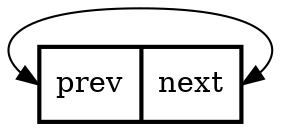

- [ ] `list_entry() - Calculate address of entry that contains list node`
```c
#define list_entry(node, type, member) container_of(node, type, member)
```

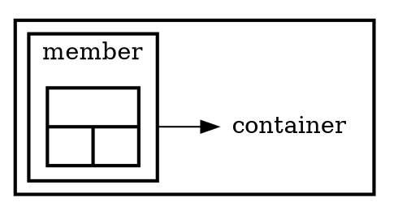

- [ ] `list_for_each - iterate over list nodes`
```c
#define list_for_each(node, head) \
    for (node = (head)->next; node != (head); node = node->next)
```

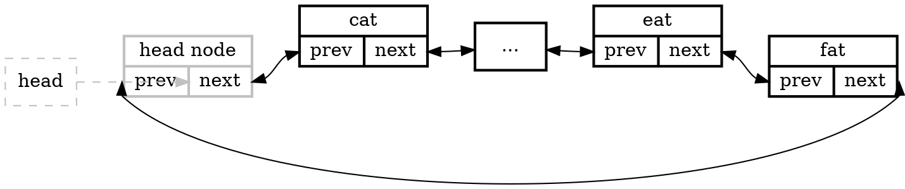

Linux 核心的 `list` 也在 [hash table](https://en.wikipedia.org/wiki/Hash_table) 的實作中出現，詳見 [List, HList, and Hash Table](https://danielmaker.github.io/blog/linux/list_hlist_hashtable.html)。
> 延伸閱讀: [hash table](https://hackmd.io/@ChialiangKuo/quiz6B-hash-table)

### 簡化的實作

Linux 核心原始程式碼變動快，為了後續探討方便，我們自 Linux 核心抽離出關鍵程式碼，建立 [sysprog21/linux-list](https://github.com/sysprog21/linux-list) 專案，讓學員得以理解箇中奧秘並進行相關實驗。

#### `container_of()`

為了提升程式碼的可攜性 (portability)，C89/C99 提供 [offsetof](https://man7.org/linux/man-pages/man3/offsetof.3.html) 巨集，可接受給定成員的型態及成員的名稱，傳回「成員的位址減去 struct 的起始位址」。示意如下:


[offsetof](https://man7.org/linux/man-pages/man3/offsetof.3.html) 定義於 `<stddef.h>`。

巨集 `container_of` 則在 [offsetof](https://man7.org/linux/man-pages/man3/offsetof.3.html) 的基礎上，擴充為「給定成員的位址、struct 的型態，及成員的名稱，傳回此 struct 的位址」，示意如下圖:


在 `container_of` 巨集出現前，程式設計的思維往往是:
1. 給定結構體起始地址
2. 求出結構體特定成員的記憶體內容
3. 傳回結構體成員的地址，作日後存取使用

`container_of` 巨集則逆轉上述流程，例如 `list_entry` 巨集利用 `container_of` 巨集，從 `struct list_head` 這個公開介面，「反向」去存取到自行定義的結構體開頭地址。

> 延伸閱讀: [Linux 核心原始程式碼巨集: `container_of`](https://hackmd.io/@sysprog/linux-macro-containerof)

#### `LIST_HEAD()` / `INIT_LIST_HEAD()`
```c
#define LIST_HEAD(head) struct list_head head = {&(head), &(head)}

static inline void INIT_LIST_HEAD(struct list_head *head) {
    head->next = head;
    head->prev = head;
}
```

初始化 `struct list_head`，先將 `next` 和 `prev` 都指向自身。`head` 指向的結構體之中的 `next` 成員表示 linked list 結構的開頭，而 `prev` 則指向結構體的結尾。

#### `list_add` / `list_add_tail`
```c
static inline void list_add(struct list_head *node, struct list_head *head) {
    struct list_head *next = head->next;

    next->prev = node;
    node->next = next;
    node->prev = head;
    head->next = node;
}

static inline void list_add_tail(struct list_head *node, struct list_head *head) {
    struct list_head *prev = head->prev;

    prev->next = node;
    node->next = head;
    node->prev = prev;
    head->prev = node;
}
```

將指定的 `node` 插入 linked list `head` 的開頭或者結尾。

#### `list_del`
```c
static inline void list_del(struct list_head *node) {
    struct list_head *next = node->next;
    struct list_head *prev = node->prev;

    next->prev = prev;
    prev->next = next;

#ifdef LIST_POISONING
    node->prev = (struct list_head *) (0x00100100);
    node->next = (struct list_head *) (0x00200200);
#endif
}
```

本函式將 `node` 從其所屬的 linked list 結構中移走。注意 `node` 本體甚至是包含 `node` 的結構所分配的記憶體，在此皆未被釋放，僅僅是將 `node` 從其原本的 linked list 連接移除。亦即，使用者需自行管理記憶體。

`LIST_POISONING` 巨集一旦定義，將讓已被移走的 `node` 節點再存取時，觸發作業系統的例外狀況：對於 `next` 或者 `prev` 的存取，會觸發執行時期的 invalid memory access (若系統禁止 predefined memory access)。

#### `list_del_init`
```c
static inline void list_del_init(struct list_head *node) {
    list_del(node);
    INIT_LIST_HEAD(node);
}
```

以 `list_del` 為基礎，但移除的 `node` 會額外呼叫 `INIT_LIST_HEAD` 把 `prev` 和 `next` 指向自身。

#### `list_empty`
```c
static inline int list_empty(const struct list_head *head) {
    return (head->next == head);
}
```

檢查 `head` 的 `next` 是否指向自身，確認 list 是否為 empty 狀態。

#### `list_is_singular`
```c
static inline int list_is_singular(const struct list_head *head) {
    return (!list_empty(head) && head->prev == head->next);
}
```

若 `head` 非 empty 狀態且 `prev` 和 `next` 是同一個節點，表示 linked list 只有一個節點。

#### `list_splice` / `list_splice_tail`
```c
static inline void list_splice(struct list_head *list, struct list_head *head) {
    struct list_head *head_first = head->next;
    struct list_head *list_first = list->next;
    struct list_head *list_last = list->prev;

    if (list_empty(list))
        return;

    head->next = list_first;
    list_first->prev = head;

    list_last->next = head_first;
    head_first->prev = list_last;
}

static inline void list_splice_tail(struct list_head *list,
                                    struct list_head *head) {
    struct list_head *head_last = head->prev;
    struct list_head *list_first = list->next;
    struct list_head *list_last = list->prev;

    if (list_empty(list))
        return;

    head->prev = list_last;
    list_last->next = head;

    list_first->prev = head_last;
    head_last->next = list_first;
}
```

將 `list` 的所有 node 都插入到 `head` 的開始 / 結束位置中。注意 `list` 本身仍維持原貌。

#### `list_splice_init` / `list_splice_tail_init`
```c
static inline void list_splice_init(struct list_head *list,
                                    struct list_head *head) {
    list_splice(list, head);
    INIT_LIST_HEAD(list);
}

static inline void list_splice_tail_init(struct list_head *list,
                                         struct list_head *head) {
    list_splice_tail(list, head);
    INIT_LIST_HEAD(list);
}
```

這二個函式類似 `list_splice` 及 `list_splice_tail`，但移除的 `list` 會額外呼叫 `INIT_LIST_HEAD` 把 `prev` 和 `next` 指向自身。

#### `list_cut_position`
```c
static inline void list_cut_position(struct list_head *head_to,
                                     struct list_head *head_from,
                                     struct list_head *node) {
    struct list_head *head_from_first = head_from->next;

    if (list_empty(head_from))
        return;

    if (head_from == node) {
        INIT_LIST_HEAD(head_to);
        return;
    }

    head_from->next = node->next;
    head_from->next->prev = head_from;

    head_to->prev = node;
    node->next = head_to;
    head_to->next = head_from_first;
    head_to->next->prev = head_to;
}
```

將從 `head_from` 的第一個節點到 `node` 間的一系列節點都移動到 `head_to` 上。`head_to` 必須是 empty 狀態 (`next` 和 `prev` 都指向自己)，否則可能發生 memory leak。

#### `list_move` / `list_move_tail`
```c
static inline void list_move(struct list_head *node, struct list_head *head) {
    list_del(node);
    list_add(node, head);
}

static inline void list_move_tail(struct list_head *node,
                                  struct list_head *head) {
    list_del(node);
    list_add_tail(node, head);
}
```

將 `node` 從原本的 linked list 移動到另一個 linked list `head` 的開頭或尾端。

#### `list_entry`
```c
#define list_entry(node, type, member) container_of(node, type, member)
```

`container_of` 等價的包裝，符合以 `list_` 開頭的命名慣例，此處的 entry 就是 list 內部的節點。

#### `list_first_entry` / `list_last_entry`
```c
#define list_first_entry(head, type, member) \
    list_entry((head)->next, type, member)

#define list_last_entry(head, type, member) \
    list_entry((head)->prev, type, member)
```

取得 linked list 的開頭或者結尾的 entry。

#### `list_for_each`
```c
#define list_for_each(node, head) \
    for (node = (head)->next; node != (head); node = node->next)
```

走訪整個 linked list。注意: `node` 和 `head` 不能在迴圈中被更改 (可能在多工環境中出現)，否則行為不可預期。

#### `list_for_each_entry`
```c
#ifdef __LIST_HAVE_TYPEOF
#define list_for_each_entry(entry, head, member)                       \
    for (entry = list_entry((head)->next, __typeof__(*entry), member); \
         &entry->member != (head);                                     \
         entry = list_entry(entry->member.next, __typeof__(*entry), member))
#endif
```

走訪包含 `struct list_head` 的另外一個結構之 entry。`entry` 和 `head` 不能在迴圈中被更改，否則行為不可預期。
* 因為 `typeof` 之限制，只能在 GNUC 下使用

#### `list_for_each_safe` / `list_for_each_entry_safe`
```c
#define list_for_each_safe(node, safe, head)                     \
    for (node = (head)->next, safe = node->next; node != (head); \
         node = safe, safe = node->next)
         
#define list_for_each_entry_safe(entry, safe, head, member)                \
    for (entry = list_entry((head)->next, __typeof__(*entry), member),     \
        safe = list_entry(entry->member.next, __typeof__(*entry), member); \
         &entry->member != (head); entry = safe,                           \
        safe = list_entry(safe->member.next, __typeof__(*entry), member))
```

透過額外的 `safe` 紀錄每個迭代 (iteration) 所操作的節點的下一個節點，因此目前的節點可允許被移走，其他操作則同為不可預期行為。

### Linux 核心風格 Linked List 應用案例

從一些範例來看 Linux 核心風格 linked list 實際的使用方式。

#### Quick sort (遞迴版本)

[sysprog21/linux-list](https://github.com/sysprog21/linux-list) 專案中的 [quick-sort.c](https://github.com/sysprog21/linux-list/blob/master/examples/quick-sort.c) 程式碼。

```c
static void list_qsort(struct list_head *head) {
    struct list_head list_less, list_greater;
    struct listitem *pivot;
    struct listitem *item = NULL, *is = NULL;

    if (list_empty(head) || list_is_singular(head))
        return;

    INIT_LIST_HEAD(&list_less);
    INIT_LIST_HEAD(&list_greater);
```

先確認 `head` 所承載的 linked list 有兩個以上 entry，否則就返回，不用排序。以 `INIT_LIST_HEAD` 初始化另外兩個 list 結構，它們分別是用來插入 entry 中比 pivot 小或者其他的節點。

```c
    pivot = list_first_entry(head, struct listitem, list);
    list_del(&pivot->list);

    list_for_each_entry_safe (item, is, head, list) {
        if (cmpint(&item->i, &pivot->i) < 0)
            list_move_tail(&item->list, &list_less);
        else
            list_move_tail(&item->list, &list_greater);
    }   
```

藉由 `list_first_entry` 取得第一個 entry 選為 pivot:
* `list_del` 將該 pivot entry 從 linked list 中移除
* 走訪整個 linked list，`cmpint` 回傳兩個指標中的值相減的數值，因此小於 `0` 意味著 `item->i` 的值比 `pivot` 的值小，加入 `list_less`，反之則同理

```c
    list_qsort(&list_less);
    list_qsort(&list_greater);

    list_add(&pivot->list, head);
    list_splice(&list_less, head);
    list_splice_tail(&list_greater, head);
}
```

藉由遞迴呼叫將 `list_less` 和 `list_greater` 排序。在 `list_for_each_entry_safe` 中，`list_move_tail` 會將所有原本在 `head` 中的節點移出，因此首先 `list_add` 加入 `pivot`，再把已經排好的 `list_less` 放在 pivot 前，`list_greater` 放在 pivot 後，完成排序。


#### Quick sort (非遞迴)

參考 [Optimized QuickSort: C Implementation (Non-Recursive)](https://alienryderflex.com/quicksort/)，嘗試實作非遞迴的 quick sort。

```c
static void list_qsort_no_recursive(struct list_head *head) {
    struct listitem *begin[MAX_LEN], *end[MAX_LEN], *L, *R;
    struct listitem pivot;
    int i = 0;

    begin[0] = list_first_entry(head, struct listitem, list);
    end[0] = list_last_entry(head, struct listitem, list);
```

`begin` 和 `end` 表示在 linked list 中的排序目標的開頭和結尾，因此最初是整個 linked list 的頭至尾。

```c
    while (i >= 0) {
        L = begin[i];
        R = end[i];
```

`begin` 和 `end` 的效果類似 stack，會填入每一輪要處理的節點開頭至結尾 ，因此先取出該輪的頭尾至 `L` 和 `R`。

```c
        if (L != R && &begin[i]->list != head) {
            // pivot is the actual address of L
            pivot = *begin[i];
            if (i == MAX_LEN - 1) {
                assert(-1);
                return;
            }
```

接著，以最開頭的節點作為 pivot。
* `i == MAX_LEN - 1` 的目的是額外檢查這輪如果填入 `begin` 和 `end` 是否會超出原本給定的陣列大小，因為我們所給予的空間是有限的

```c
            while (L != R) {
                while (R->i >= pivot.i && L != R)
                    R = list_entry(R->list.prev, struct listitem, list);
                if (L != R) {
                    L->i = R->i;
                    L = list_entry(L->list.next, struct listitem, list);
                }

                while (L->i <= pivot.i && L != R)
                    L = list_entry(L->list.next, struct listitem, list);
                if (L != R) {
                    R->i = L->i;
                    R = list_entry(R->list.prev, struct listitem, list);
                }
            }
```

否則的話，從結尾的點(`R`)一直往 `prev` 前進，找到比 `pivot` 值更小的節點的話就將其值移到開頭的 `L` 去。同理，從開頭的點(`L`)一直往 `next` 前進，找到比 `pivot` 值更大的節點的話，就將其值移到結尾的 `R` 去
* `L != R` 則負責判斷當 `L` 往 `next` 而 `R` 往 `prev` 移動碰在一起時，當 `L == R` 時，不再做上述的操作，離開迴圈

```c
            L->i = pivot.i;
            begin[i + 1] = list_entry(L->list.next, struct listitem, list);
            end[i + 1] = end[i];
            end[i++] = L;
```

此時 `L` 所在地方是 `pivot` 的值應在的正確位置，因此將 `pivot` 的值填入 `L`。此時需要被處理的排序是 `pivot` 往後到結尾的一段，兩個點分別是 `L` 的 `next`，和這輪的 `end[i]`
* 另一段則是 `pivot` 以前從原本的 `begin[i]` 到 `L` 一段

```c
        } else
            i--;
    }
}
```

如果 `L == R` 或者  `&begin[i]->list == head`，表示此段 linked list 已經不需要再做處理，`i--` 類似於 pop stack 的操作。

### Linux 核心原始程式碼
對比 [sysprog21/linux-list](https://github.com/sysprog21/linux-list) 與 [linux/list.h](https://github.com/torvalds/linux/blob/master/include/linux/list.h) 的實作，會發現最大的差異在於 `WRITE_ONCE` 巨集的使用。

我們可以比較 `list_add` 來探討差異的細節
- [ ] [sysprog21/linux-list](https://github.com/sysprog21/linux-list/blob/master/include/list.h#L94)
```c
static inline void list_add(struct list_head *node, struct list_head *head) {
    struct list_head *next = head->next;

    next->prev = node;
    node->next = next;
    node->prev = head;
    head->next = node;
}
```

- [ ] [linux/list.h](https://github.com/torvalds/linux/blob/master/include/linux/list.h#L84)
```c
static inline void __list_add(struct list_head *new,
			      struct list_head *prev,
			      struct list_head *next) {
    if (!__list_add_valid(new, prev, next))
        return;

    next->prev = new;
    new->next = next;
    new->prev = prev;
    WRITE_ONCE(prev->next, new);
}

static inline void list_add(struct list_head *new, struct list_head *head)
{
    __list_add(new, head, head->next);
}
```

乍看之下，若將 `WRITE_ONCE(prev->next, new)` 替換成 `prev->next = new`，兩者一樣嗎？

`WRITE_ONCE` 定義在 [linux/tools/include/linux/compiler.h](https://github.com/torvalds/linux/blob/master/tools/include/linux/compiler.h#L184) 路徑下，我們可以從註解中對其作用進行理解:
> Prevent the compiler from merging or refetching reads or writes. The compiler is also forbidden from reordering successive instances of READ_ONCE and WRITE_ONCE, but only when the compiler is aware of some particular ordering. One way to make the compiler aware of ordering is to put the two invocations of READ_ONCE or WRITE_ONCE in different C statements.

藉由 `WRITE_ONCE` 和 `READ_ONCE` 的使用，可以避免編譯器合併、切割、甚至重排特定的記憶體讀寫操作。下面是 `WRITE_ONCE` 的定義:
```c
#define WRITE_ONCE(x, val)				\
({							\
	union { typeof(x) __val; char __c[1]; } __u =	\
		{ .__val = (val) }; 			\
	__write_once_size(&(x), __u.__c, sizeof(x));	\
	__u.__val;					\
})
```

我們可以再次看到 [statement expression](https://gcc.gnu.org/onlinedocs/gcc/Statement-Exprs.html) 技巧的應用。此外，可以看到 `WRITE_ONCE` 把 `val` 寫入 union 結構中，使其與一個 `char __c[1]` 共享空間。藉由以 union 為基礎的 [`type-punning`](https://en.wikipedia.org/wiki/Type_punning#Use_of_union) 技巧，可避免違反 strict aliasing 規則，使得 `__c` 能作為這個 union 的指標來使用，從而允許編譯器最佳化。


需注意 type punning 的方式有不同類型，而在 gcc 中，使用 union 進行 type punning 的方式被作為語言的擴展並合法(詳見 [gcc: nonbugs](https://gcc.gnu.org/bugs/#nonbugs))，該方式不會違反 gcc 的 [strict aliasing](https://en.wikipedia.org/wiki/Aliasing_(computing)#Conflicts_with_optimization) 規則。但在其他編譯器中則可能因為違反規則導致 undefined behavior。

> * [What is the strict aliasing rule?](https://stackoverflow.com/questions/98650/what-is-the-strict-aliasing-rule)
> * [Unions and type-punning](https://stackoverflow.com/questions/25664848/unions-and-type-punning) 

關鍵的 `__write_once_size` 的任務則是把 `__val` 寫入至 `x` 中，但通過巧妙的設計避免編譯器將其做錯誤的最佳化，細節請見下面的 `__write_once_size` 說明
```c
typedef __u8  __attribute__((__may_alias__))  __u8_alias_t;
typedef __u16 __attribute__((__may_alias__)) __u16_alias_t;
typedef __u32 __attribute__((__may_alias__)) __u32_alias_t;
typedef __u64 __attribute__((__may_alias__)) __u64_alias_t;
```

在深入 `__write_once_size` 之前，先來看看這個型別定義。

首先需要了解何謂 [aliasing](https://en.wikipedia.org/wiki/Aliasing_(computing)): 其所指為同一個位置可被多個 symbol 存取時，這種情形會造成編譯器最佳化的限制。根據 [Options That Control Optimization](https://gcc.gnu.org/onlinedocs/gcc/Optimize-Options.html)， `-fstrict-aliasing` 參數會讓編譯器假設程式撰寫者不會將相似類型 (例如 `int` 和 `unsigned int`) 以外的指標予以指向同一塊記憶體空間，以允許做更激進的最佳化，該參數在 `-O2`, `-O3`, `-Os` 下會預設開啟。

但我們可根據 [Specifying Attributes of Types](https://gcc.gnu.org/onlinedocs/gcc/Type-Attributes.html) 中所提到，使用 `__may_alias__` 告知編譯器此型別允許 aliasing 的發生，避免激進的最佳化導致非預期的程式行為，至於 Linux 這裡特別定義 `*_alias_t` 的目的可以參考註解:
> Following functions are taken from kernel sources and break aliasing rules in their original form.
> 
> While kernel is compiled with `-fno-strict-aliasing`, perf uses `-Wstrict-aliasing=3` which makes build fail under gcc 4.4. Using extra `__may_alias__` type to allow aliasing in this case. 

```c
static __always_inline void __write_once_size(volatile void *p, void *res, int size) {
    switch (size) {
    case 1: *(volatile  __u8_alias_t *) p = *(__u8_alias_t  *) res; break;
    case 2: *(volatile __u16_alias_t *) p = *(__u16_alias_t *) res; break;
    case 4: *(volatile __u32_alias_t *) p = *(__u32_alias_t *) res; break;
    case 8: *(volatile __u64_alias_t *) p = *(__u64_alias_t *) res; break;
    default:
        barrier();
        __builtin_memcpy((void *)p, (const void *)res, size);
        barrier();
    }
}
```

對於 1, 2, 4, 8 位元組的變數，可直接搭配 [`volatile`](https://en.wikipedia.org/wiki/Volatile_(computer_programming)) 提示編譯器不要最佳化這個寫入操作。`volatile` 所考慮的情境在於: 變數的值即使從程式中乍看不會改變，在每一次存取時實際則有可能被更動 (例如該變數可能指向某個 memory mapped I/O，會被硬體更動，或者被 signal handler 和主程式共用的全域變數)，因此可避免寫入操作被錯誤最佳化。

對於其他長度的變數，則可以透過 memory barriers 搭配 `memcpy` 的方法來寫入。`barrier()` 如同其名稱是個屏障，告訴編譯器不能 `barrier()` 前的 load/store 移動到 `barrier()` 後，反之亦然。

值得一提的是，Linux 中採用這種 "volatile access" 而非直接將 object 標註為 volatile 屬性，在 [doc: volatile considered evil](https://lwn.net/Articles/233482/) 中有提及後者可能隱藏的問題。

延伸閱讀:
* [並行程式設計: Atomics 操作](https://hackmd.io/@sysprog/concurrency-atomics)
* [Nine ways to break your systems code using volatile](https://blog.regehr.org/archives/28)
* [WRITE_ONCE in linux kernel lists](https://stackoverflow.com/questions/34988277/write-once-in-linux-kernel-lists)

### Linux 核心的 `list_sort` 實作

在 [linux/list_sort.c](https://github.com/torvalds/linux/blob/master/lib/list_sort.c) 中，可見 Linux 特別針對系統層級的考量所設計的 linked list sort。接下來，嘗試探討其中的設計原理和可能的考量。

```c
/**
 * list_sort - sort a list
 * @priv: private data, opaque to list_sort(), passed to @cmp
 * @head: the list to sort
 * @cmp: the elements comparison function
 *
```

先探討其中的實作內容。首先是需要的三個參數:
* `priv` 是一個 pointer，可以用來傳輸 `cmp` 需要的參數
* `head` 要被排序的 list
* `cmp` 是比較*自定義大小*的 function pointer

```c
/*... 
 * The comparison function @cmp must return > 0 if @a should sort after
 * @b ("@a > @b" if you want an ascending sort), and <= 0 if @a should
 * sort before @b *or* their original order should be preserved.  It is
 * always called with the element that came first in the input in @a,
 * and list_sort is a stable sort, so it is not necessary to distinguish
 * the @a < @b and @a == @b cases.
 *
 * This is compatible with two styles of @cmp function:
 * - The traditional style which returns <0 / =0 / >0, or
 * - Returning a boolean 0/1.
 * The latter offers a chance to save a few cycles in the comparison
 * (which is used by e.g. plug_ctx_cmp() in block/blk-mq.c).
 *
 * A good way to write a multi-word comparison is::
 *
 *	if (a->high != b->high)
 *		return a->high > b->high;
 *	if (a->middle != b->middle)
 *		return a->middle > b->middle;
 *	return a->low > b->low;
```

註解中說明了在比較 `a` `b` 時，如果 `a` 需置於 `b` 的之後，則 `cmp` 需回傳大於 0 的值。list_sort 是 [stable sort](https://en.wikipedia.org/wiki/Category:Stable_sorts)，所以不必區分小於或等於 0 的分別。

最後則展示一個簡單的 multi-word comparison。

```c
/* This mergesort is as eager as possible while always performing at least
 * 2:1 balanced merges.  Given two pending sublists of size 2^k, they are
 * merged to a size-2^(k+1) list as soon as we have 2^k following elements.
 *
 * Thus, it will avoid cache thrashing as long as 3*2^k elements can
 * fit into the cache.  Not quite as good as a fully-eager bottom-up
 * mergesort, but it does use 0.2*n fewer comparisons, so is faster in
 * the common case that everything fits into L1.
```

接著，註解中提到這裡的 merge sort 實作重點。方法會保持兩個要被 merge 的 list 至少是 `2 : 1` 的狀態 (較大的 list 至多是較小者的 2 倍)，這可有效的降低比較的次數。list_sort 與一般的 fully-eager bottom-up mergesort 方法不同，後者只要出現兩個 $2^k$ 大小的 list，就會立刻被合併。而前者的方法是在出現兩個 $2^k$ 大小的 list 的時候，不立即合併，反之，一直等到下一個 $2^k$ 的 list 被蒐集起來時，前者的這兩個 linked list 才會被合併起來。只要這 `2 : 1` 的 list 可以完全被放到 cache 裡，就可避免 [cache thrashing](https://en.wikipedia.org/wiki/Thrashing_(computer_science))。

在 [lib/list_sort: Optimize number of calls to comparison function](https://www.mail-archive.com/linux-kernel@vger.kernel.org/msg1957556.html) 可看到更完整的敘述。

```c
/* The merging is controlled by "count", the number of elements in the
 * pending lists.  This is beautifully simple code, but rather subtle.
 *
 * Each time we increment "count", we set one bit (bit k) and clear
 * bits k-1 .. 0.  Each time this happens (except the very first time
 * for each bit, when count increments to 2^k), we merge two lists of
 * size 2^k into one list of size 2^(k+1).
```

那麼前述的規則該怎麼維持呢? 方法中會透過一個 `count` 來紀錄 pending 的節點數量。當目前的 count + 1 後，會設置第 $k$ 個 bit 為 1，$k-1$ 至 0 bit 為 0  時(除了 `count` 為 $2^k - 1$ 的情境)，我們就把兩個 $2^k$ 長度的 list 做合併。細節在後面探討程式碼時會再嘗試說明得更清楚。

對照程式碼的部份解釋:

```c=
__attribute__((nonnull(2,3)))
void list_sort(void *priv, struct list_head *head,
		int (*cmp)(void *priv, struct list_head *a,
			struct list_head *b))
{
    struct list_head *list = head->next, *pending = NULL;
    size_t count = 0; /* Count of pending */

    if (list == head->prev) /* Zero or one elements */
        return;

    /* Convert to a null-terminated singly-linked list. */
    head->prev->next = NULL;
```

首先破壞掉 linked list 的 circular 結構，最後的節點(`head->prev`) 的 `next` 指向 NULL。
* [`__attribute__((nonnull))`](https://www.keil.com/support/man/docs/armcc/armcc_chr1359124976631.htm) 讓 compiler 可以對指定位置的 pointer 是 NULL 時發出警告

```c=16
    do {
        size_t bits;
        struct list_head **tail = &pending;

        /* Find the least-significant clear bit in count */
        for (bits = count; bits & 1; bits >>= 1)
            tail = &(*tail)->prev;
        /* Do the indicated merge */
        if (likely(bits)) {
            struct list_head *a = *tail, *b = a->prev;

            a = merge(priv, (cmp_func)cmp, b, a);
            /* Install the merged result in place of the inputs */
            a->prev = b->prev;
            *tail = a;
        }

        /* Move one element from input list to pending */
        list->prev = pending;
        pending = list;
        list = list->next;
        pending->next = NULL;
        count++;
    } while (list);
```

我們可先來觀察 `count` 與 merge 的進行之規律。注意到這裡的格式中，左邊是在該 count 的 iter 開始時的狀態，右邊則是經可能的 merge 後把自身加入 pending list 後的狀態。(參考第 21 行進行 bitwise AND)

* $2^0$ $\to$ count = 1 = $1_{2}$ $\to$ $2^0$ + $2^0$ (no merge)
* $2^0$ + $2^0$ $\to$ count = 2 = $10_{2}$ $\to$ $2^1$ + $2^0$ (將 $10_{2}$ & 1 的話 set bit 0，merge to 2^1)
* $2^1$ + $2^0$ $\to$ count = 3 = $11_{2}$ -> $2^1$ + $2^0$ + $2^0$ (no merge)
* $2^1$ + $2^0$ + $2^0$ $\to$ count = 4 = $100_{2}$ $\to$ $2^1$ + $2^1$ + $2^0$ (將 $100_{2}$ & 1 的話 set bit 0 $\to$ merge to $2^1$)
* $2^1$ + $2^1$ + $2^0$ $\to$ count = 5 = $101_{2}$ $\to$ $2^2$ + $2^0$ + $2^0$ (將 $101_{2}$ & 1 的話 set bit 1 $\to$ merge to $2^2$)
* $2^2$ + $2^0$ + $2^0$ $\to$ count = 6 = $110_{2}$ $\to$ $2^2$ + $2^1$  + $2^0$ (將 $110_{2}$ & 1 的話 set bit 0 $\to$ merge to $2^1$)

可觀察到，`count` 的最小位元的 `0` 假設在位置 k，根據規則就要 merge 出 $2^{k+1}$ 的 list (除了 `count` 為 $2^k - 1$)。而後面為 1 的 bit k - 1, k - 2 ... 0 可以代表 pending 裡有 $2^{k-1}, 2^{k-2} ...... 2^0$ 大小的 Llist 各一個，且因為 `*tail` 一開始就指向 $2^0$ 的那個 list，所以 `*tail` 往 prev 走 k 步就會找到 $2^k$ 大小的 list A，而 A 的 `prev` 是另一個 $2^k$ 大小的 list B，我們要把兩者 merge 在一起。

回到程式碼，for 迴圈中透過 `count` 最低位元的連續 `1` 找到此輪要 merge 的兩個 list，且 bits 若不為 `0` 剛好會等同於我們提到要 merge 的 `count`。最後。每一輪的 list 會把自己的 `next` 設為 `NULL` 而 `prev` 指向 pending，並更新成原本的 `next` 所指向的下一個 node 繼續流程。

下面來看 `merge` 具體的實作:
```c
__attribute__((nonnull(2,3,4)))
static struct list_head *merge(void *priv, cmp_func cmp,
				struct list_head *a, struct list_head *b)
{
    struct list_head *head, **tail = &head;

    for (;;) {
        /* if equal, take 'a' -- important for sort stability */
        if (cmp(priv, a, b) <= 0) {
            *tail = a;
            tail = &a->next;
            a = a->next;
            if (!a) {
                *tail = b;
                break;
            }
        } else {
            *tail = b;
            tail = &b->next;
            b = b->next;
            if (!b) {
                *tail = a;
                break;
            }
        }
    }
    return head;
}
```

merge 接受參數的兩個 `list_head` 形態的 a 和 b 後，`tail` 初始時指向一個 dummy pointer。然後 for 迴圈比較 a 和 b。若 a 應該在 b 之前，則 `*tail` 改指向 a，且 `tail` 被更新以指向「指向 a 的下個節點的指標」，這個步驟等同把 a 加到一個新的 linked list 中，然後下一次改成比 a 的 `next` 和 b，反之也是類似道理。直到 `a` 或 `b` 的 `next` 為 NULL 時，把另一個加入 `*tail` 則完成。

繼續來看 `list_sort` 的實作:
```c=41
    /* End of input; merge together all the pending lists. */
    list = pending;
    pending = pending->prev;
    for (;;) {
        struct list_head *next = pending->prev;

        if (!next)
            break;
        list = merge(priv, (cmp_func)cmp, pending, list);
        pending = next;
    }
    /* The final merge, rebuilding prev links */
    merge_final(priv, (cmp_func)cmp, head, pending, list);
}
```

當所有的節點都被加入 pending 後，把所有的 pending 都 merge 在一起。刻意留下 pending 中的其一 `pending` 和其他的 pending merge 在一起的 `list` 去做 `merge_final`，後者的目的是因為 `merge` 只有做單向(`next`)的鏈結，需要把 `prev` 也接去正確的點上，並且回復至 circular linked list 的狀態。

## Fisher–Yates shuffle
[Fisher–Yates shuffle](https://en.wikipedia.org/wiki/Fisher%E2%80%93Yates_shuffle) 是用來將一段有限的數列做隨機排序(排列的結果是等概率的) 的演算法。
### Pencil-and-paper method

最原始的方法是由 [Ronald Fisher](https://en.wikipedia.org/wiki/Ronald_Fisher) 和 [Frank Yates](https://en.wikipedia.org/wiki/Frank_Yates) 手寫，大致概念如下：

* 假設初始的序列如下:

| 隨機數範圍 | 選擇隨機數 | 原始序列  | 產生序列 |
| ---------- | ---------- |:--------- | -------- |
|            |            | 1 2 3 4 5 |          |

* 5 個數字的序列，因此從 1~5 間隨機選一數字，以這裡為例是 3，所以把原始序列從左開始數的第 3 個數字 3 放到結果中

| 隨機數範圍 | 選擇隨機數 | 原始序列  | 產生序列 |
| ---------- | ---------- |:--------- | -------- |
| 1-5        | 3          | 1 2 3 4 5 | 3        |

* 4 個數字的序列，因此從 1~4 間隨機選一數字，以這裡為例是 4，所以把原始序列從左開始數的第 4 個數字 5 放到結果中

| 隨機數範圍 | 選擇隨機數 | 原始序列      | 產生序列 |
| ---------- | ---------- | ------------- |:-------- |
| 1-4        | 4          | 1 2 ~~3~~ 4 5 | 3 5      |
* 重複這個流程，直到隨機數範圍為 0 (原始序列的內容都被搬到產生的序列中)

### Modern method

考慮到在計算機上的使用，Richard Durstenfeld 提出改進。因為原始方法「從左開始數的第 n 個數字」這個過程涉及對原始陣列的額外調整，所以時間複雜度會是 $O(n^2)$，這裡的時間複雜度則是 $O(n)$。此外，不需另外產生一個儲存的序列(inplace)，而是透過 swap 的方式達到同等的效果。

:::warning
這裡的時間複雜度是以相鄰記憶體儲存的前題，考慮到資料結構的差異可能也會有複雜度的差異，必須思考自己使用的資料結構給出最恰當的演算法。
:::

* 假設初始的序列如下:

| 隨機數範圍 | 選擇隨機數 | 原始序列  |
| ---------- | ---------- |:--------- |
|            |            | 1 2 3 4 5 | 

* 從 1~5 間隨機選一數字，例如這裡的 `3`，將原始序列從左開始數的第 3 個數字和最後 1 個數字對調

| 隨機數範圍 | 選擇隨機數 | 更新後序列  | 
| ---------- | ---------- |:--------- | 
| 1-5        | 3          | 1 2 5 4 3 | 

* 從 1~4 間隨機選一數字，以這裡為例是 2，所以把原始序列從左開始數的第 2 個數字和倒數第 2 個數字交換

| 隨機數範圍 | 選擇隨機數 | 更新後序列   | 
| ---------- | ---------- | ------------- |
| 1-4        | 2          | 1 4 5 2 3 | 

* 重複這個流程，直到隨機數範圍為 0

### 實作

```c
void shuffle(node_t **head)
{
    srand(time(NULL));
    
    // First, we have to know how long is the linked list
    int len = 0;
    node_t **indirect = head;
    while (*indirect) {
        len++;
        indirect = &(*indirect)->next;
    }   

    // Append shuffling result to another linked list
    node_t *new = NULL;
    node_t **new_head = &new;
    node_t **new_tail = &new;

    while (len) {
        int random = rand() % len;
        indirect = head;

        while (random--)
            indirect = &(*indirect)->next;

        node_t *tmp = *indirect;
        *indirect = (*indirect)->next;

        tmp->next = NULL;
        if (new) {
            (*new_tail)->next = tmp;
            new_tail = &(*new_tail)->next;
        } else {
            new = tmp;
        }

        len--;
    }   

    *head = *new_head;
}
```

* 先走訪整個原始的 linked list，計算原本的 linked list 的長度
* 用一個 `new` 作為新的 linked list 的 dummy node
    * `new_head` 總是指向新 linked list 的頭，這是為了回傳時更新 head
    * `new_tail` 總是指向新 linked list 的尾端，這是為了重新 append 的時候不需要從頭找起
* 每次產生舊 linked list 長度範圍的隨機亂數 `n`，找到第 `n` 個 node，拆下來 append 到新的 linked list 上
* 重覆直到舊的 linked list 不存在節點，即 `len == 0`


## 開放原始碼專案中的實作

- [ ] Linux 核心的 [include/linux/list.h](https://github.com/torvalds/linux/blob/master/include/linux/list.h)
《[Linux Device Drivers](https://lwn.net/Kernel/LDD3/)》第 3 版的[第 11 章](https://static.lwn.net/images/pdf/LDD3/ch11.pdf)有 linked list 相關內容
* 特點
    * doubly-linked list, circular
    * API 操作標的為 `struct list_head`，使用者需自行管理記憶體
    * non thread-safe

- [ ] [GLib](https://docs.gtk.org/glib/) 的 [GList](https://developer.gnome.org/glib/stable/glib-Doubly-Linked-Lists.html)
[glist.h](https://gitlab.gnome.org/GNOME/glib/-/blob/main/glib/glist.h), [glist.c](https://gitlab.gnome.org/GNOME/glib/-/blob/main/glib/glist.c)
* 特點
    * doubly-linked list
    * API 操作標的為 pointer to entry data (as `void *`), glib 內部以 `struct Glist` 表示節點, 用法接近 C++ [std::list](https://en.cppreference.com/w/cpp/container/list)
    * 搭配的記憶體管理: [GLib memory slice](https://docs.gtk.org/glib/memory-slices.html)
    * 延伸資料結構: [GQueue](https://gitlab.gnome.org/GNOME/glib/-/blob/main/glib/gqueue.c), [GAsyncQueue](https://gitlab.gnome.org/GNOME/glib/-/blob/main/glib/gasyncqueue.c)
    * [CLib](https://github.com/aheck/clib) 重寫 GLib 裡頭的 GList, GHashTable 及 GString，改為 MIT 授權

## 待整理
* [Why Linux kernel doubly-linked list is not just a simple linked list?!](https://medium.com/@m.zanoosi/why-linux-kernel-doubly-linked-list-is-not-just-a-simple-linked-list-fb8c43ff150)