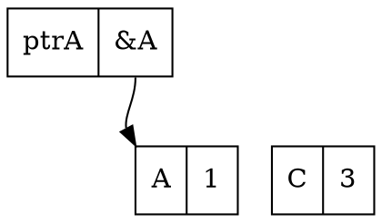
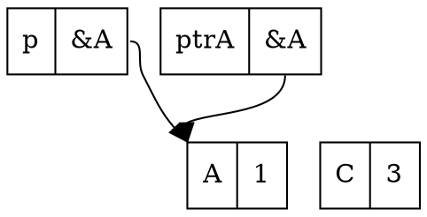
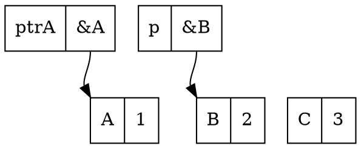
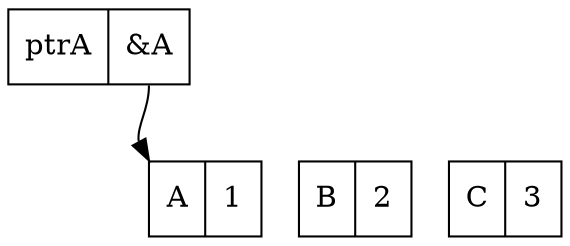
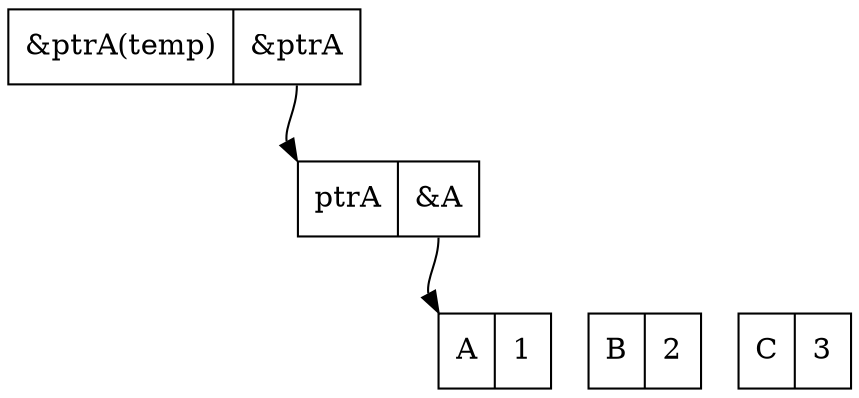
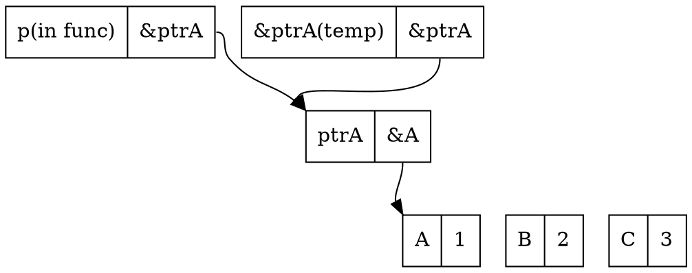
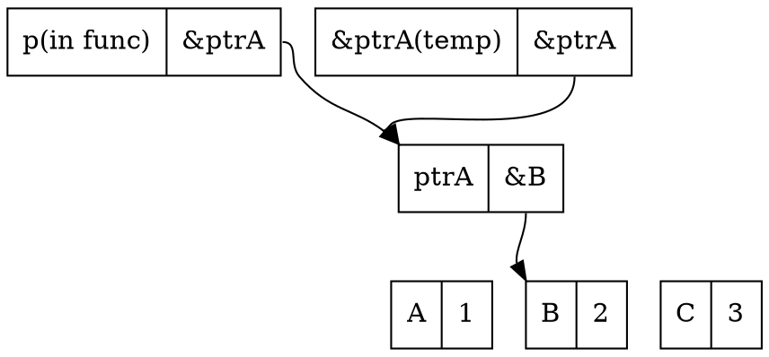

> **原始出處：** https://hackmd.io/@sysprog/c-pointer
> **擷取日期：** 2026-02-26
> **用途：** 課程教材 — 你所不知道的 C 語言：指標篇
> **涵蓋度：** 完整
> **省略內容：** 無

---
tags: DYKC, C, CLANG, C LANGUAGE, pointer
---

# [你所不知道的C語言](https://hackmd.io/@sysprog/c-prog/)：指標篇
*「指標」扮演「記憶體」和「物件」之間的橋樑*
Copyright (**慣C**) 2015, 2016, 2018 [宅色夫](http://wiki.csie.ncku.edu.tw/User/jserv)

==[直播錄影(上)](https://youtu.be/G7vERppua9o)==
==[直播錄影(下)](https://www.youtube.com/watch?v=Owxols1RTAg&feature=youtu.be)==


## 即便你對指標毫無掌握，你還是能寫程式

Ólafur Waage 在 [CppCon 2018](https://cppcon.org/cppcon-2018-program/) 有個 5 分鐘的演講 "[Let's learn programming by inventing it](https://www.youtube.com/watch?v=l5Mp_DEn4bs)" 提及，學習 C 語言的過程，以 K&R 一書為例，許多人聞風喪膽的「指標」一直到第 5 章，約全書一半才提到，可解讀為「你可以在不懂指標是什麼之前，仍可掌握多數的 C 語言功能」。


## 這個講座並非「頭腦體操」

* stackoverflow 上的 [頭腦體操](http://stackoverflow.com/questions/8208021/how-to-increment-a-pointer-address-and-pointers-value/8208106#8208106)

取自 [C Traps and Pitfalls](http://www.literateprogramming.com/ctraps.pdf) 的案例 "Understanding Declarations":
```c
(*(void(*)())0)();
```

可改寫為以下敘述：
```c
typedef void (*funcptr)();
(* (funcptr) 0)();
```

- [ ] [godbolt](http://gcc.godbolt.org/): 直接在網頁上看到 gcc 生成的程式碼
    ```c
    int main() {
        typedef void (*funcptr)();
        (* (funcptr) (void *) 0)();
    }
    ```
    對應的組合語言，搭配 `-Os` (空間最佳化)
    ```assembly
    main:
        pushq       %rax
        xorl        %eax, %eax
        call        *%rax
        xorl        %eax, %eax
        popq        %rdx
        ret
    ```

</img>
> [source](https://media.giphy.com/media/G10pb1bOz98oE/giphy.gif)

科技公司面試題:
```c
void **(*d) (int &, char **(*)(char *, char **));
```
上述宣告的解讀：
* d is a pointer to a function that takes two parameters:
  - a reference to an int and
  - a pointer to a function that takes two parameters:
    - a pointer to a char and
    - a pointer to a pointer to a char
  - and returns a pointer to a pointer to a char
* and returns a pointer to a pointer to void

[signal 系統呼叫](http://man7.org/linux/man-pages/man2/signal.2.html)的宣告方式也很經典: 
  - [How to read this prototype?](http://stackoverflow.com/questions/15739500/how-to-read-this-prototype)


## Go 語言也有指標

1999 年 4 月 27 日，Ken Thompson 和 Dennis Ritchie 自美國總統柯林頓手中接過 1998 年 [National Medal of Technology](https://en.wikipedia.org/wiki/National_Medal_of_Technology_and_Innovation) (國家科技獎章)，隔年 12 月，時年 58 歲的 Ken Thompson 自貝爾實驗室退休。Ken Thompson 自貝爾實驗室退休後成為一名飛行員。大概是整日翱翔天際，獲得頗多啟發，在 2006 年，他進入 Google 工作，隔年他和過去貝爾實驗室的同僚 [Rob Pike](https://en.wikipedia.org/wiki/Rob_Pike) 及 [Robert Griesemer](https://en.wikipedia.org/wiki/Robert_Griesemer) 等人在公司內部提出嶄新的 Go 程式語言，後者可用於雲端運算在內的眾多領域。

指標這個好東西，當然也要從 C 語言帶過去給 Go 語言，連同美妙的 struct。
  - 根據第一份 [Golang Talk](https://talks.golang.org/2009/go_talk-20091030.pdf)，Robert Griesemer, Ken Thompson 及 Rob Pike 等三人認為，世界在變，但系統語言卻已十年未有劇烈變革
  - Go 之前的程式語言未能達到：
    - 新增函式庫不是一個正確的方向
    - 需要重新思考整個架構來開發新的程式語言

在實作層面，pointer 和 struct 往往是成雙成對存在 (下方會解釋)


## 先羅列你已經知道的部分


> [David Brailsford](https://www.nottingham.ac.uk/computerscience/people/david.brailsford) 教授解說 C 語言指標

* [Everything you need to know about pointers in C](https://boredzo.org/pointers/)
* 疑惑
    * 該如何解釋 [qsort(3)](https://linux.die.net/man/3/qsort) 的參數和設計考量呢？
    * 為何我看到的程式碼往往寫成類似下面這樣？
    ```c
    struct list **lpp;
	for (lpp = &list; *lpp != NULL; lpp = &(*lpp)->next)
    ```

## 回頭看 C 語言規格書

在 [開發工具和規格標準](https://hackmd.io/s/HJFyt37Mx) 篇提過參考第一手資料的重要性，以下 ISO/IEC 9899 (簡稱 "C99")和指標相關的描述：

- [規格書](https://web.archive.org/web/20180127192726/http://www.open-std.org/jtc1/sc22/wg14/www/docs/n1256.pdf) (PDF) 搜尋 "***object***"，共出現 735 處
  - 搜尋 "***pointer***"，共出現 637 處。有趣的是，許多教材往往不談 object，而是急著談論 pointer，殊不知，這兩者其實就是一體兩面
  - object != object-oriented
    - 前者的重點在於「資料表達法」，後者的重點在於 "everything is object"
  - C11 ([ISO/IEC 9899:201x](https://web.archive.org/web/20180329042731/http://www.open-std.org/jtc1/sc22/wg14/www/docs/n1570.pdf)) / [網頁版](http://port70.net/~nsz/c/c11/n1570.html)

- `&` 不要都念成 and，涉及指標操作的時候，要讀為 "address of"
  - C99 標準 [6.5.3.2] Address and indirection operators 提到 '==&==' address-of operator

- C99 [3.14] ***object***
  - region of data storage in the execution environment, the contents of which can represent values
  - 在 C 語言的物件就指在執行時期，==資料==儲存的區域，可以明確表示數值的內容
  - 很多人誤認在 C 語言程式中，(int) 7 和 (float) 7.0 是等價的，其實以資料表示的角度來看，這兩者截然不同，前者對應到二進位的 "111"，而後者以 IEEE 754 表示則大異於 "111"

- C99 [6.2.4] ***Storage durations of objects***
  - An object has a storage duration that determines its lifetime. There are three storage durations: static, automatic, and allocated.
  
  > 注意生命週期 (lifetime) 的概念，漢語講「初始化」時，感覺像是「盤古開天」，很容易令人誤解。其實 initialize 的[英文意義](http://dictionary.reference.com/browse/initialize)很狹隘： "to set (variables, counters, switches, etc.) to their starting values at the beginning of a program or subprogram."
  
  - The lifetime of an object is the portion of program execution during which storage is guaranteed to be reserved for it. An object exists, has a constant address and retains its last-stored value throughout its lifetime. If an object is referred to outside of its lifetime, the behavior is undefined.
  
  > 在 object 的生命週期以內，其存在就意味著有對應的常數記憶體位址。注意，C 語言永遠只有 call-by-value

  - The value of a pointer becomes indeterminate when the object it points to reaches the end of its lifetime.
  
  > 作為 object 操作的「代名詞」(alias) 的 pointer，倘若要在 object 生命週期以外的時機，去取出 pointer 所指向的 object 內含值，是未知的。考慮先做 `ptr = malloc(size); free(ptr);` 倘若之後做 `*ptr`，這個 allocated storage 已經超出原本的生命週期

  - An object whose identifier is declared with no linkage and without the storage-class specifier static has automatic storage duration.

- C99 [6.2.5]  ***Types***
  - A pointer type may be derived from a function type, an object type, or an incomplete type, called the referenced type. A pointer type describes an object whose value provides a reference to an entity of the referenced type. A pointer type derived from the referenced type T is sometimes called ‘‘pointer to T’’. The construction of a pointer type from a referenced type is called ‘‘pointer type derivation’’.
  > 注意到術語！這是 C 語言只有 call-by-value 的實證，函式的傳遞都涉及到數值
  > 這裡的 "incomplete type" 要注意看，稍後會解釋。要區分 `char []` 和 `char *`
  
  - Arithmetic types and pointer types are collectively called scalar types. Array and structure types are collectively called aggregate types.
  
  > 注意 "scalar type" 這個術語，日後我們看到 `++`, `--`, `+=`, `-=` 等操作，都是對 scalar (純量)
  
  > [[來源](http://www.cyut.edu.tw/~cpyu/oldphweb/chapter3/page3.htm)] 純量只有大小，它們可用數目及單位來表示(例如溫度 = 30^o^C)。純量遵守算數和普通的代數法則。注意：純量有「單位」(可用 `sizeof` 操作子得知單位的「大小」)，假設 `ptr` 是個  pointer type，對 `ptr++` 來說，並不是單純 `ptr = ptr + 1`，而是遞增或遞移 1 個「單位」
  
  - An array type of unknown size is an incomplete type. It is completed, for an identifier of that type, by specifying the size in a later declaration (with internal or external linkage). A structure or union type of unknown content is an incomplete type. It is completed, for all declarations of that type, by declaring the same structure or union tag with its defining content later in the same scope.
  > 這是 C/C++ 常見的 forward declaration 技巧的原理，比方說我們可以在標頭檔宣告 `struct GraphicsObject;` (不用給細部定義) 然後 `struct GraphicsObject *initGraphics(int width, int height);` 是合法的，但 `struct GraphicsObject obj;` 不合法
:::success
因為沒有細部定義，所以是 Incomplete Type，沒辦法建立實體，卻可以用指標
:::

  - Array, function, and pointer types are collectively called derived declarator types. A declarator type derivation from a type T is the construction of a derived declarator type from T by the application of an array-type, a function-type, or a pointer-type derivation to T.
  > 這句話很重要，貌似三個不相關的術語「陣列」、「函式」，及「指標」都歸類為 derived declarator types，讀到此處會感到驚訝者，表示不夠理解 C 語言
:::success
array function pointer 其實是一樣的，重點都在位址
:::
  </img>
  
:::info
"derivative" 這詞在是微積分學中就是導數。一個函數在某一點的導數描述了這個函數在這一點附近的變化率。導數的本質是通過極限的概念對函數進行局部的線性逼近。
  </img>
  (一個實值函數的圖像曲線。函數在一點的導數等於它的圖像上這一點處之切線的斜率)

:notes: derivative 的 KK 音標是 [dəˋrɪvətɪv]，而 derivation 的 KK 音標是 [d,ɛrəv'eʃən]
:::

回到 C 語言，你看到一個數值，是 scalar，但可能也是自某個型態衍生出的 declarator type derivation，實際對應到 array, function, pointer 等型態的 derivation
  
**(練習題)** 設定絕對地址為 `0x67a9` 的 32-bit 整數變數的值為 `0xaa6`，該如何寫？
```c
*(int32_t * const) (0x67a9) = 0xaa6;
/* Lvalue */
```
:::success
要先把 0x67a9 轉型成指標，再用 * 取值做更改
:::

  - A pointer to void shall have the same representation and alignment requirements as a pointer to a character type. 
    > 關鍵描述！規範 `void *` 和 `char *` 彼此可互換的表示法

```c
void *memcpy(void *dest, const void *src, size_t n);
```
:::success
明明是處理字串的函式，去看規格書的原型卻是用 void
:::

## 英文很重要

安裝 `cdecl` 程式，可以幫你產生 C 程式的宣告。
```shell
$ sudo apt-get install cdecl
```

使用案例:
```shell
$ cdecl
cdecl> declare a as array of pointer to function returning pointer to function returning pointer to char
```

會得到以下輸出:
```c
char *(*(*a[])())()
```

把前述 C99 規格的描述帶入，可得:
```shell
cdecl> declare array of pointer to function returning struct tag
```
```c
struct tag (*var[])()
```

如果你沒辦法用英文來解說 C 程式的宣告，通常表示你不理解！

`cdecl` 可解釋 C 程式宣告的意義，比方說：
```shell
cdecl> explain char *(*fptab[])(int)
declare fptab as array of pointer to function (int) returning pointer to char
```

## 為何有 `.` 和 `->` ？

在 C 語言中，運算子 `.` 和 `->` 主要差異是情境與語法表達方式，從功能上看，二者作用無異。`a->b` 等價於 `(*a).b`，也就是說，`->` 可用 `*` 和 `.` 的組合達成。

為何 C 語言要設計兩個類似的運算子？在早期的 C 語言中，結構體 (`struct`) 無法直接作為函式參數傳遞，只能透過指向結構體的指標進行操作。在機器碼或組合語言層面，僅存在暫存器與記憶體（可以視為一個大的陣列）。變數是 C 對記憶體地址的抽象表示，實質表示一個地址。例如：
```c
a = b;
```

在組合語言的角度，可理解為：
```c
*ptrA = *ptrB;
```

其中，`ptrA` 和 `ptrB` 是記憶體地址，即指標。

基於此背景，來討論結構體的本質及其成員的意義。假設有以下程式碼：

```c
struct point {
    int x, y;
};
struct point p;
struct point *pp = &p;
```

以現代 C 語言的語意來說，`p` 是個結構體物件，而 `x` 和 `y` 是其成員。但從組合語言的角度來看，`p` 實際是個不完整的地址，而 `x` 和 `y` 則是在結構體內部的地址偏移量。因此，必須同時結合 `p` 與 `x` 或 `y`，才能形成一個完整的地址，單獨的 `p` 無法操作。

在早期 C 語言中，`*pp` 沒有實際意義，因為結構體無法直接被放入暫存器或進行處理。例如：
```c
(*pp).x = 1;  /* 無法翻譯為機器碼 */
```

對於早期的 C 語言，要存取指標所指向的內容及其成員的地址偏移這二個操作必須緊密結合，才能產生有意義的結果。因此，才有 `->` 運算子用來表示這種緊密結合的操作，例如：
```c
pp->x = 1;
```

不過，隨著 C 語言的標準化與編譯器的進步，現代 C 編譯器已能將`(*pp).x` 和 `pp->x` 等效處理，二者的效率沒有差異。

C++ 引入 `.*` 和 `->*` 運算子，要留意 `->*` 不是 `->` 和 `*` 的組合，這是另外的議題。

## 與生俱來的機制
很多程式語言常以「沒有指標」作為賣點來宣傳，然而對於 C 語言來說，指標卻是與生俱來的核心。什麼是指標？為何許多程式語言的設計者想避開它？

指標就是記憶體位址：當一個位址被當作變數來使用時，我們稱它為指標，該變數的型別自然就是指標型別。指標的作用，就是藉由給定一個位址，存取該位址所對應的值。為了理解指標的本質，我們必須從計算機的基本架構談起。

從宏觀上來看，計算機可分為兩類：
1. 採取儲存-執行模型的計算機
    * 這類機器的代表就是我們日常使用的個人電腦，由 CPU 與記憶體組成。CPU 僅負責邏輯運算，所有指令與資料皆儲存在記憶體中。記憶體純粹提供儲存功能，不具備任何運算能力。
2. 特製硬體 (如 ASIC 或 FPGA)
    * 這類機器針對特定需求構建邏輯電路，具有高效率，但不適合進行通用運算。

以我們熟悉的儲存-執行模型來說，其運作方式為：
1. CPU 在位址匯流排上要求存取某個位址
2. 記憶體將該位址對應的資料回傳至資料匯流排

這表示，通用計算機的主體操作皆透過「指標」完成。CPU 無法直接操作記憶體中的數值，必須透過以下步驟：
- 從某個位址 A0 讀取數值 V0
- 對 V0 進行運算，產生新的值 V1
- 將 V1 寫入另一個位址 A1

早期的程式開發就是依此模式運作，這便是組合語言的視角：
```c
mov -0x4c(%rbp), %ebx
```

不過這樣寫程式太繁瑣，C 語言在 UNIX 的發展背景下誕生，提供更簡潔的方式：
```c
int a = 10;
char *p = &a;
*p = 13;
```

C 語言以極簡的方式，映射和封装 CPU 的運作邏輯。也就是說，當時人們不追求複雜的商務邏輯，只希望有一種簡單的方式來抽象出計算機的行為，C 語言因應而生。也可以說，C 語言的精華就是指標，指標是 C 語言的一切。我們可以不寫 if-else、不用 switch-case、不用 while、甚至不用 for 迴圈，但不能沒有指標。

例如，我們可以用指標陣列（或狀態矩陣）替代 if-else：
```c
int (*routine)[...]();
...
condition = calc(...);
routine[condition](argv);
```

指標是儲存-執行模型下運作的必要條件。回顧其工作模式：
- 給定一個位址，CPU 可讀取該位址的資料。
- 給定一個位址，CPU 可寫入資料至該位址。

只要 CPU 要正常工作，就必須能存取整個記憶體位址空間。換句話說，一切來自記憶體！要操作記憶體，就必須使用指標！C 語言本質上就是組合語言的簡化版本，它延續組合語言的邏輯，用指標創造世界。

說到把 C 語言指標用到極致的範例，莫過於 Linux 核心中的嵌入鏈結串列 `struct list_head`：
```c
struct list_head {
    struct list_head *next, *prev;
};
```

藉由 C 語言的指標機制，精緻展現物件導向設計，`list_head` 猶如所有存取資料的基底，藉由 `container_of` 巨集，它能將 `list_head` 還原為任意元件，如此轉換的關鍵，正是「指標」。
> 延伸閱讀: [Linux 核心原始程式碼巨集: container_of](https://hackmd.io/@sysprog/linux-macro-containerof)

指標，不僅是 C 語言的靈魂，更是儲存-執行模型中不可或缺的存在。

## `void *` 之謎

`void` 在最早的 C 語言是不存在的，直到 C89 才確立，為何要設計這樣的型態呢？ [最早的 C 語言中](https://www.bell-labs.com/usr/dmr/www/primevalC.html)，任何函式若沒有特別標注返回型態，一律變成 `int` (伴隨著 `0` 作為返回值)，但這導致無從驗證 [function prototype](https://en.wikipedia.org/wiki/Function_prototype) 和實際使用的狀況

`void *` 的設計，導致開發者必須透過 ==explicit (顯式)== 或強制轉型，才能存取最終的 object，否則就會丟出編譯器的錯誤訊息，從而避免危險的指標操作。在 ISO C 中，我們無法直接對 `void *` 做數值操作
```c
void *p = ...;
void *p2 = p + 1; /* what exactly is the size of void? */
```
換句話說， `void *` 存在的目的就是為了強迫使用者使用 ==顯式轉型== 或是 ==強制轉型==，以避免 Undefined behavior 產生。這樣的設計很合理，因為不會有任何 object 是 void type，void 僅供我們操作使用，不能對 pointer to void 取 dereference，必須要先 `(char*) p;` 強制轉型後才能用
> 在 [GNU C Extension](https://www.gnu.org/software/c-intro-and-ref/manual/html_node/Pointer-Arithmetic.html#Pointer-Arithmetic) 中，可以對 `void *` 做數值操作，單位為 1

C/C++ [Implicit conversion](http://en.cppreference.com/w/cpp/language/implicit_conversion) vs. [Explicit type conversion](https://en.cppreference.com/w/cpp/language/explicit_cast)
C99 對 sign extension 的[定義和解說](https://www.ptt.cc/bbs/C_and_CPP/M.1460791524.A.603.html)

對某硬體架構，像是 Arm，我們需要額外的 ==alignment==。ARMv5 (含) 以前，若要操作 32-bit 整數 (uint32_t)，該指標必須對齊 32-bit 邊界 (否則會在 dereference 時觸發 exception)。於是，當要從 `void *` 位址讀取 uint16_t 時，需要這麼做：
```c
/* may receive wrong value if ptr is not 2-byte aligned */
/* portable way of reading a little-endian value */
uint16_t value = *(uint16_t *) ptr;
uint16_t value = *(uint8_t *) ptr | ((*(uint8_t *) (ptr + 1)) << 8);
```

延伸閱讀: [記憶體管理、對齊及硬體特性](https://hackmd.io/@sysprog/c-memory)

### `void *` 真的萬能嗎？

依據 C99 規格 6.3.2.3:8 [ Pointers ]
> A pointer to a function of one type may be converted to a pointer to a function of another type and back again; the result shall compare equal to the original pointer. If a converted pointer is used to call a function whose type is not compatible with the pointed-to type, the behavior is undefined.

換言之，C99 不保證 pointers to data (in the standard, "objects or incomplete types" e.g. `char *` or `void *`) 和 pointers to functions 之間相互轉換是正確的
- 可能會招致 undefined behavior (UB)
- 注意：C99 規範中，存在一系列的 UB，詳見 [未定義行為篇](https://hackmd.io/@sysprog/c-undefined-behavior)

> 延伸閱讀: [The Lost Art of Structure Packing](http://www.catb.org/esr/structure-packing/)

## 沒有「雙指標」只有「指標的指標」

「雙馬尾」(左右「獨立」的個體) 和「馬尾的馬尾」(由單一個體關聯到另一個體的對應) 不同
- 漢語的「[雙](https://www.moedict.tw/%E9%9B%99)」有「對稱」且「獨立」的意含，但這跟「指標的指標」行為完全迥異
- 講「==雙==指標」已非「懂不懂 C 語言」，而是漢語認知的問題

C 語言中，萬物皆是數值 (everything is a value)，函式呼叫當然只有 call-by-value。「指標的指標」(英文就是 a pointer of a pointer) 是個常見用來改變「傳入變數原始數值」的技巧。

考慮以下程式碼:
```c=1
int B = 2;
void func(int *p) { p = &B; }
int main() {
    int A = 1, C = 3;
    int *ptrA = &A;
    func(ptrA);
    printf("%d\n", *ptrA);
    return 0;
}
```

在第 5 行 (含) 之前的記憶體示意:


第 6 行 `ptrA` 數值傳入 `func` 後的記憶體示意:


- `func` 依據 [函式呼叫篇](https://hackmd.io/s/HJpiYaZfl) 描述，將變數 `p` 的值指定為 `&B`


由上圖可見，原本在 main 中的 `ptrA` 內含值沒有改變。這不是我們期望的結果，該如何克服呢？可透過「指標的指標」來改寫，如下：

```c=1
int B = 2;
void func(int **p) { *p = &B; }
int main() {
    int A = 1, C = 3;
    int *ptrA = &A;
    func(&ptrA);
    printf("%d\n", *ptrA);
    return 0;
}
```

在第 5 行 (含) 之前的記憶體示意:


第 6 行時，傳入 `func` 的參數是 `&ptrA`，也就是下圖中的 `&ptrA(temp)`:


進入 func 執行後，在編譯器產生對應參數傳遞的程式碼中，會複製一份剛傳入的 `&ptrA`，產生一個自動變數 `p`，將 `&ptrA` 內的值存在其中，示意如下:


在 `func` 中把 `p` 指向到的值換成 `&B`:


經過上述「指標的指標」，`*ptrA` 的數值從 1 變成 2，而且 `ptrA` 指向的物件也改變了。
:::success
可以看出指標的指標才能讓我們達到預期的結果
原本指標的寫法，只有在函式的 scope 裡面，那個副本 p 指向 B
但實際傳進去的 Ptr A 沒有改到指向 B
:::
延伸閱讀:
* [C Linked List Implementation Pointer vs. Pointer-to-Pointer Consistency](https://softwareengineering.stackexchange.com/questions/260411/c-linked-list-implementation-pointer-vs-pointer-to-pointer-consistency)
* [你所不知道的 C 語言: linked list 和非連續記憶體操作](https://hackmd.io/s/SkE33UTHf)


## forward declaration 搭配指標的技巧

案例: [oltk](https://github.com/openmoko/system-test-suite/tree/master/gta02-dm2/src/oltk) 是 [Openmoko](https://en.wikipedia.org/wiki/Openmoko) 為了工廠測試而開發出的精簡繪圖系統，支援觸碰螢幕，程式碼不到 1000 行 C 語言程式。執行畫面: (oltk 的開發者是 [olv](https://github.com/olvaffe))


- [ ] [oltk.h](https://github.com/openmoko/system-test-suite/blob/master/gta02-dm2/src/oltk/oltk.h)

```c
struct oltk; // 宣告 (incomplete type, void)
struct oltk_button;
typedef void oltk_button_cb_click(struct oltk_button *button, void *data);
typedef void oltk_button_cb_draw(struct oltk_button *button,
                                 struct oltk_rectangle *rect, void *data);
struct oltk_button *oltk_button_add(struct oltk *oltk,
                                    int x, int y,
                                    int width, int height);
```

`struct oltk` 和 `struct oltk_button` 沒有具體的定義 (definition) 或實作 (implementation)，僅有宣告 (declaration)。

- [ ] [oltk.c](https://github.com/openmoko/system-test-suite/blob/master/gta02-dm2/src/oltk/oltk.c)

```c
struct oltk {
  struct gr *gr;
  struct oltk_button **zbuttons;
  ...
  struct oltk_rectangle invalid_rect;
};
```

軟體界面 (interface) 揭露於 oltk.h，不管 struct oltk 內容怎麼修改，已公開的函式如 `oltk_button_add` 都是透過 pointer 存取給定的位址，而不用顧慮具體 struct oltk 的實作，如此一來，不僅可以隱藏實作細節，還能兼顧二進位的相容性 (binary compatibility)。

同理，struct oltk_button 不管怎麼變更，在 struct oltk 裡面也是用給定的 pointer 去存取，保留未來實作的彈性。

延伸閱讀
* [你所不知道的 C 語言：物件導向程式設計篇](https://hackmd.io/@sysprog/c-oop)
* [Hide data inside pointers](https://arjunsreedharan.org/post/105266490272/hide-data-inside-pointers)
 
## Pointers vs. Arrays

- array vs. pointer
    - in declaration
        - extern, 如 `extern char x[];` $\to$ 不能變更為 pointer 的形式
        - definition/statement, 如 `char x[10]` $\to$ 不能變更為 pointer 的形式
        - parameter of function, 如 `func(char x[])` $\to$ 可變更為 pointer 的形式 $\to$ `func(char *x)`
    - in expression
        - array 與 pointer 可互換

```c
int main() {
    int x[10] = {0, 1, 2, 3, 4, 5, 6, 7, 8, 9};
    printf("%d %d %d %d\n", x[4], *(x + 4), *(4 + x), 4[x]);
}
```

在 [The C Programming Language](http://www.amazon.com/The-Programming-Language-Brian-Kernighan/dp/0131103628) 第 2 版，Page 99 寫道:
> As formal parameters in a function definition,

該書 Page 100 則寫:
> `char s[]`; and `char *s` are equivalent.

:::info
- 這就是悲劇的由來，人們往往忘了前一頁
- `x[i]` 總是被編譯器改寫為 `*(x + i)` $\leftarrow$ in expression
:::

:::success
1. 所以其實 `[]` 只是語法糖，比較好寫，但編譯時電腦仍然是用位址在操作
2. 二維陣列也是語法糖，C 最後仍然透過轉換轉成一維的位址做操作(透過指標的方法做降維)
:::

- C 提供操作多維陣列的機制 (C99 [6.5.2.1] **_Array subscripting_**)，但實際上只有一維陣列的資料存取
    - 對應到線性記憶體
    - Successive subscript operators designate an element of a multidimensional array object. If E is an n-dimensional array (n ≥ 2) with dimensions i × j × ... × k, then E (used as other than an lvalue) is converted to a pointer to an (n − 1)-dimensional array with dimensions j × ... × k. If the unary * operator is applied to this pointer explicitly, or implicitly as a result of subscripting, the result is the pointed-to (n − 1)-dimensional array, which itself is converted into a pointer if used as other than an lvalue. It follows from this that arrays are stored in row-major order (last subscript varies fastest)
    - Consider the array object defined by the declaration `int x[3][5];` Here x is a 3 × 5 array of ints; more precisely, x is an array of three element objects, each of which is an array of five ints. In the expression `x[i]`, which is equivalent to `(*((x)+(i)))`, x is first converted to a pointer to the initial array of five ints. Then i is adjusted according to the type of x, which conceptually entails multiplying i by the size of the object to which the pointer points, namely an array of five int objects. The results are added and indirection is applied to yield an array of five ints. When used in the expression `x[i][j]`, that array is in turn converted to a pointer to the first of the ints, so `x[i][j]` yields an int.
- array subscripting 在**編譯時期**只確認以下兩件事:
    - 得知 size
    - 取得陣列第 0 個 (即最初的一項) 元素的指標
- 前兩者以外的操作，都透過 pointer
    - array subscripting => syntax sugar

- Array declaration:

```c
int a[3];
struct { double v[3]; double length; } b[17];
int calendar[12][31];
```

那麼...

```c
sizeof(calendar) = ? sizeof(b) = ?
```

善用 GDB，能省下沒必要的 `printf()`，並可互動分析: (下方以 GNU/Linux x86_64 作為示範平台)

- 有時會遇到程式邏輯和結果正確，但因為 `printf()` 的輸出格式沒用對，而誤以為自己程式沒寫好的狀況

```shell
(gdb) p sizeof(calendar)
$1 = 1488
(gdb) print 1488 / 12 / 31
$2 = 4
(gdb) p sizeof(b)
$3 = 544
```

還可分析型態:
```shell
(gdb) whatis calendar
type = int [12][31]
(gdb) whatis b[0]
type = struct {...}
(gdb) whatis &b[0]
type = struct {...} *
```

更可直接觀察和修改記憶體內容:
```shell
(gdb) x/4 b
0x601060 <b>: 0x00000000 0x00000000 0x00000000 0x00000000
(gdb) p b
$4 = {{
  v = {0, 0, 0},
  length = 0
} <repeats 17 times>}
```

終於可來作實驗:
```shell
(gdb) p &b
$5 = (struct {...} (*)[17]) 0x601060 <b>
(gdb) p &b+1
$6 = (struct {...} (*)[17]) 0x601280 <a>
```

上一行 `&b + 1` 指向的位址，就是 `int a[3]` 的所在處？！來確認:
```shell
(gdb) p &a[0]
$7 = (int *) 0x601280 <a>
```

那 `&b[0] + 1` 指向哪呢？
```shell
(gdb) p &b[0]+1
$8 = (struct {...} *) 0x601080 <b+32>
(gdb) p sizeof(b[0])
$9 = 32
```

原來 `&b[0] + 1` 的 `+1` 就是遞移一個 `b[0]` 佔用的空間。

提昇輸出的可讀性
```shell
(gdb) set print pretty
```

繼續觀察記憶體內容:
```c
(gdb) p &b[0]
$10 = (struct {...} *) 0x601060 <b>
(gdb) p (&b[0])->v
$11 = {0, 0, 0}
```

`p` 命令不僅能 print，還可變更記憶體內容:
```c
(gdb) p (&b[0])->v = {1, 2, 3}
$12 = {1, 2, 3}
(gdb) p b[0]
$13 = {
  v = {1, 2, 3},
  length = 0
}
```

還記得前面提到 `(float) 7.0` 和 `(int) 7` 的不同嗎？我們來觀察執行時期的表現:

```c
(gdb) whatis (&b[0])->v[0]
type = double
(gdb) p sizeof (&b[0])->v[0]
$14 = 8
```

Linux x86_64 採用 [LP64 data model](https://en.wikipedia.org/wiki/64-bit_computing#64-bit_data_models)，`double` 依據 C 語言規範，至少要有 64-bit 長度。現在試著強制轉型:
:::success
也是因為這個 LP64 的規定，才會導致下面的結果，double 至少佔 64 位元，int 常見是 32 位元，所以結果才會不同，強制轉型成整數會導致沒有提取足夠量的位元數，導致結果不一樣
:::
```c
(gdb) p &(&b[0])->v[0]
$15 = (double *) 0x601060 <b>
(gdb) p (int *) &(&b[0])->v[0]
$16 = (int *) 0x601060 <b>
(gdb) p *(int *) &(&b[0])->v[0]
$17 = 0
```

竟然變成 `0`，為什麼？！
因為:
```shell
(gdb) p sizeof(int)
$18 = 4
```

我們只取出 `v[0]` 開頭的 4 bytes，轉型為 `int` 後，內容就是 0。印出記憶體來觀察：
```c
(gdb) x/4 (int *) &(&b[0])->v[0]
0x601060 <b>: 0x00000000 0x3ff00000 0x00000000 0x40000000
```

GDB 強大之處不只如此，你甚至在動態時期可呼叫函式 (改變執行順序)，比方說 `memcpy`:
```c
(gdb) p calendar
$19 = {{0 <repeats 31 times>} <repeats 12 times>}
(gdb) p memcpy(calendar, b, sizeof(b[0]))
$20 = 6296224
(gdb) p calendar
$21 = {{0, 1072693248, 0, 1073741824, 0, 1074266112, 0 <repeats 25 times>}, {0 <repeats 31 times>} <repeats 11 times>}
```

現在 `calendar[][]` 內容已變更。前述輸出有個數值 `6296224`，到底是什麼呢？試著觀察:
```c
(gdb) p (void *) 6296224
$22 = (void *) 0x6012a0 <calendar>
```
:::success
把純量轉型成pointer type，gdb就知道要去找他指的位置是什麼
:::

原來就是 `memcpy` 的目的位址，符合 [memcpy(3)](http://linux.die.net/man/3/memcpy) 的描述。

從 calendar 把 `{1, 2, 3}` 內容取出該怎麼作呢？
```c
(gdb) p *(double *) &calendar[0][0]
$23 = 1
(gdb) p *(double *) &calendar[0][2]
$24 = 2
(gdb) p *(double *) &calendar[0][4]
$25 = 3
```
:::success
這邊要注意如果直接 p calendar[0][0] 出來會看到0，因為calendar本身是int，這樣取只會取前面4個byte，就得到0
這是因為指標改變了記憶體存取的方式，會有alignment問題
同樣的地址，用不同的pointer type會有不同的移動量
解讀出來的數值就會不同
:::

- Pointers may happen to point to an element of an array
    - We can use that pointer to obtain a pointer to the next/previous element of that array
    - Add/Subtract 1 for that pointer

```c
int a[10];
	...
int *p;
p = a; /* take the pointer to a[0] */
p++; /* next element */
p--; /* previous element */
```

- Adding an integer to a pointer is different from adding that integer to the bit representation of that pointer

```c
int *p;
p = p + 1; /* this advances p's value (pointed-address) by sizeof(int) which is usually not 1 */
```

- The name of the array is the same as a pointer to the array in every context but one

```c
int a[3];
int *p;
p = a; /* p points to a[0] */
*a = 5; /* sets a[0] to 5 */
*(a+1) = 5; /* sets a[1] to 5 */
```

The only difference is in sizeof:

```c
sizeof(a) /* returns the size of the entire array not just a[0] */
```

- Suppose we want to concatenate string s and string t into a single string

```c
char *r;
strcpy(r, s);
strcat(r, t);
```

Doesn't work cause ==r doesn't point anywhere.==

Lets make r an array – now it points to 100 chars

```c
char r[100];  //編譯器配置的其實是至少100個，可能會多給
strcpy(r, s);
strcat(r, t);
```

This works as long as the strings pointed to by s and t aren’t too big.
:::success
如果strcpy或strcat導致那個r超過原本配置的空間
就會出問題，可能影響資料安全
:::

- We would like to write something like:

```c
char r[strlen(s) + strlen(t)];
strcpy(r, s); strcat(r, t);
```

However C requires us to state the size of the array as constant.

```c
char *r = malloc(strlen(s) + strlen(t));
strcpy(r, s); strcat(r, t);
```

This fails for three reasons:

1.  `malloc()` might fail to allocate the required memory
2.  It is important to free the memory allocated
3.  We did not allocate enough memory

The correct code will be:

```c
char *r = malloc(strlen(s) + strlen(t) + 1); // use sbrk; change program break
if (!r) exit(1); /* print some error and exit */
strcpy(r, s); strcat(r, t);
```

/* later */
```c
free(r);
r = NULL; /* Try to reset free’d pointers to NULL */
```

`int main(int argc, char *argv[], char *envp[])` 的奧秘

```c
#include <stdio.h>
int main(int argc, char (*argv)[0])
{
  puts(((char **) argv)[0]);
  return 0;
}
```

使用 gdb
```c
(gdb) b main
(gdb) r
(gdb) print *((char **) argv)
$1 = 0x7fffffffe7c9 "/tmp/x"
```

這裡符合預期，但接下來：
```c
(gdb) x/4s (char **) argv
0x7fffffffe558: "\311\347\377\377\377\177"
0x7fffffffe55f: ""
0x7fffffffe560: ""
0x7fffffffe561: ""
```

無法立即會意，換個方式解析：
```c
(gdb) x/4s ((char **) argv)[0]
0x7fffffffe7c9: "/tmp/x"
0x7fffffffe7d0: "LC_PAPER=zh_TW"
0x7fffffffe7df: "XDG_SESSION_ID=91"
0x7fffffffe7f1: "LC_ADDRESS=zh_TW"
```
:::success
argc是一個純量，紀錄argv這個vector有多大
可以利用argv看出環境變數
main執行時其實是會由shell 提供argv作為參數傳進去
:::
後三項是 envp (environment variable)

C array 大概是 C 語言中數一數二令人困惑的部分。根據你使用的地方不同，Array 會有不同的意義：
* 如果是用在 expression，array 永遠會被轉成一個 pointer
* 用在 function argument 以外的 declaration 中它還是一個 array，而且「不能」被改寫成 pointer
* function argument 中的 array 會被轉成 pointer

若現在這裡有一個全域變數 (global)
```c
char a[10];
```

在另一個檔案中，我不能夠用 `extern char *a` 來操作原本的 `a`，因為實際上會對應到不同的指令 (instruction)。但若你的 declaration 是在 function argument 中，那麼：
* `void function(char a[])` 與 `void function(char * const a)` 是等價的
* 而且，真實的型態會是 pointer

因此你不能用 `sizeof` 取得其佔用的空間！（array 是 unmodifiable l-value，所以除了被轉成 pointer，它還會是一個不能再被設定數值的指標，因此需要加上 `const` 修飾。）

最後，用在取值時，array 的行為與 pointer 幾乎雷同，但 array 會是用兩步取值，而 pointer 是三步。（array 的位址本身加上 offset，共兩步，而使用 pointer時，cpu 需先載入 pointer 位址，再用 pointer 的值當作位址並加上 offset 取值）

A common C pitfall is to confuse a pointer with the data to which it points


依據 man page [strdup(3)](http://linux.die.net/man/3/strdup) :
> The strdup() function returns a pointer to a new string which is a duplicate of the string s. Memory for the new string is obtained with [malloc(3)](http://linux.die.net/man/3/malloc), and can be freed with [free(3)](http://linux.die.net/man/3/free).

`strdup()` 實際上會呼叫 `malloc()`，來配置足以放置給定字串的「新空間」。
:::success
這個分配新空間的動作，就和一般的字串處理不太一樣
malloc分配空間可能會失敗，也可能分配到的空間不夠存
這都是寫程式時要特別注意的記憶體分配帶來的問題
:::


## Function Pointer

```c
int main() { return (********puts)("Hello"); }
```

為何可運作？

根據 C99 規格書

- C99 [ 6.3.2.1 ] A function designator is an expression that has function type
    - **Except** when it is the operand of the **sizeof** operator or the unary **&** operator, a **function designator** with type ‘‘function returning type’’ **is converted to** an expression that has type ‘‘**pointer to function returning type’**’.
    - `*` is Right associative operator
    > 若非一元 `&` 或 `sizeof` 運算，則 function designator 會認定為指向函式的指標型態
- C99 [6.5.1 ] It is an lvalue, a function designator, or a void expression if the unparenthesized expression is, respectively, an lvalue, a function designator, or a void expression.
- C99 [6.5.3.2-4] The unary * operator denotes indirection. **If the operand points to a function, the result is a function designator**

(注意到 designator 的發音，KK 音標為 [͵dɛ**zɪg**ˋnetɚ])

[實驗程式碼](https://gist.github.com/JIElite/d429aedbc515973ad46cd353a43d2388)


程式碼 `(********puts)` 可看作 `(*(*(*(*(*(*(*(*puts))))))))`，最裡面的括號 `(*puts)` 由 [ 6.5.3.2-4 ] 可知它是一個 function designator。再根據 [ 6.3.2.1 ]，它最後會被轉為 pointer to function returning type。往外延伸一個括號 `(*(*puts))` 由於最裡面的括號是一個 function designator，再多一個 * operator 它還是一個 function designator，最後也會被轉為 pointer to function returning type，依此類推最後 `(********puts)` 仍會是一個 function designator。

根據 6.3.2.1
```c
void (*fptr)();
void test();
fptr = test;
```

test: void (), 會被轉成 function pointer: void (*) ()

fptr is a pointer to function with returning type,

根據 6.5.3.2
`(*fptr)` is a function designator, a function designator will be converted to pointer.

type of (*fptr): void ()

我們可利用 gdb 去查看這些數值，搭配 print 命令:
```shell
(gdb) print test
$1 = {void ()} 0x400526 <test>
(gdb) print test
$2 = {void ()} 0x400526 <test>
(gdb) print fptr
$3 = (void (*)()) 0x400526 <test>
(gdb) print (*fptr)
$4 = {void ()} 0x400526 <test>
(gdb) print (**fptr)
$5 = {void ()} 0x400526 <test>
```

test 是一個 function designator ，因為不是搭配 `&`, sizeof 使用，所以會被轉成為 pointer to function

`(*fptr)` 是一個 function pointer 搭配 * (dereference, indirection) operator 使用，則它的結果會被轉成為一個 function designator

所以 `(**fptr)` 要拆成兩個部份： `(* ( *fptr) )`, 裡面的 `*fptr` 是個 function designator, 但是還是會被轉成一個 pointer to function，我們可註記為 `fptr`。

又，外面又有一個 * operator, `( *fptr ) ` 是個 function designator, 最後還是會被轉化為 pointer to function

但 `0x400526` 這個數值是怎麼來的呢？

我們可用以下命令觀察:
```shell
$ gcc -o fp -g fp.c
$ objdump -d fp
```

參考輸出裡頭的一段：
```shell
0000000000400526 <test>:
400526: 55 push %rbp
400527: 48 89 e5 mov %rsp,%rbp
40052a: 90 nop
40052b: 5d pop %rbp
40052c: c3 retq
```

這個數值其實是執行檔反組譯後的函式進入點，但這數值並非存在實體記憶體的實際數值，而是虛擬記憶載入位址。

由於 `puts` 的 function prototype 是 `int puts(const char *s)`，因此 每次經過 `*` operator 運算後得到的結果是仍然是 `int`。所以 `*` 的數目不會影響結果。最後 return 的值是根據 s 的長度加上 `'\n'`。而這個例子 return 給 `main` 的值是 6


## Address and indirection operators

對應到 C99/C11 規格書 [ 6.5.3.2 ]，`&` 對運算元 (operand) 的限制如下：
>1. The operand of the unary & operator shall be either a function designator, the result of a [] or unary * operator, or an lvalue that designates an object that is not a bit-field and is not declared with the register storage-class specifier.
>2. The operand of the unary * operator shall have pointer type.
* function designator - 基本上就是 function name
* `[]` or `*` 的操作結果：跟這兩個作用時，基本上就是相消
    - `*` - operand 本身
    - `[]` - `&` 會消失，而 `[]` 會被轉換成只剩 `+` (註：原本 `[]` 會是 `+` 搭配 `*`)
        + 例如: `&(a[5]) == a + 5`
* 一個指向非 bit-field or register storage-class specifier 的 object 的 lvalue
    > [bit-field](https://hackmd.io/@sysprog/c-bitfield)：一種在 struct 或 union 中使用用來節省記憶體空間的物件;
    > 特別的用途：沒有名稱的 bit-field 可以做為 padding

除了遇到 `[]` 或 `*` 外，使用 `&` 的結果基本上都是得到 pointer to the object 或是 function 的 address

考慮以下程式碼:
```c
char str[123];
```

為何 `str == &str` 呢？
* 實際上左右兩邊的型態是不一樣的，只是值相同。
* 左邊的是 pointer to char：`char *`
    - 規格書中表示：除非遇到 sizeof 或是 & 之外，array of type (在這就是指 str) 都會被直接解讀成 pointer to type (在這就是 pointer to char)，而這個 type 是根據 array 的第一個元素來決定的
    > Except when it is the operand of the sizeof operator or the unary & operator, or is a string literal used to initialize an array, an expression that has type ‘‘array of type’’ is converted to an expression with type ‘‘pointer to type’’ that points to the initial element of the array object and is not an lvalue. (C99 6.3.2.1)
* 右邊的則是 pointer to an array： `char (*)[123]`
    - 上面提到：遇到 & 時，str 不會被解讀為 pointer to type，而是做為原本的 object，在這就是 array object，而 address of array object 也就是這個 array object 的起始位址，當然也就會跟第一個元素的位址相同
    - 除了用值相同來解釋外，規格書在提到 equality operators 時，也有說到類似情境
    > Two pointers compare equal if and only if both are null pointers, both are pointers to the same object (including a pointer to an object and a subobject at its beginning) or function (C99 6.5.9)

## 針對指標的修飾 (qualifier)


* 指標本身不可變更 (Constant pointer to variable): `const` 在 `*` 之後
> char ==*== const pContent;
* 指標所指向的內容不可變更 (Pointer to constant): `const` 在 `*` 之前
> const char ==*== pContent;
> char const ==*== pContent;
* 二者都不可變更
> const char ==*== const pContent;

ISO/IEC 9899:2018 §6.7.3：
> If an object is declared with a const-qualified type, it may not be modified by the program.

這裡的 "object" 依型別語意可指：
* 指標本身（若指標層被 `const` 限定）
* 指向的資料（若資料層被 `const` 限定）

| 宣告 | 資料可變？ | 指標可變？ | 正確語意 |
|:----|:---------:|:--------:|:-------|
| `const int *p`        | 否     | 是     | pointer to const int       |
| `int const *p`        | 否     | 是     | pointer to const int       |
| `int * const p`       | 是     | 否     | const pointer to int       |
| `const int * const p` | 否     | 否     | const pointer to const int |

誤稱: 若把 "pointer to const" 稱為 "const pointer"，會造成混淆。

## Learn C The Hard Way

- [書本資訊](https://learncodethehardway.org/c/)
- [Exercise 36: Safer Strings](https://github.com/zedshaw/learn-c-the-hard-way-lectures/blob/master/ex36/lecture.md)
    - "**Why C Strings Were A Horrible Idea**"
        - it is not possible to validate a C string without possibly looping infinitely.
        - 延伸閱讀: ["NULL"：電腦科學中最嚴重的錯誤，造成10億美元損失](https://linux.cn/article-6503-1.html)
    - 中華民國刑法第 227 條：「對於未滿十四歲之少男或少女為性交者，處三年以上十年以下有期徒刑 ... 對於十四歲以上未滿十六歲之男女為性交者，處七年以下有期徒刑」
    - 刑法第 227-1 條 (兩小無猜條款)，規定未滿十八歲的人犯 227 條時，為告訴乃論，這是考量到雙方都是未成年，因為對性事好奇，或者是彼此相愛而進行性行為，故有特規定這個例外可通融，得免除或減輕其刑。
    - [[出處]](https://join.gov.tw/idea/detail/6fd3e0af-ed8c-43d7-80fc-23813a9234f0) 規定要 18 歲以上才可看限制級內容的影片、圖畫和書刊，不過滿 16 歲就可合法性交
        - 看限制級內容還不如實地操作才學得到東西 (實作萬歲！)
    - 有沒有發現跟 C-style string 很像？都「經歷過」，才跟你說以前有「法律疑慮」
    - 延伸閱讀: [Did Ken, Dennis, and Brian choose wrong with NUL-terminated text strings?](http://queue.acm.org/detail.cfm?id=2010365)
        - Performance Costs: 什麼時候 Visual BASIC 會比 C 來得快？像是取得字串的長度，前者是常數時間，但後者就算做了[各式 strlen() 最佳化](https://coldnew.gitbooks.io/2015-embedded-summber/content/exame/detect_macro.html)，終究耗時
        - Compiler Development Cost: 對於 `char msg[256]` 這樣的 string literal，編譯器最佳化時，會嘗試用 `memcpy()` 取代 `strcpy()`，前者通常有平台相依的最佳化，而後者因為不能事先知道長度，無法做更有效率的最佳化。但這樣的最佳化技巧要讓編譯器自動施行，導致額外的維護成本
        - Security Costs: 一個 `gets()` 就有機會搞垮系統，對照看 [Insecure coding in C](http://www.slideshare.net/olvemaudal/insecure-coding-in-c-and-c)
- [Exercise 15: Pointers Dreaded Pointers](https://www.kancloud.cn/wizardforcel/lcthw/169213)
- [Exercise 16: Structs And Pointers To Them](https://github.com/zedshaw/learn-c-the-hard-way-lectures/blob/master/ex16/lecture.md)
- [Exercise 18: Pointers To Functions](https://github.com/zedshaw/learn-c-the-hard-way-lectures/blob/master/ex18/lecture.md)


## 重新探討「字串」

- 在電腦科學中，字串是由一連串的符號組成 (注意：每單位可能不是 1 byte)，每種程式語言對字串的實作方式或多或少會有不同，C 語言沒有直接的語言層面支援，一般用 "c string" 或稱為 "c-style string" (C++ 觀點) 稱呼，c string 又稱為是 **ASCIIZ** 或 **null-terminated string**
- 自 C99 以來，C 有 2 種字串
    1. byte string: 使用 char 作為最小操作單位，每個 char 至少要 8 bits
    2. wide string: 使用 [wchar_t](http://pubs.opengroup.org/onlinepubs/007908775/xsh/wchar.h.html) 作為最小操作單位，以便支援 Unicode 或多國語文 (意味著變動程度編碼)
        - 大多數歐語的部分字母都有標示讀音的附加符號 (俗稱 accent marks，學術上則稱 diacritics)，例如法語的 **ç**、西班牙語的 **ñ**、德語的 **ü**、芬蘭語的 **å**、波蘭語的 **ł**、丹麥語的 **ø** 等等
        - 英語在歷史上曾經受過多國語言所沉浸和洗禮，本是歸屬於日耳曼語系，後又受過拉丁語、希臘語、法語、斯堪的納維亞語（即普遍的北歐語）等影響，以致今天英語的讀音變得非常不規則，相比其他歐語，英語的字母失去表音的功能，已不能從字母本身猜出正確讀音。
        - 延伸閱讀: [字母符號](http://languagemystery.blogspot.tw/2013/05/blog-post_30.html)

:::info
[UTF-8 的發明人](https://www.cl.cam.ac.uk/~mgk25/ucs/utf-8-history.txt) 也是主導 UNIX 發展的 Rob Pike 與 Ken Thompson

[取自 Wikipedia](https://en.wikipedia.org/wiki/C_string_handling):
> "Support for Unicode literals such as `char foo[512] = "φωωβαρ";` (UTF-8) or `wchar_t foo[512] = L"φωωβαρ";` (UTF-16 or UTF-32) is implementation defined, and may require that the source code be in the same encoding. Some compilers or editors will require entering all non-ASCII characters as `\xNN` sequences for each byte of UTF-8, and/or `\uNNNN` for each word of UTF-16."
:::

* [ [出處](http://luse.blogspot.tw/2009/06/blog-post.html) ] 為了使用上方便，許多程式語言提供 **string literals** (在 C 就是 C99 [6.4.5]) ，讓開發者得以在程式碼內表示一些字串。由於 C 語言是個系統程式語言，所以大家對這些東西會身在何處是有高度興趣的。而 string literals 到底會身在何處，和編譯器的實作有關
* C 語言規格中定義 string literals 會被分配於 "static storage" 當中 (C99 [6.4.5])，並說明如果程式嘗試修改 string literals 的內容，將會造成未定義行為
    - 以 gcc 的 ELF target 來說，將 string literals 分配在 read-only data section 中 (當然包含 `\0` 結尾)
- 由於 C 語言提供了一些 syntax sugar 來初始化陣列，這使得 `char *p = "hello world"` 和 `char p[] = "hello world"` 寫法相似，但底層的行為卻大相逕庭
    - 背景知識: [你所不知道的 C 語言：函式呼叫篇](https://hackmd.io/s/SJ6hRj-zg) 關於 stack 的描述
    - 以指標的寫法 `char *p` 來說，意思是 `p` 將會是指向 static storage 的一個指標。如此的寫法有潛在問題，因為當開發者嘗試修改 string literals 的內容，將會造成未定義行為，而編譯器並不會對存取 p 的元素提出警告
    - 值得注意的是，陣列的寫法依據 C99 規範，string literals 是必須放在 "static storage" 中，而 `char p[]` 的語意則表示要把資料分配在 stack 內，所以這會造成編譯器 (gcc) 隱性地 (implicitly) 產生額外的程式碼，使得 C 程式在執行時期可把 string literals 從 static storage 複製到 stack 中。雖然字串本身並非存放於 stack 內，但 `char p[]` 卻是分配在 stack 內，這也造成 `return p` 是未定義行為
:::success
如果是用 char p[] 的方法，直接印出 p 是可以的，但如果是要 return 就會出錯
用 char *p = "hello world" 話，只要不改他就不會出現這個問題，但他的問題是 literals 不能改值
:::
* 光有字串表示法是遠遠不夠的，我們需要在字串上進行若干操作。C 語言的規格書中定義了標準函式庫，在 [7.21] ***String handling \<string.h\>*** 提及，以避免製造重複的輪子。接下來問題來了，這些字串處理函式的原型大部分是使用 `char *` 或 `void *` 的型別來當參數，那這些參數到底能不能接受 null pointer `(void *) 0` 呢？如果不能，那函式要負責檢查嗎？null pointer 算是一個字串嗎 ？對一個 null pointer 使用這些函式 (如 `strlen`) 會發生什麼事？規格書中有定義這些東西嗎？
    - 答案是，像 `strlen` 一類的 "string handling function" ++**不可**++ 接受 null pointer 作為參數，因為在絕大部分的狀況中，null pointer 並非合法字串 (why?)，所以將 null pointer 代入 `strlen()` 也造成未定義行為
    - 多數函式庫實作 (glibc) 也不會在內做 null pointer 檢查 (有些函式庫的實作會使用編譯器的延伸語法來提出警告)，這意味著，開發者要肩負檢查 null pointer 的一切責任！

* 回頭閱讀規格書: [7.21.1] 提到以下:
    > Various methods are used for determining the lengths of the arrays, but in all cases a `char *` or `void *` argument points to the initial (lowest addressed) character of the array. If an array is accessed beyond the end of an object, the behavior is undefined.

- null pointer 顯然在 ++**絕大部分**++ 的狀況都不符合這個規定，既然不符合規定，函式庫的實作顯然也不需要浪費心力去做檢查。更不用說想要在一些物件導向的字串函式庫中使用 string 物件的 null pointer 來做字串運算。


## Linus Torvalds 親自教你 C 語言

- [array argument 的正確使用時機](https://hackmd.io/@sysprog/c-array-argument)
[source](https://lkml.org/lkml/2015/9/3/541) Are there any cases of multi-dimensional arrays? Because those actually have semantic meaning outside of `sizeof()`, just in things like adding offsets. Eg something like

```c
int fn(int a[][10])
```

- ends up being equivalent to something like

```c
int fn(int (*a)[10])
```

and `a + 1` is actually 40 bytes ahead of `a`, so it does *not* act like
an "int *".
(And I might have screwed that up mightily - C multidimensional arrays
and the conversions to pointers are really easy to get confused about.
Which is why I hope we don't have them)

- [藝術與核心](http://blog.linux.org.tw/~jserv/archives/001888.html)

```c
#define ARRAY_SIZE(x) (sizeof(x) / sizeof((x)[0]))
```

## Lvalue 的作用

有兩個詞彙常令人誤解: `lvalue` (C 和 C++ 都有) 和 `rvalue` (C++ 特有) —— 兩者都是對運算式（expression）的分類方式，其存在可追溯到 1960 年代的 [CPL 程式語言](https://en.wikipedia.org/wiki/CPL_(programming_language))。

在 [Value categories](https://en.cppreference.com/w/cpp/language/value_category) 談及這部分的發展脈絡：CPL 開始對運算式區分為左側模式 (left-hand mode) 與右側模式 (right-hand mode)，左、右是指運算式是在指定的左或右側，有些運算式只有在指定的左側才會有意義。C 語言有類似的分類方式，分為 `lvalue` 與其他運算式，似乎 `l` 暗示著 left 的首字母，不過 C 語言標準中明確聲明 `l` 是 "locator" (定位器) 的意思，lvalue 定義為 "locator value"，亦即 lvalue 是個物件的表示式 (an expression referring to an object)，該物件的型態可以是一般的 object type 或 incomplete type，但不可為 `void`。換句話說，運算式的結果會是個有名稱的物件。

到了 C++ 98，非 lvalue 運算式被稱為 `rvalue`，而部分在 C 語言隸屬「非 lvalue 的運算式」變成 lvalue，後續在 C++ 11，運算式又被重新分類為 glvalue(“generalized” lvalue), prvalue(“pure” rvalue), xvalue(an “eXpiring” value), lvalue 與 rvalue。

某些文件將 lvalue 和 rvalue 分別譯為左值、右值，這種翻譯方式顯然過時，且偏離 C 和 C++ 語言規格的定義，我們要知道，lvalue 和 rvalue 只是個分類名稱。

:::info
無論是 C 語言、B 語言，還是 Pascal 語言，都可追溯到 [ALGOL 60](https://en.wikipedia.org/wiki/ALGOL_60)，後者是 Algorithmic Language (演算法使用的語言) 的縮寫，提出巢狀 (nested) 結構和一系列程式流程控制，今日我們熟知的 if-else 語法，就在 ALGOL 60 出現。ALGOL 60 和 COBOL 程式語言並列史上最早工業標準化的程式語言。

除了 ALGOL 60，直接影響 C 語言的程式語言是 BCPL，後者是劍橋大學的 Martin Richards 於 1967 年訪問麻省理工學院時期所設計。BCPL 程式語言的提出，是回應同樣是劍橋大學發展的 CPL (最初的意思是 Cambridge Programming Language，後來由於和倫敦大學合作，更名為 "Combined Programming Language"，也被戲稱為 "Cambridge Plus London")。首篇提及 CPL 的論文發表於 1963 年，其設計接近硬體，程式設計的門檻高，而且不容易實作其編譯器，拖到 1970 年才有首個 CPL 的編譯器。BCPL 對 CPL 做了簡化，這個 "B" 字母就是 "Basic" 的意思，由於 BCPL 語言設計的精簡，所以其編譯器可在 16 KB 的空間實作出來，也是最早 [Hello World 程式出現的程式語言](http://www.catb.org/jargon/html/B/BCPL.html)。
:::

在規格書的 Rationale 將 lvalue 定義為 object locator (C99)
* C99 6.3.2.1 footnote
    > The name "lvalue" comes originally from the assignment expression E1 = E2, in which the left operand E1 is required to be a (modifiable) lvalue. It is perhaps better considered as representing an object "locator value". What is sometimes called "rvalue" is in this International Standard described as the "value of an expression". An obvious example of an lvalue is an identifier of an object. As a further example, if E is a unary expression that is a pointer to an object, *E is an lvalue that designates the object to which E points.

舉例來說：
```c
int a = 10;
int *E = &a;
++(*E);  // a = a + 1
++(a++); // error
```

E 就是上面 C99 註腳提及的 "a pointer to an object" (這裡的 object 指的就是 a 佔用的記憶體空間)，下面列舉 E 這個 identifier 不同角度所代表的身份：
* `E`
    + object: 儲存 address of int object 的區域
    + lvalue: E object 的位置，也就是 E object 這塊區域的 address
* `*E`
    + lvalue: 對 E 這個 object 做 dereference 也就是把 E object 所代表的內容 (address of int object) 做 dereference，也就得到了 int object 的位置，換個說法就是上面所提到的 lvalue that designates the object which E points

以 gcc 編譯上方程式碼會產生
> error: **lvalue** required as increment operand

錯誤訊息，因為 `a++` 會回傳 a 的 value，而這個 value 是暫存值也就是個 non-lvalue，而 `++()` 這個 operator 的 operand 必須要是一個 lvalue，因為要寫回 data，需要有地方 (location) 可寫入
* 延伸閱讀: [Understanding lvalues and rvalues in C and C++](http://eli.thegreenplace.net/2011/12/15/understanding-lvalues-and-rvalues-in-c-and-c)

透過 Lvalue 解釋 compound literal 效果的[案例](http://stackoverflow.com/questions/14105645/is-it-possible-to-create-an-anonymous-initializer-in-c99/14105698#14105698)：
```c
#include <stdio.h>
struct s { char *a; };
void f(struct s *p) { printf("%s\n", p->a); }
int main() {
    f(&(struct s){ "hello world" });
    return 0;
}
```


## Insecure coding in C

- [slideshare](http://www.slideshare.net/olvemaudal/insecure-coding-in-c-and-c) by [Olve Maudal](http://www.slideshare.net/olvemaudal?utm_campaign=profiletracking&utm_medium=sssite&utm_source=ssslideview)
- 許多危險、未定義的 C 語言程式碼
- [MISRA C](https://en.wikipedia.org/wiki/MISRA_C)
    > "Guidelines for the use of the C language in critical systems"


## Null pointer?

- [台灣工程師常唸錯的英文單字](http://blog.privism.org/2012/06/blog-post.html)
    - null `[nʌl]` 請不要發「怒偶」，他沒有怒。


> [source](https://www.facebook.com/photo.php?fbid=10206570192283054&set=p.10206570192283054)

考慮以下程式 (null.c)
```c
int main() { return (NULL == 0); }
```

用 gcc-7.2 編譯:
```shell
null.c:1:22: 'NULL' undeclared (first use in this function)
int main() { return (NULL == 0); }
                     ^~~~
null.c:1:22: note: each undeclared identifier is reported only once for each function it appears in
```

表示 NULL 需要定義，我們加上 `#include <stddef.h>` 即可通過編譯。那 `main` 的回傳值是 0 還是 1 (或非零) 呢？

- 依據 C99 規格 6.3.2.3
    - nothing requires the NULL **pointer** to have the numeric value of zero;
    - 這點導致實作上的歧異
- C99 規格 6.3.2.3 - 3
    - A “null **pointer** constant” does not have to be a “null **pointer**”

* [C++11- NULLPTR != NULL](https://cppturkiye.wordpress.com/2016/02/05/c11-nullptr-null/)
* [空指標常數(null pointer constant)](https://www.ptt.cc/bbs/C_and_CPP/M.1461840781.A.192.html)
* 依據 C99 / C11 規格 **6.3.2.3** - 3
    - "An integer constant expression with the value 0, or such an expression cast to type void *, is called a null pointer constant.
    - If a null pointer constant is converted to a pointer type, the resulting pointer, called a null pointer, is guaranteed to compare unequal to a pointer to any object or function."
    - 在 caller 端轉換數值為 pointer type 時，就會變為 null pointer。
- 延伸 C99/C11 規格 **6.3.2.3** - 4
    - Conversion of a null pointer to another pointer type yields a null pointer of that type. Any two null pointers shall compare equal.
    - (void*)(uintptr_t) 0 本質上是個 null pointer，而 NULL 是 null pointer constant，以 C99 的觀點。
- C99 規格 6.7.8 Initialization
    - 當透過 malloc() 建立的物件經由 free() 釋放後，應該將指標設定為 NULL
    - 避免 doubly-free
- `free()` 傳入 NULL 是安全的

</img>

[source](http://www.viva64.com/en/b/0306/) (裡頭有非常精彩的 undefined behavior 討論)

### 兩個 NULL 指標是否能比較？

依據 C99 規格 6.3.2.3 - 3
> "An integer constant expression with the value 0, or such an expression cast to type void *, is called a null pointer constant.55) If a null pointer constant is converted to a pointer type, the resulting pointer, called a null pointer, is guaranteed to compare **unequal** to a pointer to any object or function."

先解釋 **_compare unequal_**
- "compare unequal" 意味著 "a == b is false"，換句話說："a != b is true"

接下來 C99 規格在 6.3.2.3 又說:
> Conversion of a null pointer to another pointer type yields a null pointer of that type. Any two null pointers shall compare equal.

對 pointer type 作比較，又是另外的狀況

依據 C99 規格 6.5.8 - 5
> "Comparison of **pointers** that do not point to the same object or to members of the same aggregate is undefined."

需要注意的是 condition (傳入 assert() 的參數也是) 依據 C99 規範是 "a scalar type"，而pointers 也是 scalar

### C 語言 offsetof 巨集的定義

`<stddef.h>` 定義了 [offsetof 巨集](https://en.wikipedia.org/wiki/Offsetof)，取得 struct 特定成員 (member) 的位移量。傳統的實作方式如下:
```c
#define offsetof(st, m) ((size_t)&(((st *)0)->m))
```

這對許多 C 編譯器 (像是早期的 gcc) 可正確運作，但依據 C99 規格，這是 undefined behavior。後來的編譯器就不再透過巨集來實作，而改用 builtin functions，像是 gcc:
```c
#define offsetof(st, m) __builtin_offsetof(st, m)
```

這對於 C++ 非常重要，否則原本的巨集連編譯都會失敗。

延伸閱讀: [C99 的 offsetof macro](http://blog.linux.org.tw/~jserv/archives/001399.html)

Linux 核心延伸 offsetof，提供 container_of 巨集，作為反向的操作，也就是給予成員位址和型態，反過來找 struct 開頭位址：
```c
#define container_of(ptr, type, member) ({ \
    const typeof(((type *) 0)->member) *__mptr = (ptr); \
    (type *) ((char *)__mptr - offsetof(type,member) );})
```

應用方式請見: [Linux 核心原始程式碼巨集: `container_of`](https://hackmd.io/@sysprog/linux-macro-containerof)
> [Indirect through null pointer](https://mes0903.github.io/Cpp-Miner/Miner_BlackMagic/Indirect_through_null_pointer/)

## 延伸閱讀

- [C 語言常見誤解](https://docs.google.com/document/d/12cR0qb-kl7jB8RA_eHQu8OSmGKEOshwLeX4Mx5qBzUE/edit) by PTT littleshan + Favonia
    - 注意：部份以 32-bit 架構為探討對象
    - 建議把前面幾節閱讀完，再來讀這篇 FAQ
- [漫談 C 語言](https://sunxiunan.com/archives/1661)
- [C Traps and Pitfalls](http://www.literateprogramming.com/ctraps.pdf)
- [The Descent to C](http://www.chiark.greenend.org.uk/~sgtatham/cdescent/)
- [What's the difference between an integer and a pointer?](https://blog.regehr.org/archives/1621)
- [C++: Array 與 Pointer](https://hackmd.io/@Mes/MinerT_array_and_pointer)
    > C11 標準 6.7.6.3:
    > A declaration of a parameter as "array of type" shall be adjusted to "qualified pointer to type", where the type qualifiers (if any) are those specified within the `[` and `]` of the array type derivation. If the keyword static also appears within the `[` and `]` of the array type derivation, then for each call to the function, the value of the corresponding actual argument shall provide access to the first element of an array with at least as many elements as specified by the size expression.