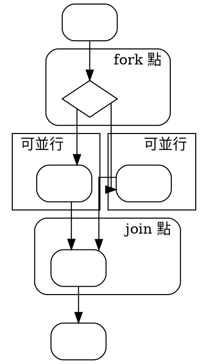
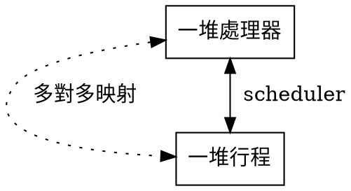

> **原始出處：** https://hackmd.io/@sysprog/linux-concepts
> **擷取日期：** 2026-02-26
> **用途：** 課程教材 — Linux 作業系統術語及概念
> **涵蓋度：** 完整
> **省略內容：** 無

---
tags: LINUX KERNEL, LKI
---

# [Linux 核心設計](https://beta.hackfoldr.org/linux/): 作業系統術語及概念

Copyright (**慣C**) 2024 [宅色夫](https://wiki.csie.ncku.edu.tw/User/jserv)
==[直播錄影](https://youtu.be/8yd6p3GaxVs)==

## 點題

面對原始程式碼超越 4 千萬行規模的 Linux 核心 (2025 年)，最令人感到挫折的，絕非缺乏程式註解，而是就算見到滿滿的註解，自己卻有如文盲，全然無從理解起。為什麼呢？往往是因為對作業系統的認知太侷限。
> Linux 6.8.0-rc3 的原始程式碼以 [tokei](https://github.com/XAMPPRocky/tokei) 工具統計，總行數達到 3741 萬，扣除註解和空白行的程式碼則超越 2 千 8 百萬行 (!)，C 語言佔大約 2 千 5 百萬行。

示範:
```c
/**
 * struct cacheinfo - represent a cache leaf node
 * @id: This cache's id. It is unique among caches with the same (type, level).
 * @type: type of the cache - data, inst or unified
 * @level: represents the hierarchy in the multi-level cache
 * @coherency_line_size: size of each cache line usually representing
 *	the minimum amount of data that gets transferred from memory
 * @number_of_sets: total number of sets, a set is a collection of cache
 *	lines sharing the same index
 * @ways_of_associativity: number of ways in which a particular memory
 *	block can be placed in the cache
 * @physical_line_partition: number of physical cache lines sharing the
 *	same cachetag
 * @size: Total size of the cache
 * @shared_cpu_map: logical cpumask representing all the cpus sharing
 *	this cache node
 * @attributes: bitfield representing various cache attributes
 * @fw_token: Unique value used to determine if different cacheinfo
 *	structures represent a single hardware cache instance.
 * @disable_sysfs: indicates whether this node is visible to the user via
 *	sysfs or not
 * @priv: pointer to any private data structure specific to particular
 *	cache design
 *
 * While @of_node, @disable_sysfs and @priv are used for internal book
 * keeping, the remaining members form the core properties of the cache
 */
struct cacheinfo {
    ...
```
> 取自 [include/linux/cacheinfo.h](https://github.com/torvalds/linux/blob/master/include/linux/cacheinfo.h)

我們將回顧若干作業系統術語及概念，像是: userspace vs. kernel space, Monolithic kernel vs. Microkernel, Address space, sharing between virtual address space, Execution context, Multi-tasking, Preemptive kernel, Symmetric MultiProcessing (SMP), CPU Scalability, Copy-On-Write, lock。探討的過程中，我們除了將術語對應到 Linux 核心外，也會參照 Solaris, Microsoft Windows NT, Plan 9, CMU Mach 等經典作業系統來解說。

## 藉由星之卡比解讀 Linux 核心發展


> [source: nody](https://twitter.com/nody_lowmoo/status/1728884379093742062)

Linux 核心發布於 1991 年，隔年任天堂發布「星之卡比」(Kirby，又譯作「卡比」)，後者是外觀類似粉紅色小丸子的主角，可吸入或吞噬敵人以獲得敵人的能力，從而過關斬將。Linux 核心和星之卡比原本是完全無關的產品，但因為女兒痴迷卡比，我意外發現二者的巧妙關聯。

Linux 核心發軔於 Linus Torvalds 的創作，適逢 AT&T 與孕育 BSD UNIX 的加州大學對簿公堂，在那充斥著物美價廉個人電腦的年代，Linux 完美填補官司訴訟造成的自由流通版本的 UNIX 仿製品的空缺。
> 延伸閱讀: [從 Revolution OS 看作業系統生態變化](https://hackmd.io/@sysprog/revolution-os-note)

Torvalds 不僅不孤單，藉由網際網路的協作，締造出世界上最成功的開放原始碼專案，過程中好似「卡比」，從其他作業系統「吸入」若干獨到能力，整理如下：
* 虛擬記憶體管理 (virtual memory management 或 MM)：具備現代作業系統的 MM (page-based)，最初源於 CMU 於 1980 年代發展的 Mach microkernel，後來被 BSD 採納，Linux 核心在開發的早期也參照 BSD 的設計，「吸入」現代的虛擬記憶體管理機制。
* procfs: 在 UNIX 哲學中，有一項膾炙人口的特色是 "Everything is a file"，不過這句話不精準，UNIX 和後續的 BSD (可視為具備血緣關係) 並非真的落實該理念，例如 socket 就存在例外。Bell Labs 在 UNIX 之後，發展出 [Plan 9 作業系統](https://en.wikipedia.org/wiki/Plan_9_from_Bell_Labs)，才算是真正的 "Everything is a file"，但沒有太多開發者重視。在 Plan 9 作業系統中，所有的裝置和服務都視作檔案為基礎的操作，例如 telnet, ftp, nfs 等等。Linux 核心採納 Plan 9 的設計，將 process (行程) 的內部資訊以檔案系統的形式展現。
* TCP/IP stack: BSD 是 TCP/IP 開發的溫床，也是擴散電腦網路技術的作業系統，Linux 核心早期就「吸入」BSD 的 TCP/IP protocol stack，又搭上網際網路的熱潮，成為奠基今日網際網路服務的關鍵作業系統。
* BPF (Berkeley Packet Filter): BPF 最初的動機的確是封包過濾機制，但被 Linux 核心「吸入」並擴充為 eBPF (Extended BPF) 後，就變成 Linux 核心內建的內部行為分析工具，可用來動態/靜態追蹤 (dynamic/static tracing) 和 profiling events，成為 Linux 核心的獨特技術，參見 [eBPF](https://hackmd.io/@sysprog/linux-ebpf)。
* 9p: Plan 9 為了貫徹 "Everything is a file" 理念，不區分原本要特別處理的遠端檔案 (remote resources) 和本地端檔案 (local file)，而是引入 9P 這個通訊協定，類似於 Linux 中的 VFS 抽象層，只要提供 inode,superblock 等等抽象層的實作，就可用同一套機制去存取不同檔案系統，而不用管資源到底在何處。儘管 Plan 9 在商業上不成功，但 Linux 核心「吸入」9P 後，將其應用於虛擬化技術，締造巨大的商業價值。
* [lxc](https://en.wikipedia.org/wiki/LXC): 借鏡 (吸入?) FreeBSD jail 和 Solaris container 的方案，用 Linux 核心的 namespace 和 cgroups 等機制重新展現。
* [mseal](https://docs.kernel.org/userspace-api/mseal.html): 始於 Linux v6.10 的 mseal 系統呼叫正是近期的案例。現代微處理器支援對記憶體的 RW (讀寫 和 NX (不可執行) 位元進行管理，提升記憶體損壞錯誤時的防禦能力，使攻擊者無法隨意修改記憶體並執行惡意指令。在該管理模式下，僅有標記為 X (可執行) 的記憶體區域才可執行程式，否則系統會觸發例外，阻止攻擊行為。memory sealing 可保護記憶體映射不被修改，特別是在遭遇損壞的指標傳遞到記憶體管理單元 (MMU) 時，有助於減少記憶體損壞的風險。memory sealing 保護機制可維持控制流完整性 (control-flow integrity; CFI)，防止本應為唯讀的記憶體變成可寫，或防止 `.text` 區段被重新映射。動態載入器可自動對 `.text` 和 `.rodata` 區段進行記憶體封存，應用程式也可於執行期間為關鍵的安全資料執行封存操作。類似功能出現在 macOS 和 OpenBSD，分別是 macOS 的 XNU 核心中的 `VM_FLAGS_PERMANENT` 旗標以及 OpenBSD 的 `mimmutable` 系統呼叫。

Daniel Stori 經營的網站提供一系列關於資訊技術的漫畫，〈[看漫畫學 Linux](https://hackmd.io/@sysprog/linux-comic)〉藉此解讀 Linux 核心的部分機制和相關的套件。

## 高階觀點

投影片: [Linux Kernel: Introduction](https://linux-kernel-labs.github.io/refs/heads/master/lectures/intro-slides.html)
* [重點描述](https://linux-kernel-labs.github.io/refs/heads/master/lectures/intro.html)

[ Page 2 ] User vs. Kernel

> 取自 [User mode and kernel mode](https://docs.microsoft.com/zh-tw/windows-hardware/drivers/gettingstarted/user-mode-and-kernel-mode)

1963 年麻省理工學院的科學記者採訪當時計算中心，並與 Fernando J. Corbató (2019 年七月因糖尿病的併發症過世，享耆壽 93 歲) 教授對話，後者是世界上第一個分時多工作業系統 Compatible Time-Sharing System (CTSS) 的主導設計者，Corbató 教授在 CTSS 獲得巨大成功後，帶領 MIT 團隊，和通用電氣及貝爾實驗室發展 MULTICS 作業系統，許多慣例和概念一路從 CTSS、MULTICS，到後來重新實作的 UNIX 作業系統。

在這部短片中，Corbató 教授談及過往批次處理系統的限制，並快速回顧電腦運作原理及如何實作分時多工、依據優先權進行排程等等，是此，電腦猶如電話交換機，同時為多個使用者所操作，每位使用者都能依據需求使用終端機，存取到運算和儲存資源，不會和其他使用系統的人有所衝突。可留意到，Corbató 教授在訪談中提到 [Supervisory program](https://en.wikipedia.org/wiki/Supervisory_program)。

另外，也不難從影片中看到形似打字機、可和電腦對話互動的裝置，那就是 teletyper (電傳打字機) —— 早期的電腦沒有配備螢幕，而是透過 teletyper，藉由訊號連線，建立人機互動的終端機 (console)，這也是 UNIX 作業系統多人多工的操作環境一直具備的特徵，後來的 Linux 也延續 teletyper 的概念，實作 tty 子系統。



[ Page 3 ] Typical operating system architecture
:dart: 摘自 [UNIX 作業系統 fork/exec 系統呼叫的前世今生](https://hackmd.io/@sysprog/unix-fork-exec):
1963 年，電腦科學家 [Melvin Conway](https://en.wikipedia.org/wiki/Melvin_Conway) 博士 (以 [Conway's Law](https://en.wikipedia.org/wiki/Conway%27s_law) 聞名於世) 發表論文〈[A Multiprocessor System Design]( https://archive.org/details/AMultiprocessorSystemDesignConway1963/page/n7)〉，正式提出 fork 思想。從論文標題不難發現，fork 的思想最初是作為一種「多處理器並行處理」執行模型，這個想法非常有意思，該想法源於下方流程圖。
:::success
此處「並行」通指 [concurrent](https://dictionary.cambridge.org/dictionary/english/concurrent) (形容詞) 和 [concurrency](https://dictionary.cambridge.org/dictionary/english/concurrency) (名詞)，這詞彙在中國簡體稱為「并发」。「並行」這譯詞在 1970 年代就出現於台灣的資訊科技刊物中，本文沿用。
:::

我們考慮以下流程圖:


若我們確立電腦程式可用一套明確的流程來表達，我們即可聲明該並行處理的方案是可行的。流程圖的分岔處，fork —— 叉子，多麼生動的類比。

一個流程圖上的分支點分裂出來的分支顯然是邏輯獨立的，這便是可並行化處理的前提，於是他們便可表現為不同的*行程 (process)* 的形式。當時的表達還只是 **process** 這個術語，還不具備現代作業系統的「行程」概念。

join 表示多個並行處理的行程由於某種原因不得不進行同步的時間點，也就是多個並行行程會合之處。在當今的多執行緒程式中，這個點依然叫作 join。比如 Java 核心套件裡頭的 [java.lang.Thread](https://docs.oracle.com/javase/8/docs/api/java/lang/Thread.html) 的 join 方法以及 [POSIX Thread](https://en.wikipedia.org/wiki/POSIX_Threads) 函式庫的 [pthread_join](https://man7.org/linux/man-pages/man3/pthread_join.3.html) 函式。

廣義來說，join 也意味著不同的行程必須經過的執行路徑，因此減少 join 的數量將會提高並行的效率。

Conway 的論文另一個創舉是，他將行程 (也就是後來作業系統中的 process 的概念) 及執行該行程的處理器 (即 CPU processor) 分離出來，抽象出 scheduler 層面。

大意是「滿足系統中的活動處理器數量是處理器總量及並行行程總數的較小值即可」。這意味著 scheduler 可以將多處理器系統的所有處理器和系統所有行程分別看成是統一的資源提供者和消費者來一起排程。


在 Unix 引入 fork 之後，這種多處理器並行的設計思想就深入到 Unix 的核心。這個思想最終也影響 Unix 及後來的 Linux，並延續至今。

關於這個設計思想為何得以影響 Unix (及其家族) 超過五十年，和 [Conway's law](https://en.wikipedia.org/wiki/Conway%27s_law) 不無關係。這定律中提到:
> Any organization that designs a system (defined broadly) will produce a design whose structure is a copy of the organization's communication structure.

這席話源於 Conway 在美國空軍服役的經驗，他的回憶錄〈personal correspondence with Nyman〉(2012 年) 提到:
> I was in the US Air Force at the time – involved with computer procurement – and I noticed that no vendor was distinguishing between "processor" and "process." That is, when a proposal involved a multiprocessor design, each processor was committed to a single process.

當時涉及「多處理器設計」(不是現代的多核處理器架構，而是強調多個運算單元的組合) 的軍方採購提案，每個處理器都被指派給單獨的行程，意味著資源使用效率缺乏彈性，於是 Conway 提出的突破方式即是強化組織內的溝通機制。

美國威斯康辛大學教授 Remzi H. Arpaci-Dusseau 和 Andrea C. Arpaci-Dusseau 撰寫的開放存取式教科書《[Operating Systems: Three Easy Pieces](https://pages.cs.wisc.edu/~remzi/OSTEP/)》，在〈[The Abstraction: The Process](https://pages.cs.wisc.edu/~remzi/OSTEP/cpu-intro.pdf)〉一章提到:
> HOW TO PROVIDE THE ILLUSION OF **MANY CPUS**?
Although there are only a few physical CPUs available, how can the OS provide the illusion of a nearly-endless supply of said CPUs?

作業系統藉由虛擬化 (virtualize) CPU 資源來達到在單一處理器實作出有如同時多個程式執行於各自的處理器之上的假象 —— 其中關鍵的手法就是分時多工 (time-sharing)，而 Unix 的第一篇論文《[The UNIX Time Sharing System](https://people.eecs.berkeley.edu/~brewer/cs262/unix.pdf)》，由 Ken Thompson 和 Dennis Ritchie 在 1973 年 10 月 ACM [Symposium on Operating Systems Principles](http://www.sosp.org/) (SOSP) 中提出，該論文在 1974 年 7 月的 [Communications of the ACM](https://cacm.acm.org/) 發表，正是採用分時多工作為主題。

:::success
至於《[Operating Systems: Three Easy Pieces](https://pages.cs.wisc.edu/~remzi/OSTEP/)》(可簡稱為 `OSTEP`) 的 "Three Easy Piece" 也有典故，是向已故物理學家費曼致敬，後者著有《Six Easy Pieces: Essentials Of Physics Explained By Its Most Brilliant Teacher》。用 `OSTEP` 作者的話說，作業系統只有物理學一半難度，那就折半為 《Three Easy Pieces》，該書的三大主軸:
* 虛擬化 (Virtualization);
* 並行 (Concurrency);
* 持續保存 (Persistence): 主要探討檔案系統;
:::

[ Page 4 ] Monolithic kernel
[ Page 5 ] Microkernel
:dart: 摘自 [淺談 Microkernel 設計和真實世界中的應用](https://hackmd.io/@sysprog/microkernel-design):


> source: [Kernel vs Microkernel vs Multikernel – Explained Visually](https://bsdmag.org/kernel/)

Mach (發音 [mʌk]) 是美國 Carnegie-Mellon 大學 (CMU) 的 microkernel 作業系統，發展於 1980 年代，著眼點是，隨著功能越來越多，UNIX 也日漸龐大複雜而難以掌握，Mach 的設計概念就是「去蕪存菁」，僅留下真正關鍵的部份，其餘的功能都用使用者層級 (user-level) 的程式 (特徵 server) 來實作，藉此減低核心的複雜度。

Mach 設計目標：
* 與 UNIX 相容
* 物件導向設計
* 跨平台：在單處理器、多處理器上都能執行
* 適合分散式運算環境

值得一提的是，儘管 Mach 已式微，但 Mach 的眾多技術突破陸續被 BSD 和 Linux kernel 所吸收。Mach 2.5 是許多商業 UNIX，像是 DEC OSF/1, NeXTSTEP (後來移轉到 Apple Computer) 的基礎，Mach 3.0 才是真正純粹的完全 microkernel 化的實作，而 Mach 4.0 則由 Utah (猶他) 大學維護。

Mach 的主要開發者 [Richard Rashid](https://en.wikipedia.org/wiki/Richard_Rashid) 自 1991 年就在 Microsoft 服務，領導 [Microsoft Research](https://en.wikipedia.org/wiki/Microsoft_Research) 若干技術突破，另一位主要 Mach 開發者 [Avie Tevanian](https://en.wikipedia.org/wiki/Avie_Tevanian) 曾在 [NeXT](https://en.wikipedia.org/wiki/NeXT) 擔任軟體主管，並在 Apple 收購 NeXT 後，轉任 Apple Inc. 的技術長 (已退休)。

Mach 被視為以下這些元件所組成: 
*   ports  (埠)
*   messages (訊息)
*   tasks (工作)
*   threads (執行緒)
*   virtual memory (虛擬記憶體)

如同一個設計成熟的物件導向系統，這些物件的介面已經定義明確，因此物件內的改變不會影響到使用這些物件的行程 (process)。

可將 Mach 中的 task  看待為 UNIX 環境中的 process。 對執行中的行程而言，它是一個可執行的環境，如同虛擬記憶體或是處理器的執行週期。不過，相對於傳統  UNIX 的 process，Mach 的 task 並不表示包含一個正在執行的 thread，對 Mach 而言，thread 也是一個獨立的物件 (!)

:::info
對比 Android，後者底層是 Linux 核心，但是設計卻高度有 microkernel 的影子，像是:
* Framework: task, thread, activity, service (microkernel terms)
* Android: binder IPC/RPC
:::

因此，一個有用的 task 必須包含至少一個 thread。Mach 的 thread 與其它常見作業系統的 thread 相仿，在同一個 task 中的 thread 相互分享記憶體與其它資源。Mach 在設計時，就希望成為一個 multi-threaded，而可有效執行於多顆處理器 (SMP) 上。

在 [NPTL](https://en.wikipedia.org/wiki/Native_POSIX_Thread_Library) 出現之前，Linux 的 multi-threaded 實作非常奇怪，仍然把 process 當作最基本的 abstraction，也就是說 scheduling, context switch 等基本操作對象仍是 process，而thread / LWP 只是和別人分享定址空間和資源的 process。因此：
* 嚴格來說，Linux 只實作一半的 thread，但這並不是壞事，因為許多的應用程式不見得用到 thread，且簡化 thread 實作的結果，使得 process 管理變得更有效率，副作用是產生出來的 "thread" 比其它作業系統的實作，顯得更 heavy-weight，可以說，過去 Linux 犧牲 thread 的效率，以換取 process 的效率
* 以 abstraction 的角度來看，Linux 過去並非在本質上支援 thread，但以 programming model 來看，Linux 的確是有 thread 可用，儘管效率較差

早期 Linux 的 process 和 thread 的效能和其他作業系統的數據比較，可參照論文 "[An Overview of the Singularity Project](https://www.microsoft.com/en-us/research/wp-content/uploads/2005/10/tr-2005-135.pdf)"  (Microsoft Research, 2005 年) 的第 31 頁

延伸閱讀: 
* [Linux 核心設計: 不僅是個執行單元的 Process](https://hackmd.io/@sysprog/linux-process)

[ Page 6 ] Monolithic kernels can be modular
:dart: 參見〈[Linux 核心模組掛載機制](https://hackmd.io/@sysprog/linux-kernel-module)〉

[ Page 7 ] Hybrid kernels
Linus Torvalds [表示](https://www.realworldtech.com/forum/?threadid=65915&curpostid=65936):
> “As to the whole ‘hybrid kernel’ thing - it’s just marketing. It’s ‘oh, those microkernels had good PR, how can we try to get good PR for our working kernel? Oh, I know, let’s use a cool name and try to imply that it has all the PR advantages that that other system has’.”

[Hybrid kernel](https://en.wikipedia.org/wiki/Hybrid_kernel) 案例:
* DragonFly BSD
    - [HAMMER](https://www.dragonflybsd.org/hammer/) - [DragonFly's Major Features List](https://www.dragonflybsd.org/features/)
    > The new infrastructure will allow many parts of the kernel to be migrated out into userspace; here they will be more easily debugged as they will be smaller, isolated programs, instead of being small parts entwined in a larger chunk of code. Additionally, the migration of select kernel code into **userspace** has the benefit of making the system more robust; if a userspace driver crashes, it will not crash the kernel.
* [XNU](https://en.wikipedia.org/wiki/XNU)
    * Apple Inc. 現在許多技術來自 Steve Jobs 於 1985 年離開 Apple Computer 後，所創立的 NeXT 公司，後者的主力產品就是 NeXTSTEP 作業系統，以 CMU Mach 為基礎，並且整合 4.3BSD userspace 作為 Mach 上的 server。
    * 後來 Apple Inc. 把 NeXTSTEP 的技術發揚光大，演化為 XNU (核心) / Darwin (作業系統)，造就 iPhone OS / macOS 的關鍵技術。
    * 技術簡報: [The Microkernel Mach Under NeXTSTEP](https://www.slideshare.net/schmidt/the-microkernel-mach-under-ne-xtstep-stripped)
    * 延伸閱讀: [Inside the Mac OS X Kernel](https://youtu.be/-7GMHB3Plc8) (錄影)

隨著應用場景複雜度的提升，典型作業系統設計的分類也變得模糊，愈來愈多使用情境想要可融合 (1) Container 的方便與速度; (2) VM 的安全性與隔離性; 這二個面向優點的技術，以下技術也因應而生：
* MicroVM
    * 相對於 VM 能夠完整支援各種功能與作業系統， microVM 想要透過客製化 VM 的需求，將用不到的功能給移除，透過限縮功能與降低複雜度來提升 VM 的效能與使用資源
    * 舉例來說，大部分雲端應用程式需要的硬體裝置只會有網路/儲存等，其他如鍵盤，滑鼠，螢幕顯示等相關的驅動程式其實完全不需要，從這個角度來看，為什麼要模擬一個完善環境結果裡面大部分的資源其實都是不需要的?
    * 對於傳統的 VM 來說，一個簡易的 microVM 的開機速度可以低到毫秒等級，使用的記憶體資源也只需要 5MB 左右，這些數據使得要快速部署大量 microVM 不再是個夢，而是真真實實可能發生的。
    * AWS 的 [Firecracker](https://github.com/firecracker-microvm/firecracker) 可能是 microVM 中最知名的專案。 AWS 透過 Firecracker 來提供 serverless 的服務，因應 microVM 的特性，使用者的服務可以更快速地被部署，同時因為 VM 的特性使得這些程式相對於傳統容器來說安全性更高。
    * microVM 的架構與願景聽起來很美好，但是其終究還是一套基於 VM 的環境，目前大部分的開發與 CI/CD 流程都是基於 Container 的概念去開發與設計的，要如何將這些流程與 microVM 整合實際上才是導入最大的難題。
    * 因此大部分的 microVM 實作上都會疊加一層 Container 的管理介面，例如 VM 起來後內建 Container 的環境，能夠直接部署 Container 來應用，透過這樣的設計讓使用者可以繼續使用 container 般的操作流程同時又享有 VM 的安全性。
    * 錄影: [What Are MicroVMs? And Why Should I Care?](https://youtu.be/4d0NIfuFLXc)
* Unikernel
    * Unikernel 解決的目標完全一致，就是又安全又快速又輕量的虛擬化技術，不過其採用的方式跟 microVM 不同。
    * Unikernel 透過打造一個輕量且不可修改的作業系統來運行目標應用程式，該作業系統是動態編譯的，編譯內容包含應用程式原始碼，相關驅動程式以及會使用到的各種函式庫，全部東西一起編譯後產生最後的作業系統。
    * Unikernel 藉由限縮某些特性來提升整體效能，例如:
        1. 整個作業系統只能有一個 process，這意味使用者的應用程式沒有辦法 fork 出其他的 process. 也因為這個特性使得其安全性頗高
        2. 作業系統跟應用程式的記憶體是採用同個記憶體空間，透過這個機制減少需要轉換的次數來達成效能提升
        3. 由於只能運行一個應用程式，所以若應用程式崩潰，這個特化的作業系統也沒有活著的必要，這時候重啟作業系統即可，反正成本很低
    * 實作案例: [nanovms](https://nanovms.com/) 公司維護的 [nanos](https://github.com/nanovms/nanos)，演講: [From the Ground Up: How We Built the Nanos Unikernel](https://youtu.be/0v21hGvCDPY)
* Container Sandbox
    * Sandbox 的目的是希望能夠提升 Container 架構的安全性，主要著重點是如何透過 Kernel Proxy 的概念讓作業系統核心不再共用，每個 Container 看起來都會有一個屬於自己的核心。
    * Kernel Proxy 會去實作所有 Container 會需要的核心功能，藉此讓每個 container 能夠不用修改的情況下就套入 kernel proxy，然後獲得更好的安全性。
    * Google 的 [gVisor](https://gvisor.dev/) 專案就是這類型的產物，其透過 Go 語言開發一套 kernel proxy 來實作各種系統呼叫。
    * Kernel Proxy 透過其第三者的機制來確保不同容器之間的惡意攻擊不會影響到彼此的 Kernel，甚至是 Host 本身。但是多了一層角色實際上整個處理的速度就會比純 Container 來得慢一些。

延伸閱讀: [Unikernel and immutable infrastructures](https://github.com/cetic/unikernels)

[ Page 8 ] Address space
:dart: 摘自 [Linux 核心設計: 不僅是個執行單元的 Process](https://hackmd.io/@sysprog/linux-process):


(和作業系統和計算機組織結構的設計有極大的落差)

[ Page 9 ] User and Kernel sharing the virtual address space
:dart: 摘自 [Linux 核心設計: 記憶體管理](https://hackmd.io/@sysprog/linux-memory)

對於記憶體的部分需要知道：
* 地址映射
* 記憶體管理的方式
* Page fault

[ Page 10 ] Execution contexts
:dart: 參見 [Linux 核心設計: 中斷處理和現代架構考量](https://hackmd.io/@sysprog/linux-interrupt)
中斷處理相信是人們不陌生的主題，甚至在中學生的計算機概論教材都出現這字眼，但在 Linux (或任何有規模的作業系統核心) 裡頭，中斷處理背後涉及的硬體特性、多種周邊 I/O、中斷控制器 (如是否支援 nested)、相關的排程和任務調度、延遲和即時處理等等，仍舊讓工程人員頭痛，特別將多核處理器、虛擬化技術，和為了實踐資訊安全而進行的隔離執行納入考量之後。


[ Page 11 ] Multi-tasking
:dart: 摘自 [Linux 核心設計: 不只挑選任務的排程器](https://hackmd.io/@sysprog/linux-scheduler):
先不講 Linux 排程器，資訊系統存在多種排程器，例如:
1. [erlang scheduler](https://www.erlang.org/doc/man/scheduler.html): erlang processes 到 threads 間的映射;
2. [nginx](https://nginx.org/en/): HTTP/HTTPS 請求到 processes / application 間的映射;
3. [Memory manager](https://www.kernel.org/doc/html/latest/admin-guide/mm/index.html): virtual memory 到 physical memory 間的映射;
4. [hypervisor](https://en.wikipedia.org/wiki/Hypervisor): VM 到實體硬體間的映射;
5. [Amazon Elastic Compute Cloud (EC2)](https://aws.amazon.com/ec2/): VM 到 hypervisor 間的映射;
6. [Apache Spark](https://spark.apache.org/): map/reduce job 到計算節點間的映射;

經由上述映射，我們可得到額外的好處:
* 資源得到更高效的利用;
* 由於增加一層 indirection，任務和任務所需要的資源間的耦合度大幅下降;
* 更好的服務品質（[quality of service](https://en.wikipedia.org/wiki/Quality_of_service), QoS);

延伸閱讀: [並行和多執行緒程式設計](https://hackmd.io/@sysprog/concurrency)

[ Page 12 ] Preemptive kernel
:dart: 參見 [Linux 核心設計: PREEMPT_RT 作為邁向硬即時作業系統的機制](https://hackmd.io/@sysprog/preempt-rt)
(綠色: preemptible; 紅色: non-preemptible)

**Non-Preemptive**

[ CONFIG_PREEMPT_NONE ]
* Preemption is not allowed in Kernel Mode
* Preemption could happen upon returning to user space

**Preemption Points in Linux Kernel**

[ CONFIG_PREEMPT ]
* Implicit preemption in Kernel
* preempt_count
    * Member of thread_info
    * Preemption could happen when preempt_count == 0

**Fully Preemptive**

[CONFIG_PREEMPT_RT_BASE ] / [ CONFIG_PREEMPT_RT_FULL ]
* Difference appears in the interrupt context
* Goal: Preempt Everywhere except
    * Preempt disable
    * Interrupt disable
* Reduce non-preemptible cases in kernel
    * spin_lock
    * Interrupt


> Timeline of merged real-time features in the mainline Linux kernel, most of them coming from the PREEMPT_RT patch

延伸閱讀: [Linux 核心搶佔](https://hackmd.io/@sysprog/linux-preempt)

[ Page 16 ] ASMP
[ Page 17 ] SMP
:dart: 參見 [Linux 核心設計: 多核處理器和 spinlock](https://hackmd.io/@sysprog/multicore-locks):

[ Page 18 ] Scalability
:dart: 參見 [Linux 核心設計: Scalability 議題](https://hackmd.io/@sysprog/linux-scalability)
Wikipedia 對於 [scalability](https://en.wikipedia.org/wiki/Scalability) 的說明:
> A system whose performance improves after adding hardware, proportionally to the capacity added, is said to be a scalable system.

整體效能可隨著硬體的成長而比例性成長，重點是比例。
許多 scalability 議題來自其中一個處理器核要使用另外一個處理器核所寫入的資料，進而導致大量的 cache coherence，這兩個處理器核競爭資源和 lock 是常見的狀況，恰好可對比於韓國瑜先生提出的「棋子」和「塞子 」觀點。於是，在多核處理器中的 cache coherence protocol 及其共享資料的處理機制，自然是 Linux 核心的 scalability 關鍵考量。


[ [電視辯論](https://youtu.be/ZAdnf1Oqcz8) ]

解決 scalability 的手法有 lock-free, sequence lock, RCU 等等。
延伸閱讀:
* [Linux 核心設計: 淺談同步機制](https://hackmd.io/@sysprog/linux-sync)
* [Linux 核心設計: RCU 同步機制](https://hackmd.io/@sysprog/linux-rcu)
* [從 CPU cache coherence 談 Linux spinlock 可擴展能力議題](https://hackmd.io/@sysprog/linux-spinlock-scalability)

[ Page 28 ] Virtual File System
:dart: 參見 [Linux 核心設計: 檔案系統概念及實作手法](https://hackmd.io/@sysprog/linux-file-system)

## 細部切入點

或許你會好奇在電腦上執行一個程式時究竟發生什麼？閱讀 [cpu.land](https://cpu.land/) 來理解多個程式如何在 Linux 運作、系統呼叫是什麼，電腦如何透過硬體中斷來管理記憶體，及 Linux 如何載入可執行檔。
1. a rabbit hole into how your computer runs programs
    > 根據[韋氏詞典](https://www.merriam-webster.com/dictionary/rabbit%20hole)，rabbit hole 寓意是「一種複雜、奇異或未知的狀態和情景」(a complexly bizarre or difficult state or situation conceived of as a hole into which one falls or descends)，人們常用 going down the rabbit hole 來表示「掉入未知世界」。這種用法最早出現於 1938 年，源於著名童話書《愛麗絲漫遊奇境記》，在這本書中，主角愛麗絲從兔子洞掉入一個擬人化的異境世界，開啟她奇妙的旅程。
2. Slice Dat Time
3. How to Run a Program
4. Becoming an Elf-Lord
5. The Translator in Your Computer
6. Let's Talk About Forks and Cows

依據 UNSW 的 [Advanced Operating Systems](https://www.cse.unsw.edu.au/~cs9242/23/lectures.shtml) (2023) 教材 [Unix and Linux Internals](https://www.cse.unsw.edu.au/~cs9242/23/lectures/08a-linux.pdf)。

[ Page 3 ]
基礎概念:
* Process model
* File system model
* IPC

現代作業系統的關鍵特徵:
* Paged virtual memory (3BSD, 1979)
* TCP/IP Networking (BSD 4.1, 1983)
* Multiprocessing (Vendor Unices such as Sequent’s ‘Balance’, 1984)